# An introduction to seaborn

Seaborn is a library for making statistical graphics in Python. It is built on top of [matplotlib](https://matplotlib.org/) and closely integrated with [pandas](https://pandas.pydata.org/) data structures.

Here is some of the functionality that seaborn offers:

*   A dataset-oriented API for examining [relationships](examples/scatter_bubbles.html#scatter-bubbles) between [multiple variables](examples/faceted_lineplot.html#faceted-lineplot)
*   Specialized support for using categorical variables to show [observations](examples/jitter_stripplot.html#jitter-stripplot) or [aggregate statistics](examples/pointplot_anova.html#pointplot-anova)
*   Options for visualizing [univariate](examples/distplot_options.html#distplot-options) or [bivariate](examples/joint_kde.html#joint-kde) distributions and for [comparing](examples/horizontal_boxplot.html#horizontal-boxplot) them between subsets of data
*   Automatic estimation and plotting of [linear regression](examples/anscombes_quartet.html#anscombes-quartet) models for different kinds [dependent](examples/logistic_regression.html#logistic-regression) variables
*   Convenient views onto the overall [structure](examples/scatterplot_matrix.html#scatterplot-matrix) of complex datasets
*   High-level abstractions for structuring [multi-plot grids](examples/faceted_histogram.html#faceted-histogram) that let you easily build [complex](examples/pair_grid_with_kde.html#pair-grid-with-kde) visualizations
*   Concise control over matplotlib figure styling with several [built-in themes](tutorial/aesthetics.html#aesthetics-tutorial)
*   Tools for choosing [color palettes](tutorial/color_palettes.html#palette-tutorial) that faithfully reveal patterns in your data

Seaborn aims to make visualization a central part of exploring and understanding data. Its dataset-oriented plotting functions operate on dataframes and arrays containing whole datasets and internally perform the necessary semantic mapping and statistical aggregation to produce informative plots.

Here’s an example of what this means:

```py
import seaborn as sns
sns.set()
tips = sns.load_dataset("tips")
sns.relplot(x="total_bill", y="tip", col="time",
            hue="smoker", style="smoker", size="size",
            data=tips);

```

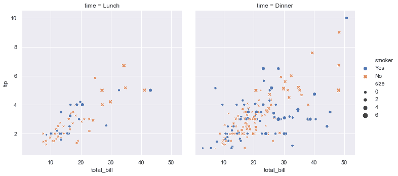

A few things have happened here. Let’s go through them one by one:

1.  We import seaborn, which is the only library necessary for this simple example.

```py
import seaborn as sns

```

Behind the scenes, seaborn uses matplotlib to draw plots. Many tasks can be accomplished with only seaborn functions, but further customization might require using matplotlib directly. This is explained in more detail [below](#intro-plot-customization). For interactive work, it’s recommended to use a Jupyter/IPython interface in [matplotlib mode](https://ipython.readthedocs.io/en/stable/interactive/plotting.html), or else you’ll have to call matplotlib.pyplot.show when you want to see the plot.

1.  We apply the default default seaborn theme, scaling, and color palette.

```py
sns.set()

```

This uses the [matplotlib rcParam system](https://matplotlib.org/users/customizing.html) and will affect how all matplotlib plots look, even if you don’t make them with seaborn. Beyond the default theme, there are [several other options](tutorial/aesthetics.html#aesthetics-tutorial), and you can independently control the style and scaling of the plot to quickly translate your work between presentation contexts (e.g., making a plot that will have readable fonts when projected during a talk). If you like the matplotlib defaults or prefer a different theme, you can skip this step and still use the seaborn plotting functions.

1.  We load one of the example datasets.

```py
tips = sns.load_dataset("tips")

```

Most code in the docs will use the [`load_dataset()`](generated/seaborn.load_dataset.html#seaborn.load_dataset "seaborn.load_dataset") function to get quick access to an example dataset. There’s nothing particularly special about these datasets; they are just pandas dataframes, and we could have loaded them with pandas.read_csv or build them by hand. Many examples use the “tips” dataset, which is very boring but quite useful for demonstration. The tips dataset illustrates the “tidy” approach to organizing a dataset. You’ll get the most out of seaborn if your datasets are organized this way, and it is explained in more detail [below](#intro-tidy-data).

1.  We draw a faceted scatter plot with multiple semantic variables.

```py
sns.relplot(x="total_bill", y="tip", col="time",
            hue="smoker", style="smoker", size="size",
            data=tips)

```

This particular plot shows the relationship between five variables in the tips dataset. Three are numeric, and two are categorical. Two numeric variables (`total_bill` and `tip`) determined the position of each point on the axes, and the third (`size`) determined the size of each point. One categorical variable split the dataset onto two different axes (facets), and the other determined the color and shape of each point.

All of this was accomplished using a single call to the seaborn function [`relplot()`](generated/seaborn.relplot.html#seaborn.relplot "seaborn.relplot"). Notice how we only provided the names of the variables in the dataset and the roles that we wanted them to play in the plot. Unlike when using matplotlib directly, it wasn’t necessary to translate the variables into parameters of the visualization (e.g., the specific color or marker to use for each category). That translation was done automatically by seaborn. This lets the user stay focused on the question they want the plot to answer.

## API abstraction across visualizations

There is no universal best way to visualize data. Different questions are best answered by different kinds of visualizations. Seaborn tries to make it easy to switch between different visual representations that can be parameterized with the same dataset-oriented API.

The function [`relplot()`](generated/seaborn.relplot.html#seaborn.relplot "seaborn.relplot") is named that way because it is designed to visualize many different statistical _relationships_. While scatter plots are a highly effective way of doing this, relationships where one variable represents a measure of time are better represented by a line. The [`relplot()`](generated/seaborn.relplot.html#seaborn.relplot "seaborn.relplot") function has a convenient `kind` parameter to let you easily switch to this alternate representation:

```py
dots = sns.load_dataset("dots")
sns.relplot(x="time", y="firing_rate", col="align",
            hue="choice", size="coherence", style="choice",
            facet_kws=dict(sharex=False),
            kind="line", legend="full", data=dots);

```

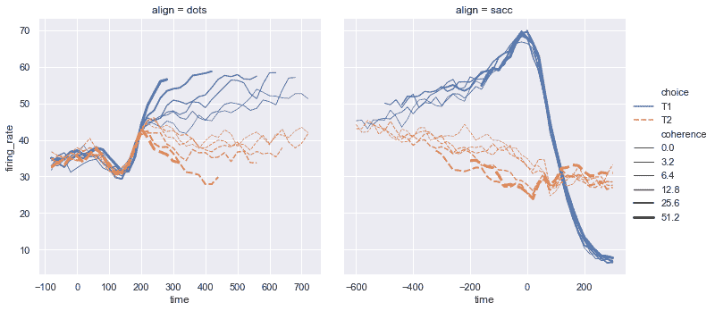

Notice how the `size` and `style` parameters are shared across the scatter and line plots, but they affect the two visualizations differently (changing marker area and symbol vs line width and dashing). We did not need to keep those details in mind, letting us focus on the overall structure of the plot and the information we want it to convey.

## Statistical estimation and error bars

Often we are interested in the average value of one variable as a function of other variables. Many seaborn functions can automatically perform the statistical estimation that is neccesary to answer these questions:

```py
fmri = sns.load_dataset("fmri")
sns.relplot(x="timepoint", y="signal", col="region",
            hue="event", style="event",
            kind="line", data=fmri);

```

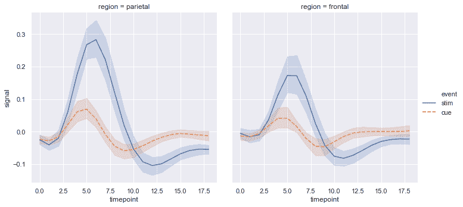

When statistical values are estimated, seaborn will use bootstrapping to compute confidence intervals and draw error bars representing the uncertainty of the estimate.

Statistical estimation in seaborn goes beyond descriptive statisitics. For example, it is also possible to enhance a scatterplot to include a linear regression model (and its uncertainty) using [`lmplot()`](generated/seaborn.lmplot.html#seaborn.lmplot "seaborn.lmplot"):

```py
sns.lmplot(x="total_bill", y="tip", col="time", hue="smoker",
           data=tips);

```

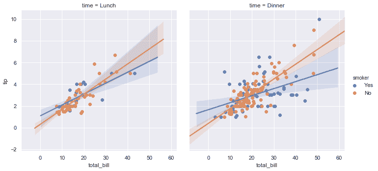

## Specialized categorical plots

Standard scatter and line plots visualize relationships between numerical variables, but many data analyses involve categorical variables. There are several specialized plot types in seaborn that are optimized for visualizing this kind of data. They can be accessed through [`catplot()`](generated/seaborn.catplot.html#seaborn.catplot "seaborn.catplot"). Similar to [`relplot()`](generated/seaborn.relplot.html#seaborn.relplot "seaborn.relplot"), the idea of [`catplot()`](generated/seaborn.catplot.html#seaborn.catplot "seaborn.catplot") is that it exposes a common dataset-oriented API that generalizes over different representations of the relationship between one numeric variable and one (or more) categorical variables.

These representations offer different levels of granularity in their presentation of the underlying data. At the finest level, you may wish to see every observation by drawing a scatter plot that adjusts the positions of the points along the categorical axis so that they don’t overlap:

```py
sns.catplot(x="day", y="total_bill", hue="smoker",
            kind="swarm", data=tips);

```

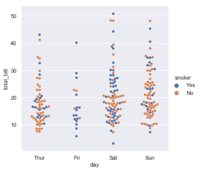

Alternately, you could use kernel density estimation to represent the underlying distribution that the points are sampled from:

```py
sns.catplot(x="day", y="total_bill", hue="smoker",
            kind="violin", split=True, data=tips);

```

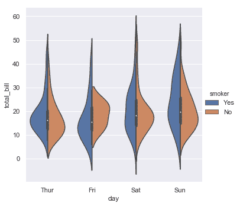

Or you could show the only mean value and its confidence interval within each nested category:

```py
sns.catplot(x="day", y="total_bill", hue="smoker",
            kind="bar", data=tips);

```

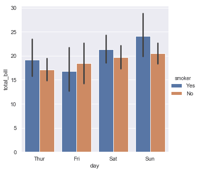

## Figure-level and axes-level functions

How do these tools work? It’s important to know about a major distinction between seaborn plotting functions. All of the plots shown so far have been made with “figure-level” functions. These are optimized for exploratory analysis because they set up the matplotlib figure containing the plot(s) and make it easy to spread out the visualization across multiple axes. They also handle some tricky business like putting the legend outside the axes. To do these things, they use a seaborn [`FacetGrid`](generated/seaborn.FacetGrid.html#seaborn.FacetGrid "seaborn.FacetGrid").

Each different figure-level plot `kind` combines a particular “axes-level” function with the [`FacetGrid`](generated/seaborn.FacetGrid.html#seaborn.FacetGrid "seaborn.FacetGrid") object. For example, the scatter plots are drawn using the [`scatterplot()`](generated/seaborn.scatterplot.html#seaborn.scatterplot "seaborn.scatterplot") function, and the bar plots are drawn using the [`barplot()`](generated/seaborn.barplot.html#seaborn.barplot "seaborn.barplot") function. These functions are called “axes-level” because they draw onto a single matplotlib axes and don’t otherwise affect the rest of the figure.

The upshot is that the figure-level function needs to control the figure it lives in, while axes-level functions can be combined into a more complex matplotlib figure with other axes that may or may not have seaborn plots on them:

```py
import matplotlib.pyplot as plt
f, axes = plt.subplots(1, 2, sharey=True, figsize=(6, 4))
sns.boxplot(x="day", y="tip", data=tips, ax=axes[0])
sns.scatterplot(x="total_bill", y="tip", hue="day", data=tips, ax=axes[1]);

```

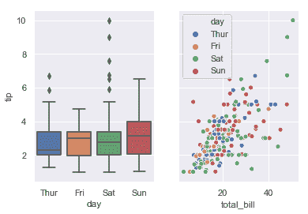

Controling the size of the figure-level functions works a little bit differently than it does for other matplotlib figures. Instead of setting the overall figure size, the figure-level functions are parameterized by the size of each facet. And instead of setting the height and width of each facet, you control the height and _aspect_ ratio (ratio of width to height). This parameterization makes it easy to control the size of the graphic without thinking about exactly how many rows and columns it will have, although it can be a source of confusion:

```py
sns.relplot(x="time", y="firing_rate", col="align",
            hue="choice", size="coherence", style="choice",
            height=4.5, aspect=2 / 3,
            facet_kws=dict(sharex=False),
            kind="line", legend="full", data=dots);

```

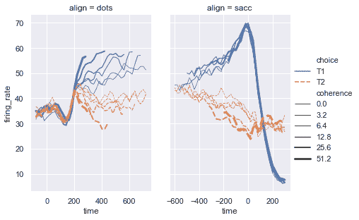

The way you can tell whether a function is “figure-level” or “axes-level” is whether it takes an `ax=` parameter. You can also distinguish the two classes by their output type: axes-level functions return the matplotlib `axes`, while figure-level functions return the [`FacetGrid`](generated/seaborn.FacetGrid.html#seaborn.FacetGrid "seaborn.FacetGrid").

## Visualizing dataset structure

There are two other kinds of figure-level functions in seaborn that can be used to make visualizations with multiple plots. They are each oriented towards illuminating the structure of a dataset. One, [`jointplot()`](generated/seaborn.jointplot.html#seaborn.jointplot "seaborn.jointplot"), focuses on a single relationship:

```py
iris = sns.load_dataset("iris")
sns.jointplot(x="sepal_length", y="petal_length", data=iris);

```

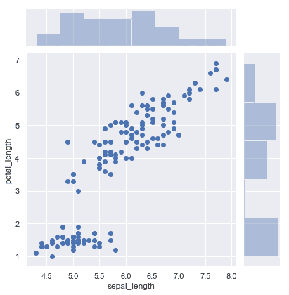

The other, [`pairplot()`](generated/seaborn.pairplot.html#seaborn.pairplot "seaborn.pairplot"), takes a broader view, showing all pairwise relationships and the marginal distributions, optionally conditioned on a categorical variable :

```py
sns.pairplot(data=iris, hue="species");

```

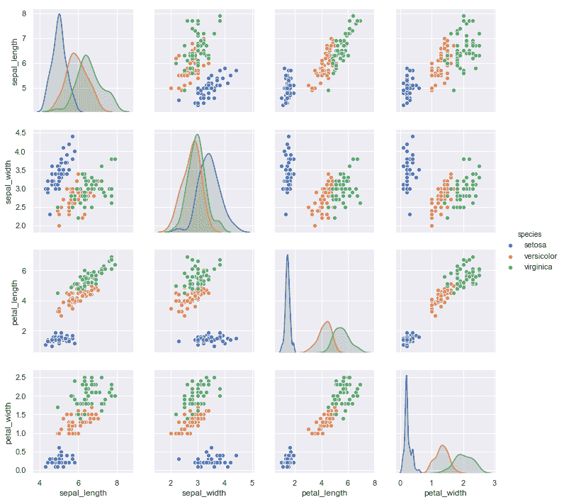

Both [`jointplot()`](generated/seaborn.jointplot.html#seaborn.jointplot "seaborn.jointplot") and [`pairplot()`](generated/seaborn.pairplot.html#seaborn.pairplot "seaborn.pairplot") have a few different options for visual representation, and they are built on top of classes that allow more thoroughly customized multi-plot figures ([`JointGrid`](generated/seaborn.JointGrid.html#seaborn.JointGrid "seaborn.JointGrid") and [`PairGrid`](generated/seaborn.PairGrid.html#seaborn.PairGrid "seaborn.PairGrid"), respectively).

## Customizing plot appearance

The plotting functions try to use good default aesthetics and add informative labels so that their output is immediately useful. But defaults can only go so far, and creating a fully-polished custom plot will require additional steps. Several levels of additional customization are possible.

The first way is to use one of the alternate seaborn themes to give your plots a different look. Setting a different theme or color palette will make it take effect for all plots:

```py
sns.set(style="ticks", palette="muted")
sns.relplot(x="total_bill", y="tip", col="time",
            hue="smoker", style="smoker", size="size",
            data=tips);

```

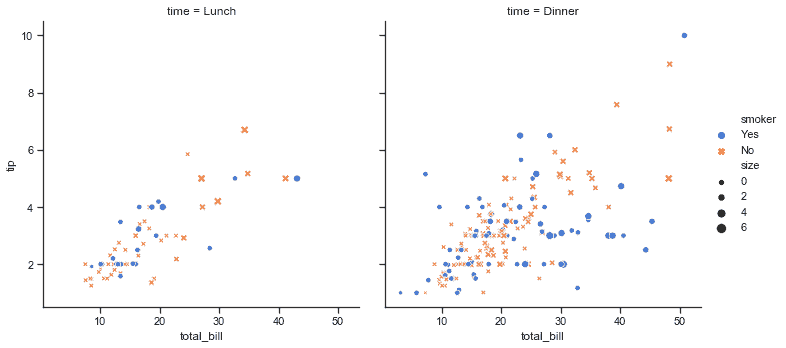

For figure-specific customization, all seaborn functions accept a number of optional parameters for switching to non-default semantic mappings, such as different colors. (Appropriate use of color is critical for effective data visualization, and seaborn has [extensive support](tutorial/color_palettes.html#palette-tutorial) for customizing color palettes).

Finally, where there is a direct correspondence with an underlying matplotlib function (like [`scatterplot()`](generated/seaborn.scatterplot.html#seaborn.scatterplot "seaborn.scatterplot") and `plt.scatter`), additional keyword arguments will be passed through to the matplotlib layer:

```py
sns.relplot(x="total_bill", y="tip", col="time",
            hue="size", style="smoker", size="size",
            palette="YlGnBu", markers=["D", "o"], sizes=(10, 125),
            edgecolor=".2", linewidth=.5, alpha=.75,
            data=tips);

```

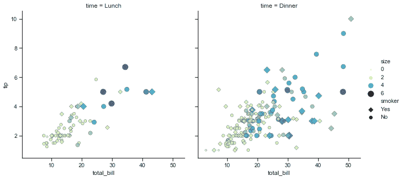

In the case of [`relplot()`](generated/seaborn.relplot.html#seaborn.relplot "seaborn.relplot") and other figure-level functions, that means there are a few levels of indirection because [`relplot()`](generated/seaborn.relplot.html#seaborn.relplot "seaborn.relplot") passes its exta keyword arguments to the underlying seaborn axes-level function, which passes _its_ extra keyword arguments to the underlying matplotlib function. So it might take some effort to find the right documentation for the parameters you’ll need to use, but in principle an extremely high level of customization is possible.

Some customization of figure-level functions can be accomplished through additional parameters that get passed to [`FacetGrid`](generated/seaborn.FacetGrid.html#seaborn.FacetGrid "seaborn.FacetGrid"), and you can use the methods on that object to control many other properties of the figure. For even more tweaking, you can access the matplotlib objects that the plot is drawn onto, which are stored as attributes:

```py
g = sns.catplot(x="total_bill", y="day", hue="time",
                height=3.5, aspect=1.5,
                kind="box", legend=False, data=tips);
g.add_legend(title="Meal")
g.set_axis_labels("Total bill ($)", "")
g.set(xlim=(0, 60), yticklabels=["Thursday", "Friday", "Saturday", "Sunday"])
g.despine(trim=True)
g.fig.set_size_inches(6.5, 3.5)
g.ax.set_xticks([5, 15, 25, 35, 45, 55], minor=True);
plt.setp(g.ax.get_yticklabels(), rotation=30);

```

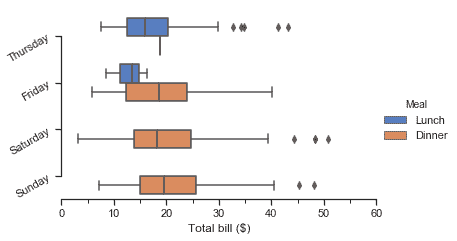

Because the figure-level functions are oriented towards efficient exploration, using them to manage a figure that you need to be precisely sized and organized may take more effort than setting up the figure directly in matplotlib and using the corresponding axes-level seaborn function. Matplotlib has a comprehensive and powerful API; just about any attribute of the figure can be changed to your liking. The hope is that a combination of seaborn’s high-level interface and matplotlib’s deep customizability will allow you to quickly explore your data and create graphics that can be tailored into a [publication quality](https://github.com/wagnerlabpapers/Waskom_PNAS_2017) final product.

## Organizing datasets

As mentioned above, seaborn will be most powerful when your datasets have a particular organization. This format ia alternately called “long-form” or “tidy” data and is described in detail by Hadley Wickham in this [academic paper](http://vita.had.co.nz/papers/tidy-data.html). The rules can be simply stated:

1.  Each variable is a column
2.  Each observation is a row

A helpful mindset for determining whether your data are tidy is to think backwards from the plot you want to draw. From this perspective, a “variable” is something that will be assigned a role in the plot. It may be useful to look at the example datasets and see how they are structured. For example, the first five rows of the “tips” dataset look like this:

```py
tips.head()

```

|  | total_bill | tip | sex | smoker | day | time | size |
| --- | --- | --- | --- | --- | --- | --- | --- |
| 0 | 16.99 | 1.01 | Female | No | Sun | Dinner | 2 |
| --- | --- | --- | --- | --- | --- | --- | --- |
| 1 | 10.34 | 1.66 | Male | No | Sun | Dinner | 3 |
| --- | --- | --- | --- | --- | --- | --- | --- |
| 2 | 21.01 | 3.50 | Male | No | Sun | Dinner | 3 |
| --- | --- | --- | --- | --- | --- | --- | --- |
| 3 | 23.68 | 3.31 | Male | No | Sun | Dinner | 2 |
| --- | --- | --- | --- | --- | --- | --- | --- |
| 4 | 24.59 | 3.61 | Female | No | Sun | Dinner | 4 |
| --- | --- | --- | --- | --- | --- | --- | --- |

In some domains, the tidy format might feel awkward at first. Timeseries data, for example, are sometimes stored with every timepoint as part of the same observational unit and appearing in the columns. The “fmri” dataset that we used [above](#intro-stat-estimation) illustrates how a tidy timeseries dataset has each timepoint in a different row:

```py
fmri.head()

```

|  | subject | timepoint | event | region | signal |
| --- | --- | --- | --- | --- | --- |
| 0 | s13 | 18 | stim | parietal | -0.017552 |
| --- | --- | --- | --- | --- | --- |
| 1 | s5 | 14 | stim | parietal | -0.080883 |
| --- | --- | --- | --- | --- | --- |
| 2 | s12 | 18 | stim | parietal | -0.081033 |
| --- | --- | --- | --- | --- | --- |
| 3 | s11 | 18 | stim | parietal | -0.046134 |
| --- | --- | --- | --- | --- | --- |
| 4 | s10 | 18 | stim | parietal | -0.037970 |
| --- | --- | --- | --- | --- | --- |

Many seaborn functions can plot wide-form data, but only with limited functionality. To take advantage of the features that depend on tidy-formatted data, you’ll likely find the `pandas.melt` function useful for “un-pivoting” a wide-form dataframe. More information and useful examples can be found [in this blog post](https://tomaugspurger.github.io/modern-5-tidy.html) by one of the pandas developers.

## Next steps

You have a few options for where to go next. You might first want to learn how to [install seaborn](installing.html#installing). Once that’s done, you can browse the [example gallery](examples/index.html#example-gallery) to get a broader sense for what kind of graphics seaborn can produce. Or you can read through the [official tutorial](tutorial.html#tutorial) for a deeper discussion of the different tools and what they are designed to accomplish. If you have a specific plot in mind and want to know how to make it, you could check out the [API reference](api.html#api-ref), which documents each function’s parameters and shows many examples to illustrate usage.