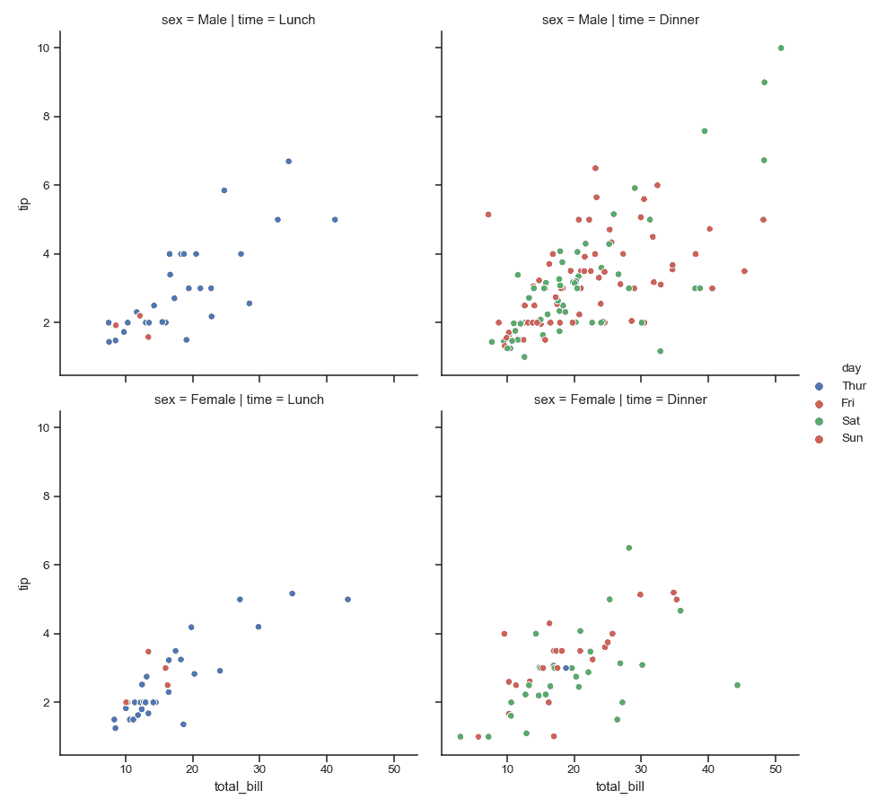
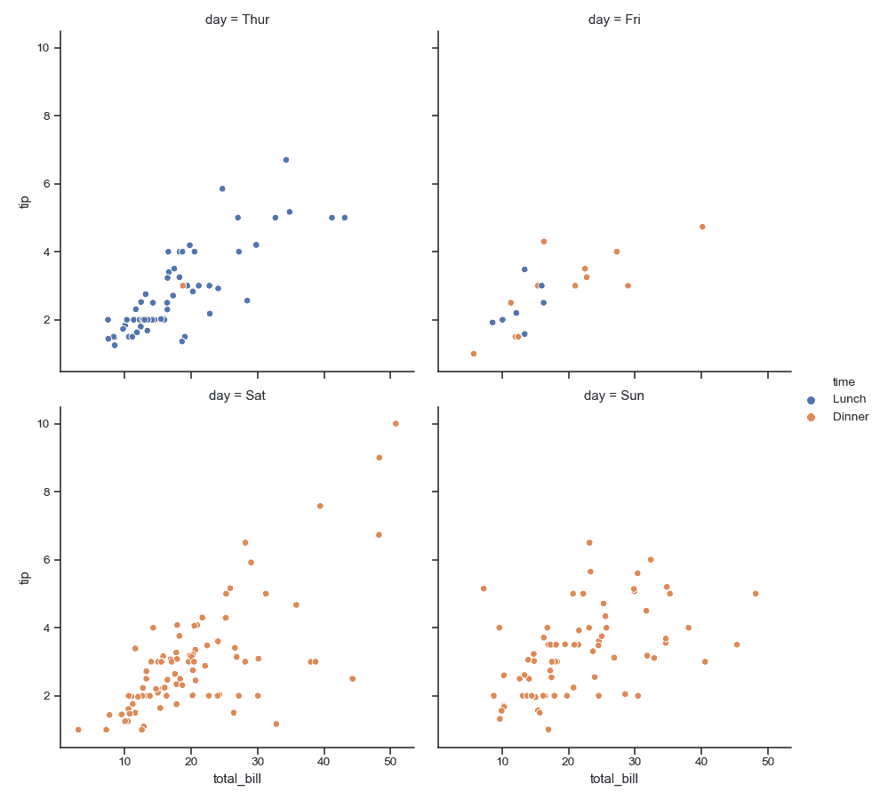
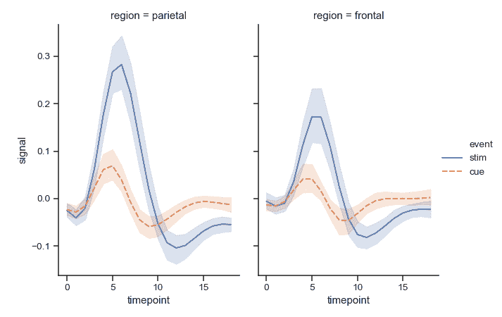

# seaborn.relplot

> 译者：[Stuming](https://github.com/Stuming)

```py
seaborn.relplot(x=None, y=None, hue=None, size=None, style=None, data=None, row=None, col=None, col_wrap=None, row_order=None, col_order=None, palette=None, hue_order=None, hue_norm=None, sizes=None, size_order=None, size_norm=None, markers=None, dashes=None, style_order=None, legend='brief', kind='scatter', height=5, aspect=1, facet_kws=None, **kwargs)
```

绘制相关关系图像到FacetGrid的图像级别接口。

此函数提供对一些不同轴级别函数的访问，这些函数通过子集的语义映射显示两个变量之间的关系。`kind`参数选择要使用的基础轴级函数：
*   [`scatterplot()`](seaborn.scatterplot.html#seaborn.scatterplot "seaborn.scatterplot") （通过`kind="scatter"`访问；默认为此）
*   [`lineplot()`](seaborn.lineplot.html#seaborn.lineplot "seaborn.lineplot") (通过`kind="line"`访问)

额外的关键字参数会被传递给隐含的函数，因此使用时应当参考对应函数的文档去了解各种选项。

对于数据不同子集的`x`与`y`的绘制关系可以通过`hue`, `size`以及`style`参数控制。这些参数控制使用哪些视觉语义来区分不同的子集。使用所有三个语义类型可以独立展示三个维度，但是这种方式得到的绘制结果难以被理解而且低效。使用多种语义（例如对相同变量同时使用`hue`及`style`）可以使图像更加易懂。

参考[tutorial](../tutorial/relational.html#relational-tutorial)获得更多信息。

绘制后，会返回带有图像的[`FacetGrid`](seaborn.FacetGrid.html#seaborn.FacetGrid "seaborn.FacetGrid")，随后可以直接进行图像细节调节或者加入其他图层。

值得注意的是，与直接使用隐含函数的方式不同，数据必须以长格式的DataFrame传入，同时变量通过`x`, `y`及其他参数指定。

参数：`x, y`：`data`中的变量名

> 输入数据的变量；数据必须为数值型。

`hue`: `data`中的名称，可选

> 将会产生具有不同颜色的元素的变量进行分组。这些变量可以是类别变量或者数值型变量，尽管颜色映射在后面的情况中会有不同的表现。

`size`：`data`中的名称，可选

> 将会产生具有不同尺寸的元素的变量进行分组。这些变量可以是类别变量或者数值型变量，尽管尺寸映射在后面的情况中会有不同的表现。

`style`：`data`中的名称，可选

> 将会产生具有不同风格的元素的变量进行分组。这些变量可以为数值型，但是通常会被当做类别变量处理。

`data`：DataFrame

> 长格式的DataFrame，每列是一个变量，每行是一个观察值。

`row, col`：`data`中的变量名，可选

> 确定网格的分面的类别变量。

`col_wrap`：int, 可选

> 以此宽度“包裹”列变量，以便列分面跨越多行。与`row`分面不兼容。

`row_order, col_order`：字符串列表，可选

> 以此顺序组织网格的行和/或列，否则顺序将从数据对象中推断。

`palette`：色盘名，列表，或者字典，可选

> 用于`hue`变量的不同级别的颜色。应当是[`color_palette()`](seaborn.color_palette.html#seaborn.color_palette "seaborn.color_palette")可以解释的东西，或者将色调级别映射到matplotlib颜色的字典。

`hue_order`：列表，可选

> 指定`hue`变量层级出现的顺序，否则会根据数据确定。当`hue`变量为数值型时与此无关。

`hue_norm`：tuple or Normalize object, optional

> Normalization in data units for colormap applied to the `hue` variable when it is numeric. Not relevant if it is categorical.

`sizes`：list, dict, or tuple, optional

> An object that determines how sizes are chosen when `size` is used. It can always be a list of size values or a dict mapping levels of the `size` variable to sizes. When `size` is numeric, it can also be a tuple specifying the minimum and maximum size to use such that other values are normalized within this range.

`size_order`：list, optional

> Specified order for appearance of the `size` variable levels, otherwise they are determined from the data. Not relevant when the `size` variable is numeric.

`size_norm`：tuple or Normalize object, optional

> Normalization in data units for scaling plot objects when the `size` variable is numeric.

`legend`：“brief”, “full”, or False, optional

> How to draw the legend. If “brief”, numeric `hue` and `size` variables will be represented with a sample of evenly spaced values. If “full”, every group will get an entry in the legend. If `False`, no legend data is added and no legend is drawn.

`kind`：string, optional

> Kind of plot to draw, corresponding to a seaborn relational plot. Options are {`scatter` and `line`}.

`height`：scalar, optional

> Height (in inches) of each facet. See also: `aspect`.

`aspect`：scalar, optional

> Aspect ratio of each facet, so that `aspect * height` gives the width of each facet in inches.

`facet_kws`：dict, optional

> Dictionary of other keyword arguments to pass to [`FacetGrid`](seaborn.FacetGrid.html#seaborn.FacetGrid "seaborn.FacetGrid").

`kwargs`：key, value pairings

> Other keyword arguments are passed through to the underlying plotting function.


返回值：`g`：[`FacetGrid`](seaborn.FacetGrid.html#seaborn.FacetGrid "seaborn.FacetGrid")

> Returns the [`FacetGrid`](seaborn.FacetGrid.html#seaborn.FacetGrid "seaborn.FacetGrid") object with the plot on it for further tweaking.


Examples

Draw a single facet to use the [`FacetGrid`](seaborn.FacetGrid.html#seaborn.FacetGrid "seaborn.FacetGrid") legend placement:

```py
>>> import seaborn as sns
>>> sns.set(style="ticks")
>>> tips = sns.load_dataset("tips")
>>> g = sns.relplot(x="total_bill", y="tip", hue="day", data=tips)

```


Facet on the columns with another variable:

```py
>>> g = sns.relplot(x="total_bill", y="tip",
...                 hue="day", col="time", data=tips)

```


Facet on the columns and rows:

```py
>>> g = sns.relplot(x="total_bill", y="tip", hue="day",
...                 col="time", row="sex", data=tips)

```



“Wrap” many column facets into multiple rows:

```py
>>> g = sns.relplot(x="total_bill", y="tip", hue="time",
...                 col="day", col_wrap=2, data=tips)

```



Use multiple semantic variables on each facet with specified attributes:

```py
>>> g = sns.relplot(x="total_bill", y="tip", hue="time", size="size",
...                 palette=["b", "r"], sizes=(10, 100),
...                 col="time", data=tips)

```


Use a different kind of plot:

```py
>>> fmri = sns.load_dataset("fmri")
>>> g = sns.relplot(x="timepoint", y="signal",
...                 hue="event", style="event", col="region",
...                 kind="line", data=fmri)

```


Change the size of each facet:

```py
>>> g = sns.relplot(x="timepoint", y="signal",
...                 hue="event", style="event", col="region",
...                 height=5, aspect=.7, kind="line", data=fmri)

```

