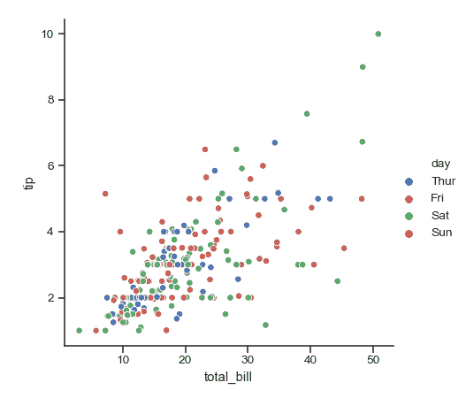
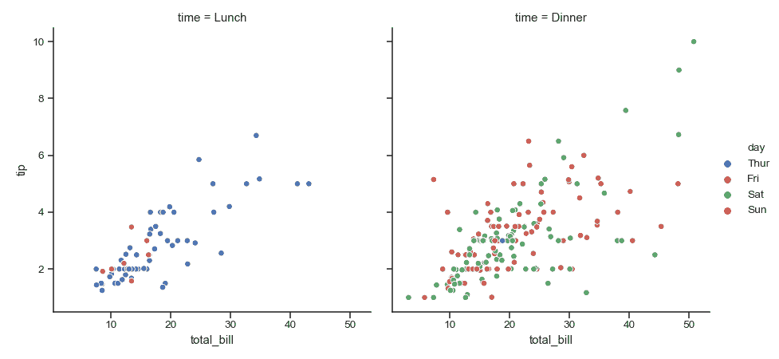
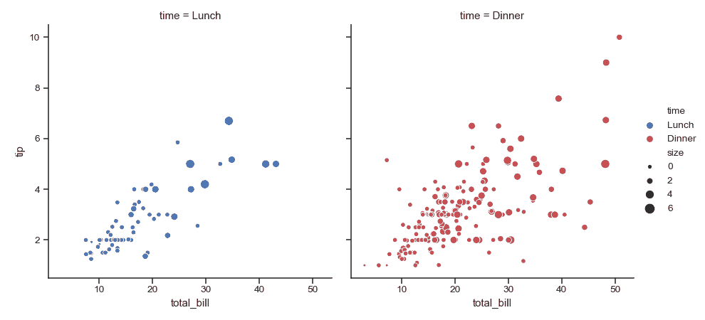
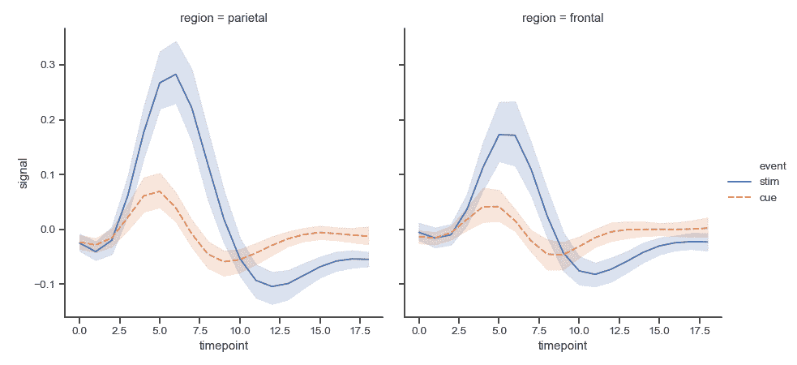

# seaborn.relplot

```py
seaborn.relplot(x=None, y=None, hue=None, size=None, style=None, data=None, row=None, col=None, col_wrap=None, row_order=None, col_order=None, palette=None, hue_order=None, hue_norm=None, sizes=None, size_order=None, size_norm=None, markers=None, dashes=None, style_order=None, legend='brief', kind='scatter', height=5, aspect=1, facet_kws=None, **kwargs)
```

Figure-level interface for drawing relational plots onto a FacetGrid.

This function provides access to several different axes-level functions that show the relationship between two variables with semantic mappings of subsets. The `kind` parameter selects the underlying axes-level function to use:

*   [`scatterplot()`](seaborn.scatterplot.html#seaborn.scatterplot "seaborn.scatterplot") (with `kind="scatter"`; the default)
*   [`lineplot()`](seaborn.lineplot.html#seaborn.lineplot "seaborn.lineplot") (with `kind="line"`)

Extra keyword arguments are passed to the underlying function, so you should refer to the documentation for each to see kind-specific options.

The relationship between `x` and `y` can be shown for different subsets of the data using the `hue`, `size`, and `style` parameters. These parameters control what visual semantics are used to identify the different subsets. It is possible to show up to three dimensions independently by using all three semantic types, but this style of plot can be hard to interpret and is often ineffective. Using redundant semantics (i.e. both `hue` and `style` for the same variable) can be helpful for making graphics more accessible.

See the [tutorial](../tutorial/relational.html#relational-tutorial) for more information.

After plotting, the [`FacetGrid`](seaborn.FacetGrid.html#seaborn.FacetGrid "seaborn.FacetGrid") with the plot is returned and can be used directly to tweak supporting plot details or add other layers.

Note that, unlike when using the underlying plotting functions directly, data must be passed in a long-form DataFrame with variables specified by passing strings to `x`, `y`, and other parameters.

参数：`x, y`：names of variables in `data`

> Input data variables; must be numeric.

`hue`：name in `data`, optional

> Grouping variable that will produce elements with different colors. Can be either categorical or numeric, although color mapping will behave differently in latter case.

`size`：name in `data`, optional

> Grouping variable that will produce elements with different sizes. Can be either categorical or numeric, although size mapping will behave differently in latter case.

`style`：name in `data`, optional

> Grouping variable that will produce elements with different styles. Can have a numeric dtype but will always be treated as categorical.

`data`：DataFrame

> Tidy (“long-form”) dataframe where each column is a variable and each row is an observation.

`row, col`：names of variables in `data`, optional

> Categorical variables that will determine the faceting of the grid.

`col_wrap`：int, optional

> “Wrap” the column variable at this width, so that the column facets span multiple rows. Incompatible with a `row` facet.

`row_order, col_order`：lists of strings, optional

> Order to organize the rows and/or columns of the grid in, otherwise the orders are inferred from the data objects.

`palette`：palette name, list, or dict, optional

> Colors to use for the different levels of the `hue` variable. Should be something that can be interpreted by [`color_palette()`](seaborn.color_palette.html#seaborn.color_palette "seaborn.color_palette"), or a dictionary mapping hue levels to matplotlib colors.

`hue_order`：list, optional

> Specified order for the appearance of the `hue` variable levels, otherwise they are determined from the data. Not relevant when the `hue` variable is numeric.

`hue_norm`：tuple or Normalize object, optional

> Normalization in data units for colormap applied to the `hue` variable when it is numeric. Not relevant if it is categorical.

`sizes`：list, dict, or tuple, optional

> An object that determines how sizes are chosen when `size` is used. It can always be a list of size values or a dict mapping levels of the `size` variable to sizes. When `size` is numeric, it can also be a tuple specifying the minimum and maximum size to use such that other values are normalized within this range.

`size_order`：list, optional

> Specified order for appearance of the `size` variable levels, otherwise they are determined from the data. Not relevant when the `size` variable is numeric.

`size_norm`：tuple or Normalize object, optional

> Normalization in data units for scaling plot objects when the `size` variable is numeric.

`legend`：“brief”, “full”, or False, optional

> How to draw the legend. If “brief”, numeric `hue` and `size` variables will be represented with a sample of evenly spaced values. If “full”, every group will get an entry in the legend. If `False`, no legend data is added and no legend is drawn.

`kind`：string, optional

> Kind of plot to draw, corresponding to a seaborn relational plot. Options are {`scatter` and `line`}.

`height`：scalar, optional

> Height (in inches) of each facet. See also: `aspect`.

`aspect`：scalar, optional

> Aspect ratio of each facet, so that `aspect * height` gives the width of each facet in inches.

`facet_kws`：dict, optional

> Dictionary of other keyword arguments to pass to [`FacetGrid`](seaborn.FacetGrid.html#seaborn.FacetGrid "seaborn.FacetGrid").

`kwargs`：key, value pairings

> Other keyword arguments are passed through to the underlying plotting function.


返回值：`g`：[`FacetGrid`](seaborn.FacetGrid.html#seaborn.FacetGrid "seaborn.FacetGrid")

> Returns the [`FacetGrid`](seaborn.FacetGrid.html#seaborn.FacetGrid "seaborn.FacetGrid") object with the plot on it for further tweaking.


Examples

Draw a single facet to use the [`FacetGrid`](seaborn.FacetGrid.html#seaborn.FacetGrid "seaborn.FacetGrid") legend placement:

```py
>>> import seaborn as sns
>>> sns.set(style="ticks")
>>> tips = sns.load_dataset("tips")
>>> g = sns.relplot(x="total_bill", y="tip", hue="day", data=tips)

```



Facet on the columns with another variable:

```py
>>> g = sns.relplot(x="total_bill", y="tip",
...                 hue="day", col="time", data=tips)

```



Facet on the columns and rows:

```py
>>> g = sns.relplot(x="total_bill", y="tip", hue="day",
...                 col="time", row="sex", data=tips)

```


“Wrap” many column facets into multiple rows:

```py
>>> g = sns.relplot(x="total_bill", y="tip", hue="time",
...                 col="day", col_wrap=2, data=tips)

```


Use multiple semantic variables on each facet with specified attributes:

```py
>>> g = sns.relplot(x="total_bill", y="tip", hue="time", size="size",
...                 palette=["b", "r"], sizes=(10, 100),
...                 col="time", data=tips)

```



Use a different kind of plot:

```py
>>> fmri = sns.load_dataset("fmri")
>>> g = sns.relplot(x="timepoint", y="signal",
...                 hue="event", style="event", col="region",
...                 kind="line", data=fmri)

```



Change the size of each facet:

```py
>>> g = sns.relplot(x="timepoint", y="signal",
...                 hue="event", style="event", col="region",
...                 height=5, aspect=.7, kind="line", data=fmri)

```

