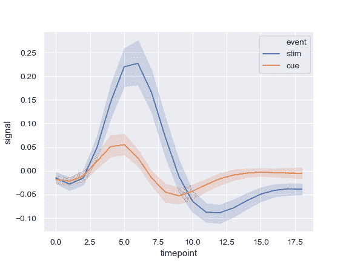
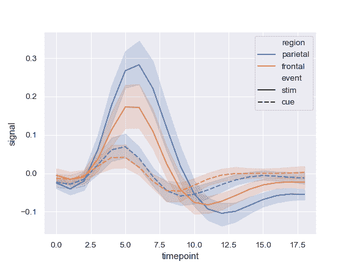
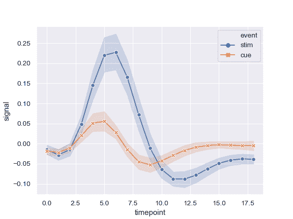
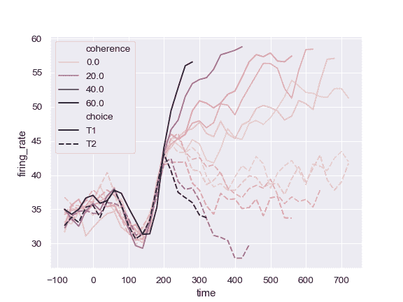
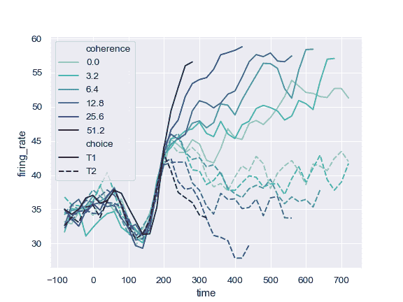
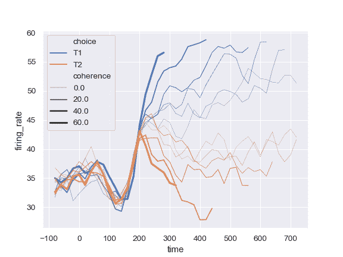
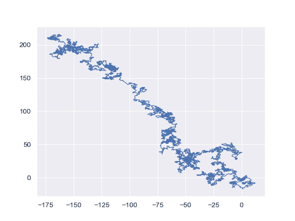

# seaborn.lineplot

```py
seaborn.lineplot(x=None, y=None, hue=None, size=None, style=None, data=None, palette=None, hue_order=None, hue_norm=None, sizes=None, size_order=None, size_norm=None, dashes=True, markers=None, style_order=None, units=None, estimator='mean', ci=95, n_boot=1000, sort=True, err_style='band', err_kws=None, legend='brief', ax=None, **kwargs)
```

Draw a line plot with possibility of several semantic groupings.

The relationship between `x` and `y` can be shown for different subsets of the data using the `hue`, `size`, and `style` parameters. These parameters control what visual semantics are used to identify the different subsets. It is possible to show up to three dimensions independently by using all three semantic types, but this style of plot can be hard to interpret and is often ineffective. Using redundant semantics (i.e. both `hue` and `style` for the same variable) can be helpful for making graphics more accessible.

See the [tutorial](../tutorial/relational.html#relational-tutorial) for more information.

By default, the plot aggregates over multiple `y` values at each value of `x` and shows an estimate of the central tendency and a confidence interval for that estimate.

| Parameters: | **x, y** : names of variables in `data` or vector data, optional

> Input data variables; must be numeric. Can pass data directly or reference columns in `data`.

**hue** : name of variables in `data` or vector data, optional

> Grouping variable that will produce lines with different colors. Can be either categorical or numeric, although color mapping will behave differently in latter case.

**size** : name of variables in `data` or vector data, optional

> Grouping variable that will produce lines with different widths. Can be either categorical or numeric, although size mapping will behave differently in latter case.

**style** : name of variables in `data` or vector data, optional

> Grouping variable that will produce lines with different dashes and/or markers. Can have a numeric dtype but will always be treated as categorical.

**data** : DataFrame

> Tidy (“long-form”) dataframe where each column is a variable and each row is an observation.

**palette** : palette name, list, or dict, optional

> Colors to use for the different levels of the `hue` variable. Should be something that can be interpreted by [`color_palette()`](seaborn.color_palette.html#seaborn.color_palette "seaborn.color_palette"), or a dictionary mapping hue levels to matplotlib colors.

**hue_order** : list, optional

> Specified order for the appearance of the `hue` variable levels, otherwise they are determined from the data. Not relevant when the `hue` variable is numeric.

**hue_norm** : tuple or Normalize object, optional

> Normalization in data units for colormap applied to the `hue` variable when it is numeric. Not relevant if it is categorical.

**sizes** : list, dict, or tuple, optional

> An object that determines how sizes are chosen when `size` is used. It can always be a list of size values or a dict mapping levels of the `size` variable to sizes. When `size` is numeric, it can also be a tuple specifying the minimum and maximum size to use such that other values are normalized within this range.

**size_order** : list, optional

> Specified order for appearance of the `size` variable levels, otherwise they are determined from the data. Not relevant when the `size` variable is numeric.

**size_norm** : tuple or Normalize object, optional

> Normalization in data units for scaling plot objects when the `size` variable is numeric.

**dashes** : boolean, list, or dictionary, optional

> Object determining how to draw the lines for different levels of the `style` variable. Setting to `True` will use default dash codes, or you can pass a list of dash codes or a dictionary mapping levels of the `style` variable to dash codes. Setting to `False` will use solid lines for all subsets. Dashes are specified as in matplotlib: a tuple of `(segment, gap)` lengths, or an empty string to draw a solid line.

**markers** : boolean, list, or dictionary, optional

> Object determining how to draw the markers for different levels of the `style` variable. Setting to `True` will use default markers, or you can pass a list of markers or a dictionary mapping levels of the `style` variable to markers. Setting to `False` will draw marker-less lines. Markers are specified as in matplotlib.

**style_order** : list, optional

> Specified order for appearance of the `style` variable levels otherwise they are determined from the data. Not relevant when the `style` variable is numeric.

**units** : {long_form_var}

> Grouping variable identifying sampling units. When used, a separate line will be drawn for each unit with appropriate semantics, but no legend entry will be added. Useful for showing distribution of experimental replicates when exact identities are not needed.

**estimator** : name of pandas method or callable or None, optional

> Method for aggregating across multiple observations of the `y` variable at the same `x` level. If `None`, all observations will be drawn.

**ci** : int or “sd” or None, optional

> Size of the confidence interval to draw when aggregating with an estimator. “sd” means to draw the standard deviation of the data. Setting to `None` will skip bootstrapping.

**n_boot** : int, optional

> Number of bootstraps to use for computing the confidence interval.

**sort** : boolean, optional

> If True, the data will be sorted by the x and y variables, otherwise lines will connect points in the order they appear in the dataset.

**err_style** : “band” or “bars”, optional

> Whether to draw the confidence intervals with translucent error bands or discrete error bars.

**err_band** : dict of keyword arguments

> Additional paramters to control the aesthetics of the error bars. The kwargs are passed either to `ax.fill_between` or `ax.errorbar`, depending on the `err_style`.

**legend** : “brief”, “full”, or False, optional

> How to draw the legend. If “brief”, numeric `hue` and `size` variables will be represented with a sample of evenly spaced values. If “full”, every group will get an entry in the legend. If `False`, no legend data is added and no legend is drawn.

**ax** : matplotlib Axes, optional

> Axes object to draw the plot onto, otherwise uses the current Axes.

**kwargs** : key, value mappings

> Other keyword arguments are passed down to `plt.plot` at draw time.

 |
| --- | --- |
| Returns: | **ax** : matplotlib Axes

> Returns the Axes object with the plot drawn onto it.

 |
| --- | --- |

See also

Show the relationship between two variables without emphasizing continuity of the `x` variable.Show the relationship between two variables when one is categorical.

Examples

Draw a single line plot with error bands showing a confidence interval:

```py
>>> import seaborn as sns; sns.set()
>>> import matplotlib.pyplot as plt
>>> fmri = sns.load_dataset("fmri")
>>> ax = sns.lineplot(x="timepoint", y="signal", data=fmri)

```


Group by another variable and show the groups with different colors:

```py
>>> ax = sns.lineplot(x="timepoint", y="signal", hue="event",
...                   data=fmri)

```



Show the grouping variable with both color and line dashing:

```py
>>> ax = sns.lineplot(x="timepoint", y="signal",
...                   hue="event", style="event", data=fmri)

```


Use color and line dashing to represent two different grouping variables:

```py
>>> ax = sns.lineplot(x="timepoint", y="signal",
...                   hue="region", style="event", data=fmri)

```



Use markers instead of the dashes to identify groups:

```py
>>> ax = sns.lineplot(x="timepoint", y="signal",
...                   hue="event", style="event",
...                   markers=True, dashes=False, data=fmri)

```



Show error bars instead of error bands and plot the standard error:

```py
>>> ax = sns.lineplot(x="timepoint", y="signal", hue="event",
...                   err_style="bars", ci=68, data=fmri)

```


Show experimental replicates instead of aggregating:

```py
>>> ax = sns.lineplot(x="timepoint", y="signal", hue="event",
...                   units="subject", estimator=None, lw=1,
...                   data=fmri.query("region == 'frontal'"))

```


Use a quantitative color mapping:

```py
>>> dots = sns.load_dataset("dots").query("align == 'dots'")
>>> ax = sns.lineplot(x="time", y="firing_rate",
...                   hue="coherence", style="choice",
...                   data=dots)

```



Use a different normalization for the colormap:

```py
>>> from matplotlib.colors import LogNorm
>>> ax = sns.lineplot(x="time", y="firing_rate",
...                   hue="coherence", style="choice",
...                   hue_norm=LogNorm(), data=dots)

```


Use a different color palette:

```py
>>> ax = sns.lineplot(x="time", y="firing_rate",
...                   hue="coherence", style="choice",
...                   palette="ch:2.5,.25", data=dots)

```


Use specific color values, treating the hue variable as categorical:

```py
>>> palette = sns.color_palette("mako_r", 6)
>>> ax = sns.lineplot(x="time", y="firing_rate",
...                   hue="coherence", style="choice",
...                   palette=palette, data=dots)

```



Change the width of the lines with a quantitative variable:

```py
>>> ax = sns.lineplot(x="time", y="firing_rate",
...                   size="coherence", hue="choice",
...                   legend="full", data=dots)

```


Change the range of line widths used to normalize the size variable:

```py
>>> ax = sns.lineplot(x="time", y="firing_rate",
...                   size="coherence", hue="choice",
...                   sizes=(.25, 2.5), data=dots)

```



Plot from a wide-form DataFrame:

```py
>>> import numpy as np, pandas as pd; plt.close("all")
>>> index = pd.date_range("1 1 2000", periods=100,
...                       freq="m", name="date")
>>> data = np.random.randn(100, 4).cumsum(axis=0)
>>> wide_df = pd.DataFrame(data, index, ["a", "b", "c", "d"])
>>> ax = sns.lineplot(data=wide_df)

```


Plot from a list of Series:

```py
>>> list_data = [wide_df.loc[:"2005", "a"], wide_df.loc["2003":, "b"]]
>>> ax = sns.lineplot(data=list_data)

```


Plot a single Series, pass kwargs to `plt.plot`:

```py
>>> ax = sns.lineplot(data=wide_df["a"], color="coral", label="line")

```


Draw lines at points as they appear in the dataset:

```py
>>> x, y = np.random.randn(2, 5000).cumsum(axis=1)
>>> ax = sns.lineplot(x=x, y=y, sort=False, lw=1)

```

