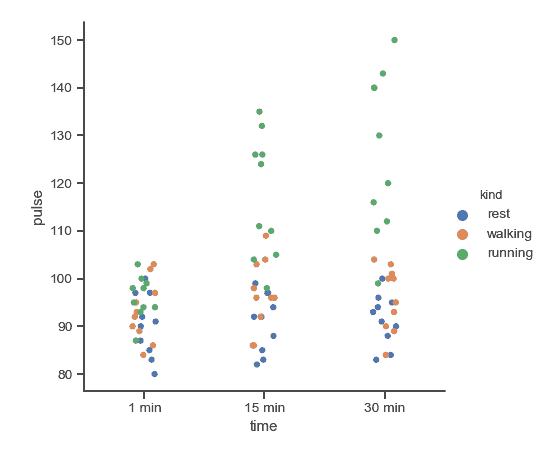
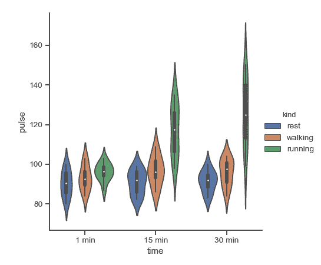
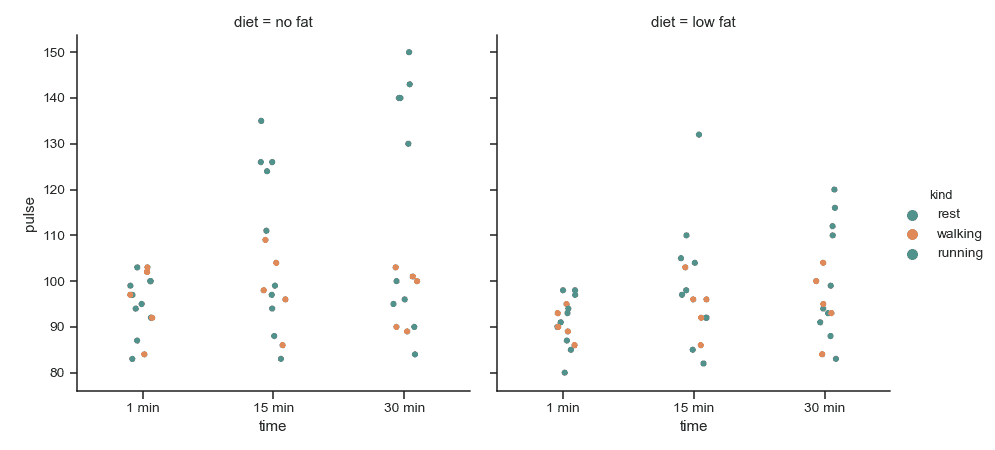
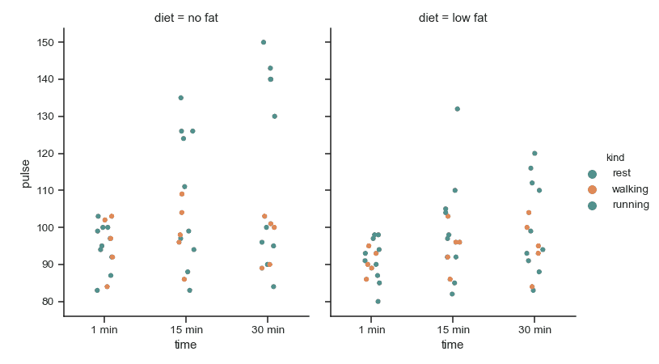
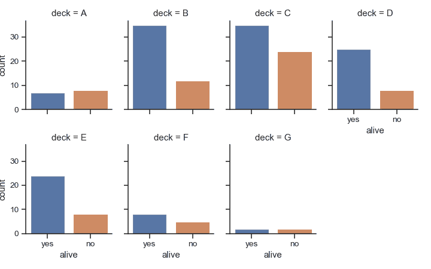
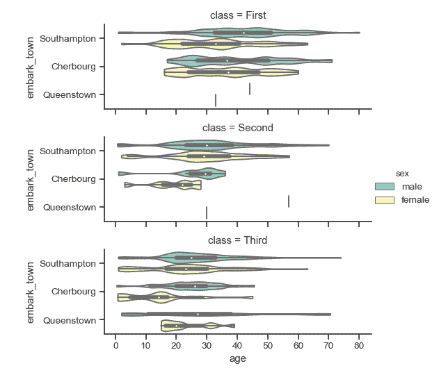
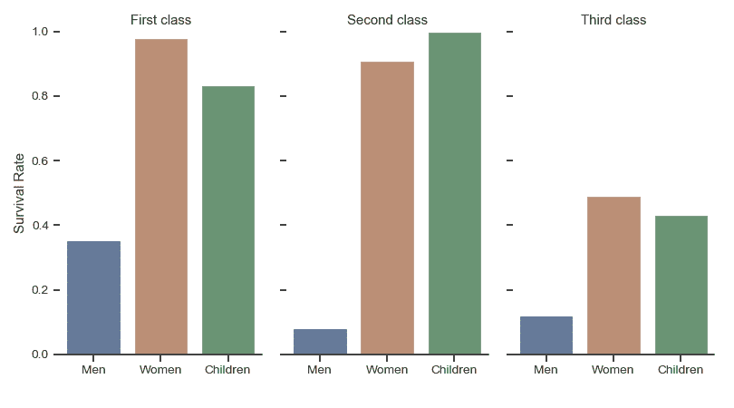

# seaborn.catplot

```py
seaborn.catplot(x=None, y=None, hue=None, data=None, row=None, col=None, col_wrap=None, estimator=<function mean>, ci=95, n_boot=1000, units=None, order=None, hue_order=None, row_order=None, col_order=None, kind='strip', height=5, aspect=1, orient=None, color=None, palette=None, legend=True, legend_out=True, sharex=True, sharey=True, margin_titles=False, facet_kws=None, **kwargs)
```

Figure-level interface for drawing categorical plots onto a FacetGrid.

This function provides access to several axes-level functions that show the relationship between a numerical and one or more categorical variables using one of several visual representations. The `kind` parameter selects the underlying axes-level function to use:

Categorical scatterplots:

*   [`stripplot()`](seaborn.stripplot.html#seaborn.stripplot "seaborn.stripplot") (with `kind="strip"`; the default)
*   [`swarmplot()`](seaborn.swarmplot.html#seaborn.swarmplot "seaborn.swarmplot") (with `kind="swarm"`)

Categorical distribution plots:

*   [`boxplot()`](seaborn.boxplot.html#seaborn.boxplot "seaborn.boxplot") (with `kind="box"`)
*   [`violinplot()`](seaborn.violinplot.html#seaborn.violinplot "seaborn.violinplot") (with `kind="violin"`)
*   [`boxenplot()`](seaborn.boxenplot.html#seaborn.boxenplot "seaborn.boxenplot") (with `kind="boxen"`)

Categorical estimate plots:

*   [`pointplot()`](seaborn.pointplot.html#seaborn.pointplot "seaborn.pointplot") (with `kind="point"`)
*   [`barplot()`](seaborn.barplot.html#seaborn.barplot "seaborn.barplot") (with `kind="bar"`)
*   [`countplot()`](seaborn.countplot.html#seaborn.countplot "seaborn.countplot") (with `kind="count"`)

Extra keyword arguments are passed to the underlying function, so you should refer to the documentation for each to see kind-specific options.

Note that unlike when using the axes-level functions directly, data must be passed in a long-form DataFrame with variables specified by passing strings to `x`, `y`, `hue`, etc.

As in the case with the underlying plot functions, if variables have a `categorical` data type, the the levels of the categorical variables, and their order will be inferred from the objects. Otherwise you may have to use alter the dataframe sorting or use the function parameters (`orient`, `order`, `hue_order`, etc.) to set up the plot correctly.

This function always treats one of the variables as categorical and draws data at ordinal positions (0, 1, … n) on the relevant axis, even when the data has a numeric or date type.

See the [tutorial](../tutorial/categorical.html#categorical-tutorial) for more information.

After plotting, the [`FacetGrid`](seaborn.FacetGrid.html#seaborn.FacetGrid "seaborn.FacetGrid") with the plot is returned and can be used directly to tweak supporting plot details or add other layers.

| Parameters: | **x, y, hue** : names of variables in `data`

> Inputs for plotting long-form data. See examples for interpretation.

**data** : DataFrame

> Long-form (tidy) dataset for plotting. Each column should correspond to a variable, and each row should correspond to an observation.

**row, col** : names of variables in `data`, optional

> Categorical variables that will determine the faceting of the grid.

**col_wrap** : int, optional

> “Wrap” the column variable at this width, so that the column facets span multiple rows. Incompatible with a `row` facet.

**estimator** : callable that maps vector -&gt; scalar, optional

> Statistical function to estimate within each categorical bin.

**ci** : float or “sd” or None, optional

> Size of confidence intervals to draw around estimated values. If “sd”, skip bootstrapping and draw the standard deviation of the observations. If `None`, no bootstrapping will be performed, and error bars will not be drawn.

**n_boot** : int, optional

> Number of bootstrap iterations to use when computing confidence intervals.

**units** : name of variable in `data` or vector data, optional

> Identifier of sampling units, which will be used to perform a multilevel bootstrap and account for repeated measures design.

**order, hue_order** : lists of strings, optional

> Order to plot the categorical levels in, otherwise the levels are inferred from the data objects.

**row_order, col_order** : lists of strings, optional

> Order to organize the rows and/or columns of the grid in, otherwise the orders are inferred from the data objects.

**kind** : string, optional

> The kind of plot to draw (corresponds to the name of a categorical plotting function. Options are: “point”, “bar”, “strip”, “swarm”, “box”, “violin”, or “boxen”.

**height** : scalar, optional

> Height (in inches) of each facet. See also: `aspect`.

**aspect** : scalar, optional

> Aspect ratio of each facet, so that `aspect * height` gives the width of each facet in inches.

**orient** : “v” &#124; “h”, optional

> Orientation of the plot (vertical or horizontal). This is usually inferred from the dtype of the input variables, but can be used to specify when the “categorical” variable is a numeric or when plotting wide-form data.

**color** : matplotlib color, optional

> Color for all of the elements, or seed for a gradient palette.

**palette** : palette name, list, or dict, optional

> Colors to use for the different levels of the `hue` variable. Should be something that can be interpreted by [`color_palette()`](seaborn.color_palette.html#seaborn.color_palette "seaborn.color_palette"), or a dictionary mapping hue levels to matplotlib colors.

**legend** : bool, optional

> If `True` and there is a `hue` variable, draw a legend on the plot.

**legend_out** : bool, optional

> If `True`, the figure size will be extended, and the legend will be drawn outside the plot on the center right.

**share{x,y}** : bool, ‘col’, or ‘row’ optional

> If true, the facets will share y axes across columns and/or x axes across rows.

**margin_titles** : bool, optional

> If `True`, the titles for the row variable are drawn to the right of the last column. This option is experimental and may not work in all cases.

**facet_kws** : dict, optional

> Dictionary of other keyword arguments to pass to [`FacetGrid`](seaborn.FacetGrid.html#seaborn.FacetGrid "seaborn.FacetGrid").

**kwargs** : key, value pairings

> Other keyword arguments are passed through to the underlying plotting function.

 |
| --- | --- |
| Returns: | **g** : [`FacetGrid`](seaborn.FacetGrid.html#seaborn.FacetGrid "seaborn.FacetGrid")

> Returns the [`FacetGrid`](seaborn.FacetGrid.html#seaborn.FacetGrid "seaborn.FacetGrid") object with the plot on it for further tweaking.

 |
| --- | --- |

Examples

Draw a single facet to use the [`FacetGrid`](seaborn.FacetGrid.html#seaborn.FacetGrid "seaborn.FacetGrid") legend placement:

```py
>>> import seaborn as sns
>>> sns.set(style="ticks")
>>> exercise = sns.load_dataset("exercise")
>>> g = sns.catplot(x="time", y="pulse", hue="kind", data=exercise)

```



Use a different plot kind to visualize the same data:

```py
>>> g = sns.catplot(x="time", y="pulse", hue="kind",
...                data=exercise, kind="violin")

```



Facet along the columns to show a third categorical variable:

```py
>>> g = sns.catplot(x="time", y="pulse", hue="kind",
...                 col="diet", data=exercise)

```



Use a different height and aspect ratio for the facets:

```py
>>> g = sns.catplot(x="time", y="pulse", hue="kind",
...                 col="diet", data=exercise,
...                 height=5, aspect=.8)

```



Make many column facets and wrap them into the rows of the grid:

```py
>>> titanic = sns.load_dataset("titanic")
>>> g = sns.catplot("alive", col="deck", col_wrap=4,
...                 data=titanic[titanic.deck.notnull()],
...                 kind="count", height=2.5, aspect=.8)

```



Plot horizontally and pass other keyword arguments to the plot function:

```py
>>> g = sns.catplot(x="age", y="embark_town",
...                 hue="sex", row="class",
...                 data=titanic[titanic.embark_town.notnull()],
...                 orient="h", height=2, aspect=3, palette="Set3",
...                 kind="violin", dodge=True, cut=0, bw=.2)

```



Use methods on the returned [`FacetGrid`](seaborn.FacetGrid.html#seaborn.FacetGrid "seaborn.FacetGrid") to tweak the presentation:

```py
>>> g = sns.catplot(x="who", y="survived", col="class",
...                 data=titanic, saturation=.5,
...                 kind="bar", ci=None, aspect=.6)
>>> (g.set_axis_labels("", "Survival Rate")
...   .set_xticklabels(["Men", "Women", "Children"])
...   .set_titles("{col_name}  {col_var}")
...   .set(ylim=(0, 1))
...   .despine(left=True))  
<seaborn.axisgrid.FacetGrid object at 0x...>

```

