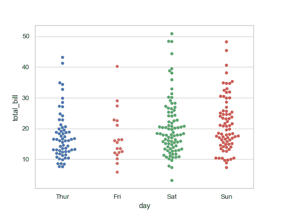
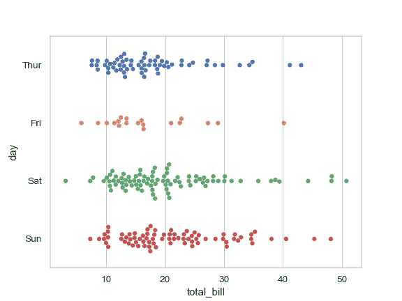
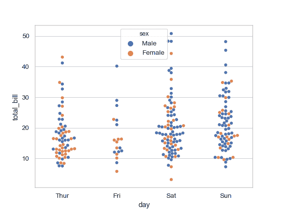
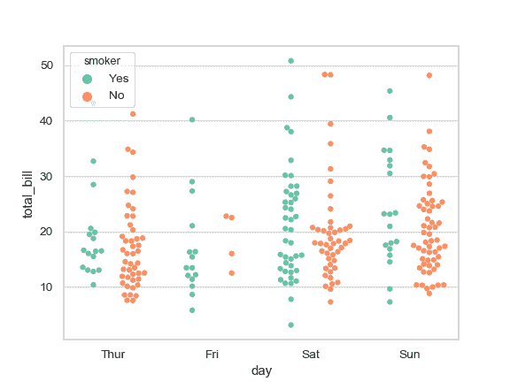
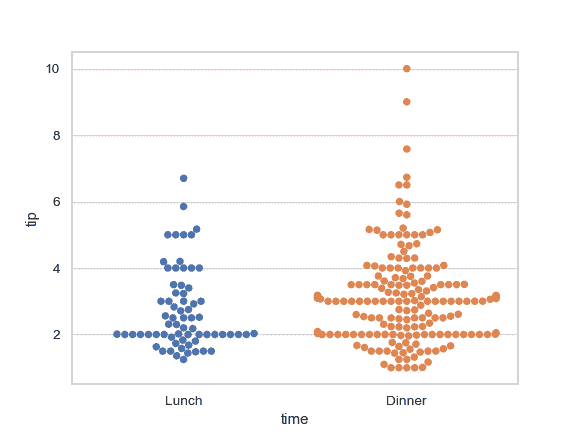

# seaborn.swarmplot

```py
seaborn.swarmplot(x=None, y=None, hue=None, data=None, order=None, hue_order=None, dodge=False, orient=None, color=None, palette=None, size=5, edgecolor='gray', linewidth=0, ax=None, **kwargs)
```

Draw a categorical scatterplot with non-overlapping points.

This function is similar to [`stripplot()`](seaborn.stripplot.html#seaborn.stripplot "seaborn.stripplot"), but the points are adjusted (only along the categorical axis) so that they don’t overlap. This gives a better representation of the distribution of values, but it does not scale well to large numbers of observations. This style of plot is sometimes called a “beeswarm”.

A swarm plot can be drawn on its own, but it is also a good complement to a box or violin plot in cases where you want to show all observations along with some representation of the underlying distribution.

Arranging the points properly requires an accurate transformation between data and point coordinates. This means that non-default axis limits must be set _before_ drawing the plot.

Input data can be passed in a variety of formats, including:

*   Vectors of data represented as lists, numpy arrays, or pandas Series objects passed directly to the `x`, `y`, and/or `hue` parameters.
*   A “long-form” DataFrame, in which case the `x`, `y`, and `hue` variables will determine how the data are plotted.
*   A “wide-form” DataFrame, such that each numeric column will be plotted.
*   An array or list of vectors.

In most cases, it is possible to use numpy or Python objects, but pandas objects are preferable because the associated names will be used to annotate the axes. Additionally, you can use Categorical types for the grouping variables to control the order of plot elements.

This function always treats one of the variables as categorical and draws data at ordinal positions (0, 1, … n) on the relevant axis, even when the data has a numeric or date type.

See the [tutorial](../tutorial/categorical.html#categorical-tutorial) for more information.

参数：`x, y, hue`：names of variables in `data` or vector data, optional

> Inputs for plotting long-form data. See examples for interpretation.

`data`：DataFrame, array, or list of arrays, optional

> Dataset for plotting. If `x` and `y` are absent, this is interpreted as wide-form. Otherwise it is expected to be long-form.

`order, hue_order`：lists of strings, optional

> Order to plot the categorical levels in, otherwise the levels are inferred from the data objects.

`dodge`：bool, optional

> When using `hue` nesting, setting this to `True` will separate the strips for different hue levels along the categorical axis. Otherwise, the points for each level will be plotted in one swarm.

`orient`：“v” &#124; “h”, optional

> Orientation of the plot (vertical or horizontal). This is usually inferred from the dtype of the input variables, but can be used to specify when the “categorical” variable is a numeric or when plotting wide-form data.

`color`：matplotlib color, optional

> Color for all of the elements, or seed for a gradient palette.

`palette`：palette name, list, or dict, optional

> Colors to use for the different levels of the `hue` variable. Should be something that can be interpreted by [`color_palette()`](seaborn.color_palette.html#seaborn.color_palette "seaborn.color_palette"), or a dictionary mapping hue levels to matplotlib colors.

`size`：float, optional

> Diameter of the markers, in points. (Although `plt.scatter` is used to draw the points, the `size` argument here takes a “normal” markersize and not size^2 like `plt.scatter`.

`edgecolor`：matplotlib color, “gray” is special-cased, optional

> Color of the lines around each point. If you pass `"gray"`, the brightness is determined by the color palette used for the body of the points.

`linewidth`：float, optional

> Width of the gray lines that frame the plot elements.

`ax`：matplotlib Axes, optional

> Axes object to draw the plot onto, otherwise uses the current Axes.


返回值：`ax`：matplotlib Axes

> Returns the Axes object with the plot drawn onto it.


See also

A traditional box-and-whisker plot with a similar API.A combination of boxplot and kernel density estimation.A scatterplot where one variable is categorical. Can be used in conjunction with other plots to show each observation.Combine a categorical plot with a class:<cite>FacetGrid</cite>.

Examples

Draw a single horizontal swarm plot:

```py
>>> import seaborn as sns
>>> sns.set(style="whitegrid")
>>> tips = sns.load_dataset("tips")
>>> ax = sns.swarmplot(x=tips["total_bill"])

```


Group the swarms by a categorical variable:

```py
>>> ax = sns.swarmplot(x="day", y="total_bill", data=tips)

```



Draw horizontal swarms:

```py
>>> ax = sns.swarmplot(x="total_bill", y="day", data=tips)

```



Color the points using a second categorical variable:

```py
>>> ax = sns.swarmplot(x="day", y="total_bill", hue="sex", data=tips)

```



Split each level of the `hue` variable along the categorical axis:

```py
>>> ax = sns.swarmplot(x="day", y="total_bill", hue="smoker",
...                    data=tips, palette="Set2", dodge=True)

```



Control swarm order by passing an explicit order:

```py
>>> ax = sns.swarmplot(x="time", y="tip", data=tips,
...                    order=["Dinner", "Lunch"])

```


Plot using larger points:

```py
>>> ax = sns.swarmplot(x="time", y="tip", data=tips, size=6)

```



Draw swarms of observations on top of a box plot:

```py
>>> ax = sns.boxplot(x="tip", y="day", data=tips, whis=np.inf)
>>> ax = sns.swarmplot(x="tip", y="day", data=tips, color=".2")

```


Draw swarms of observations on top of a violin plot:

```py
>>> ax = sns.violinplot(x="day", y="total_bill", data=tips, inner=None)
>>> ax = sns.swarmplot(x="day", y="total_bill", data=tips,
...                    color="white", edgecolor="gray")

```


Use [`catplot()`](seaborn.catplot.html#seaborn.catplot "seaborn.catplot") to combine a [`swarmplot()`](#seaborn.swarmplot "seaborn.swarmplot") and a [`FacetGrid`](seaborn.FacetGrid.html#seaborn.FacetGrid "seaborn.FacetGrid"). This allows grouping within additional categorical variables. Using [`catplot()`](seaborn.catplot.html#seaborn.catplot "seaborn.catplot") is safer than using [`FacetGrid`](seaborn.FacetGrid.html#seaborn.FacetGrid "seaborn.FacetGrid") directly, as it ensures synchronization of variable order across facets:

```py
>>> g = sns.catplot(x="sex", y="total_bill",
...                 hue="smoker", col="time",
...                 data=tips, kind="swarm",
...                 height=4, aspect=.7);

```

