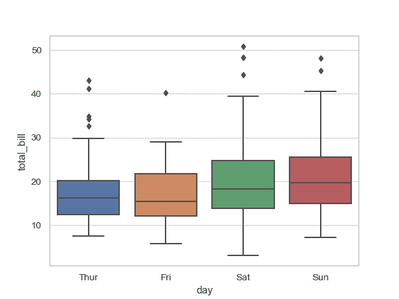
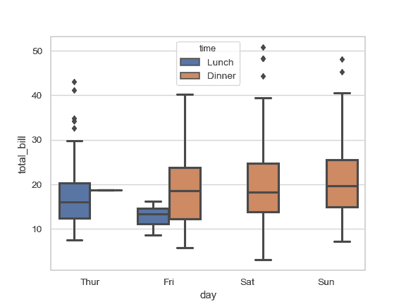
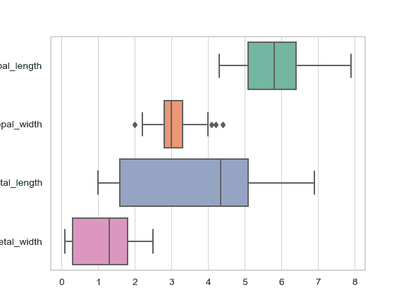
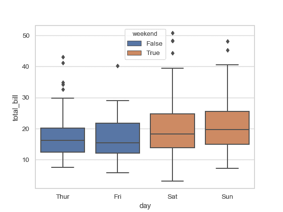
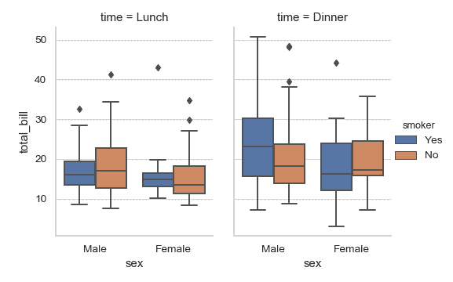

# seaborn.boxplot

```py
seaborn.boxplot(x=None, y=None, hue=None, data=None, order=None, hue_order=None, orient=None, color=None, palette=None, saturation=0.75, width=0.8, dodge=True, fliersize=5, linewidth=None, whis=1.5, notch=False, ax=None, **kwargs)
```

Draw a box plot to show distributions with respect to categories.

A box plot (or box-and-whisker plot) shows the distribution of quantitative data in a way that facilitates comparisons between variables or across levels of a categorical variable. The box shows the quartiles of the dataset while the whiskers extend to show the rest of the distribution, except for points that are determined to be “outliers” using a method that is a function of the inter-quartile range.

Input data can be passed in a variety of formats, including:

*   Vectors of data represented as lists, numpy arrays, or pandas Series objects passed directly to the `x`, `y`, and/or `hue` parameters.
*   A “long-form” DataFrame, in which case the `x`, `y`, and `hue` variables will determine how the data are plotted.
*   A “wide-form” DataFrame, such that each numeric column will be plotted.
*   An array or list of vectors.

In most cases, it is possible to use numpy or Python objects, but pandas objects are preferable because the associated names will be used to annotate the axes. Additionally, you can use Categorical types for the grouping variables to control the order of plot elements.

This function always treats one of the variables as categorical and draws data at ordinal positions (0, 1, … n) on the relevant axis, even when the data has a numeric or date type.

See the [tutorial](../tutorial/categorical.html#categorical-tutorial) for more information.

参数：`x, y, hue`：names of variables in `data` or vector data, optional

> Inputs for plotting long-form data. See examples for interpretation.

`data`：DataFrame, array, or list of arrays, optional

> Dataset for plotting. If `x` and `y` are absent, this is interpreted as wide-form. Otherwise it is expected to be long-form.

`order, hue_order`：lists of strings, optional

> Order to plot the categorical levels in, otherwise the levels are inferred from the data objects.

`orient`：“v” &#124; “h”, optional

> Orientation of the plot (vertical or horizontal). This is usually inferred from the dtype of the input variables, but can be used to specify when the “categorical” variable is a numeric or when plotting wide-form data.

`color`：matplotlib color, optional

> Color for all of the elements, or seed for a gradient palette.

`palette`：palette name, list, or dict, optional

> Colors to use for the different levels of the `hue` variable. Should be something that can be interpreted by [`color_palette()`](seaborn.color_palette.html#seaborn.color_palette "seaborn.color_palette"), or a dictionary mapping hue levels to matplotlib colors.

`saturation`：float, optional

> Proportion of the original saturation to draw colors at. Large patches often look better with slightly desaturated colors, but set this to `1` if you want the plot colors to perfectly match the input color spec.

`width`：float, optional

> Width of a full element when not using hue nesting, or width of all the elements for one level of the major grouping variable.

`dodge`：bool, optional

> When hue nesting is used, whether elements should be shifted along the categorical axis.

`fliersize`：float, optional

> Size of the markers used to indicate outlier observations.

`linewidth`：float, optional

> Width of the gray lines that frame the plot elements.

`whis`：float, optional

> Proportion of the IQR past the low and high quartiles to extend the plot whiskers. Points outside this range will be identified as outliers.

`notch`：boolean, optional

> Whether to “notch” the box to indicate a confidence interval for the median. There are several other parameters that can control how the notches are drawn; see the `plt.boxplot` help for more information on them.

`ax`：matplotlib Axes, optional

> Axes object to draw the plot onto, otherwise uses the current Axes.

`kwargs`：key, value mappings

> Other keyword arguments are passed through to `plt.boxplot` at draw time.


返回值：`ax`：matplotlib Axes

> Returns the Axes object with the plot drawn onto it.


See also

A combination of boxplot and kernel density estimation.A scatterplot where one variable is categorical. Can be used in conjunction with other plots to show each observation.A categorical scatterplot where the points do not overlap. Can be used with other plots to show each observation.

Examples

Draw a single horizontal boxplot:

```py
>>> import seaborn as sns
>>> sns.set(style="whitegrid")
>>> tips = sns.load_dataset("tips")
>>> ax = sns.boxplot(x=tips["total_bill"])

```


Draw a vertical boxplot grouped by a categorical variable:

```py
>>> ax = sns.boxplot(x="day", y="total_bill", data=tips)

```



Draw a boxplot with nested grouping by two categorical variables:

```py
>>> ax = sns.boxplot(x="day", y="total_bill", hue="smoker",
...                  data=tips, palette="Set3")

```


Draw a boxplot with nested grouping when some bins are empty:

```py
>>> ax = sns.boxplot(x="day", y="total_bill", hue="time",
...                  data=tips, linewidth=2.5)

```



Control box order by passing an explicit order:

```py
>>> ax = sns.boxplot(x="time", y="tip", data=tips,
...                  order=["Dinner", "Lunch"])

```


Draw a boxplot for each numeric variable in a DataFrame:

```py
>>> iris = sns.load_dataset("iris")
>>> ax = sns.boxplot(data=iris, orient="h", palette="Set2")

```



Use `hue` without changing box position or width:

```py
>>> tips["weekend"] = tips["day"].isin(["Sat", "Sun"])
>>> ax = sns.boxplot(x="day", y="total_bill", hue="weekend",
...                  data=tips, dodge=False)

```



Use [`swarmplot()`](seaborn.swarmplot.html#seaborn.swarmplot "seaborn.swarmplot") to show the datapoints on top of the boxes:

```py
>>> ax = sns.boxplot(x="day", y="total_bill", data=tips)
>>> ax = sns.swarmplot(x="day", y="total_bill", data=tips, color=".25")

```


Use [`catplot()`](seaborn.catplot.html#seaborn.catplot "seaborn.catplot") to combine a [`pointplot()`](seaborn.pointplot.html#seaborn.pointplot "seaborn.pointplot") and a [`FacetGrid`](seaborn.FacetGrid.html#seaborn.FacetGrid "seaborn.FacetGrid"). This allows grouping within additional categorical variables. Using [`catplot()`](seaborn.catplot.html#seaborn.catplot "seaborn.catplot") is safer than using [`FacetGrid`](seaborn.FacetGrid.html#seaborn.FacetGrid "seaborn.FacetGrid") directly, as it ensures synchronization of variable order across facets:

```py
>>> g = sns.catplot(x="sex", y="total_bill",
...                 hue="smoker", col="time",
...                 data=tips, kind="box",
...                 height=4, aspect=.7);

```

