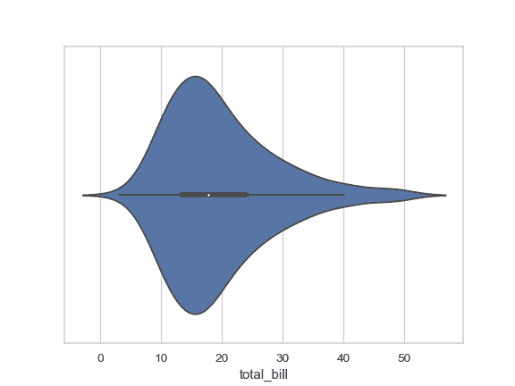
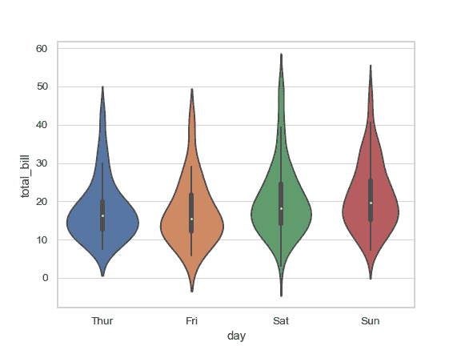
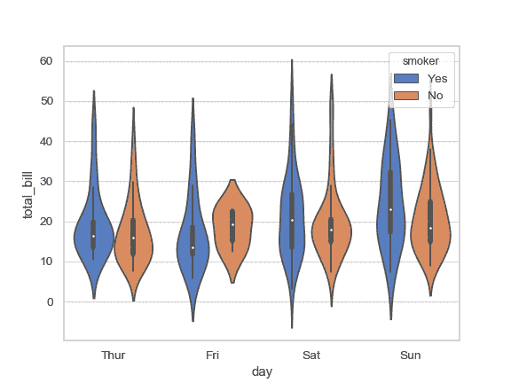
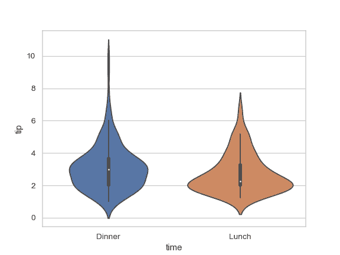
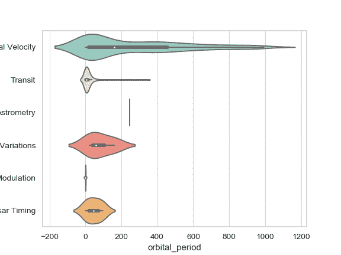
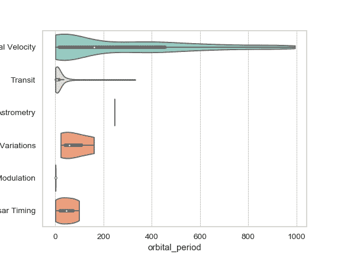
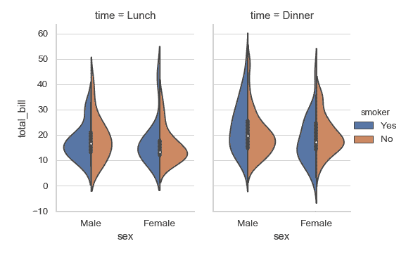

# seaborn.violinplot

> 译者：[FindNorthStar](https://github.com/FindNorthStar)

```py
seaborn.violinplot(x=None, y=None, hue=None, data=None, order=None, hue_order=None, bw='scott', cut=2, scale='area', scale_hue=True, gridsize=100, width=0.8, inner='box', split=False, dodge=True, orient=None, linewidth=None, color=None, palette=None, saturation=0.75, ax=None, **kwargs)
```

结合箱型图与核密度估计绘图。

小提琴图的功能与箱型图类似。 它显示了一个（或多个）分类变量多个属性上的定量数据的分布，从而可以比较这些分布。与箱形图不同，其中所有绘图单元都与实际数据点对应，小提琴图描述了基础数据分布的核密度估计。

小提琴图可以是一种单次显示多个数据分布的有效且有吸引力的方式，但请记住，估计过程受样本大小的影响，相对较小样本的小提琴可能看起来非常平滑，这种平滑具有误导性。

输入数据可以通过多种格式传入，包括：

*   格式为列表，numpy数组或pandas Series对象的数据向量可以直接传递给`x`，`y`和`hue`参数。
*   对于长格式的DataFrame，`x`，`y`，和`hue`参数会决定如何绘制数据。
*   对于宽格式的DataFrame，每一列数值列都会被绘制。
*   一个数组或向量的列表。

在大多数情况下，可以使用numpy或Python对象，但更推荐使用pandas对象，因为与数据关联的列名/行名可以用于标注横轴/纵轴的名称。此外，您可以使用分类类型对变量进行分组以控制绘图元素的顺序。

此函数始终将其中一个变量视为分类，并在相关轴上的序数位置(0,1，... n)处绘制数据，即使数据属于数值类型或日期类型也是如此。

更多信息请参阅 [tutorial](../tutorial/categorical.html#categorical-tutorial)。

参数：`x, y, hue`：`数据`或向量数据中的变量名称，可选

> 用于绘制长格式数据的输入。查看样例以进一步理解。

`data`：DataFrame，数组，数组列表，可选

> 用于绘图的数据集。如果`x`和`y`都缺失，那么数据将被视为宽格式。否则数据被视为长格式。

`order, hue_order`：字符串列表，可选

> 控制分类变量（对应的条形图）的绘制顺序，若缺失则从数据中推断分类变量的顺序。

`bw`：{‘scott’, ‘silverman’, float}，可选

> 内置变量值或浮点数的比例因子都用来计算核密度的带宽。实际的核大小由比例因子乘以每个分箱内数据的标准差确定。

`cut`：float，可选

> 以带宽大小为单位的距离，以控制小提琴图外壳延伸超过内部极端数据点的密度。设置为0以将小提琴图范围限制在观察数据的范围内。（例如，在 `ggplot` 中具有与 `trim=True` 相同的效果）

`scale`：{“area”, “count”, “width”}，可选

> 该方法用于缩放每张小提琴图的宽度。若为 `area` ，每张小提琴图具有相同的面积。若为 `count` ，小提琴的宽度会根据分箱中观察点的数量进行缩放。若为 `width` ，每张小提琴图具有相同的宽度。

`scale_hue`：bool，可选

> 当使用色调参数 `hue` 变量绘制嵌套小提琴图时，该参数决定缩放比例是在主要分组变量（`scale_hue=True`）的每个级别内还是在图上的所有小提琴图（`scale_hue=False`）内计算出来的。

`gridsize`：int，可选

> 用于计算核密度估计的离散网格中的数据点数目。

`width`：float，可选

> 不使用色调嵌套时的完整元素的宽度，或主要分组变量的一个级别的所有元素的宽度。

`inner`：{“box”, “quartile”, “point”, “stick”, None}，可选

> 控制小提琴图内部数据点的表示。若为`box`，则绘制一个微型箱型图。若为`quartiles`，则显示四分位数线。若为`point`或`stick`，则显示具体数据点或数据线。使用`None`则绘制不加修饰的小提琴图。

`split`：bool，可选

> 当使用带有两种颜色的变量时，将`split`设置为True则会为每种颜色绘制对应半边小提琴。从而可以更容易直接的比较分布。

`dodge`：bool，可选

> 使用色调嵌套时，元素是否应沿分类轴移动。

`orient`：“v” &#124; “h”，可选

> 控制绘图的方向（垂直或水平）。这通常是从输入变量的dtype推断出来的，但是当“分类”变量为数值型或绘制宽格式数据时可用于指定绘图的方向。

`linewidth`：float，可选

> 构图元素的灰线宽度。

`color`：matplotlib颜色，可选

> 所有元素的颜色，或渐变调色板的种子颜色。

`palette`：调色板名称，列表或字典，可选

> 用于`hue`变量的不同级别的颜色。可以从 [`color_palette()`](seaborn.color_palette.html#seaborn.color_palette "seaborn.color_palette") 得到一些解释，或者将色调级别映射到matplotlib颜色的字典。

`saturation`：float，可选

> 控制用于绘制颜色的原始饱和度的比例。通常大幅填充在轻微不饱和的颜色下看起来更好，如果您希望绘图颜色与输入颜色规格完美匹配可将其设置为`1`。

`ax`：matplotlib轴，可选

> 绘图时使用的Axes轴对象，否则使用当前Axes轴对象。


返回值：`ax`：matplotlib轴

> 返回Axes对轴象，并在其上绘制绘图。


亦可参见

一个传统的箱型图具有类似的API。当一个变量是分类变量的散点图。可以与其他图表结合使用以展示各自的观测结果。分类散点图的特点是其中数据点互不重叠。可以与其他图表结合使用以展示各自的观测结果。

示例

绘制一个单独的横向小提琴图：

```py
>>> import seaborn as sns
>>> sns.set(style="whitegrid")
>>> tips = sns.load_dataset("tips")
>>> ax = sns.violinplot(x=tips["total_bill"])

```



根据分类变量分组绘制一个纵向的小提琴图：

```py
>>> ax = sns.violinplot(x="day", y="total_bill", data=tips)

```



根据2个分类变量嵌套分组绘制一个小提琴图：

```py
>>> ax = sns.violinplot(x="day", y="total_bill", hue="smoker",
...                     data=tips, palette="muted")

```



绘制分割的小提琴图以比较不同的色调变量：

```py
>>> ax = sns.violinplot(x="day", y="total_bill", hue="smoker",
...                     data=tips, palette="muted", split=True)

```


通过显式传入参数指定顺序控制小提琴图的显示顺序：

```py
>>> ax = sns.violinplot(x="time", y="tip", data=tips,
...                     order=["Dinner", "Lunch"])

```



将小提琴宽度缩放为每个分箱中观察到的数据点数目：

```py
>>> ax = sns.violinplot(x="day", y="total_bill", hue="sex",
...                     data=tips, palette="Set2", split=True,
...                     scale="count")

```


将四分位数绘制为水平线而不是迷你箱型图：

```py
>>> ax = sns.violinplot(x="day", y="total_bill", hue="sex",
...                     data=tips, palette="Set2", split=True,
...                     scale="count", inner="quartile")

```


用小提琴图内部的横线显示每个观察到的数据点：

```py
>>> ax = sns.violinplot(x="day", y="total_bill", hue="sex",
...                     data=tips, palette="Set2", split=True,
...                     scale="count", inner="stick")

```


根据所有分箱的数据点数目对密度进行缩放：

```py
>>> ax = sns.violinplot(x="day", y="total_bill", hue="sex",
...                     data=tips, palette="Set2", split=True,
...                     scale="count", inner="stick", scale_hue=False)

```


使用窄带宽来减少平滑量：

```py
>>> ax = sns.violinplot(x="day", y="total_bill", hue="sex",
...                     data=tips, palette="Set2", split=True,
...                     scale="count", inner="stick",
...                     scale_hue=False, bw=.2)

```


绘制横向小提琴图：

```py
>>> planets = sns.load_dataset("planets")
>>> ax = sns.violinplot(x="orbital_period", y="method",
...                     data=planets[planets.orbital_period < 1000],
...                     scale="width", palette="Set3")

```



不要让密度超出数据中的极端数值：

```py
>>> ax = sns.violinplot(x="orbital_period", y="method",
...                     data=planets[planets.orbital_period < 1000],
...                     cut=0, scale="width", palette="Set3")

```



使用 `hue` 而不改变小提琴图的位置或宽度：

```py
>>> tips["weekend"] = tips["day"].isin(["Sat", "Sun"])
>>> ax = sns.violinplot(x="day", y="total_bill", hue="weekend",
...                     data=tips, dodge=False)

```


把 [`catplot()`](seaborn.catplot.html#seaborn.catplot "seaborn.catplot") 与 [`violinplot()`](#seaborn.violinplot "seaborn.violinplot") 以及 [`FacetGrid`](seaborn.FacetGrid.html#seaborn.FacetGrid "seaborn.FacetGrid") 结合起来使用。这允许您通过额外的分类变量进行分组。使用 [`catplot()`](seaborn.catplot.html#seaborn.catplot "seaborn.catplot") 比直接使用 [`FacetGrid`](seaborn.FacetGrid.html#seaborn.FacetGrid "seaborn.FacetGrid") 更为安全，因为它保证了不同切面上变量同步的顺序：

```py
>>> g = sns.catplot(x="sex", y="total_bill",
...                 hue="smoker", col="time",
...                 data=tips, kind="violin", split=True,
...                 height=4, aspect=.7);

```

