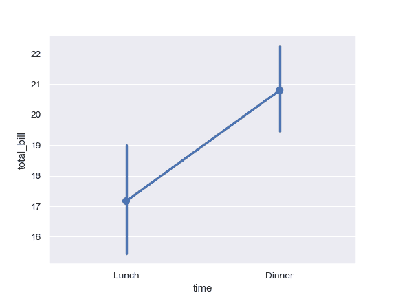
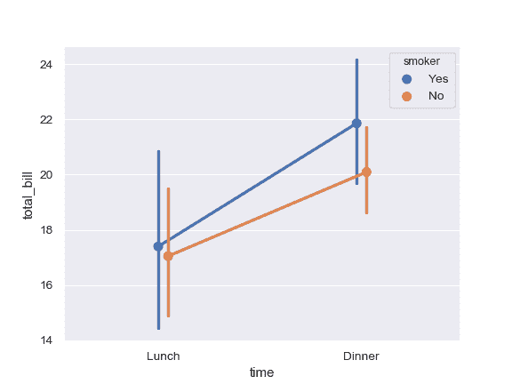
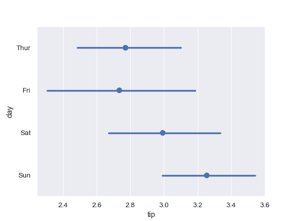
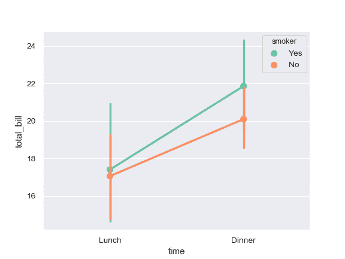
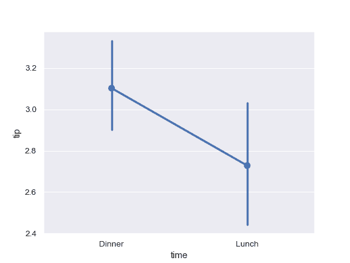
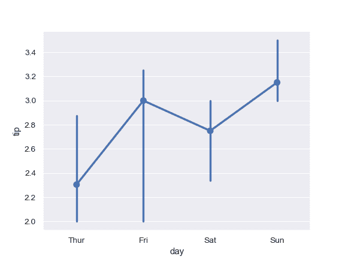
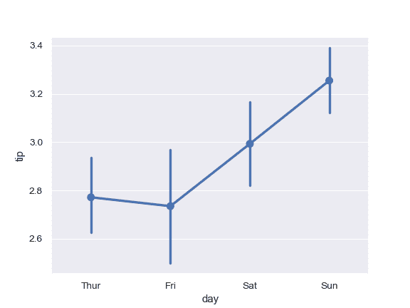
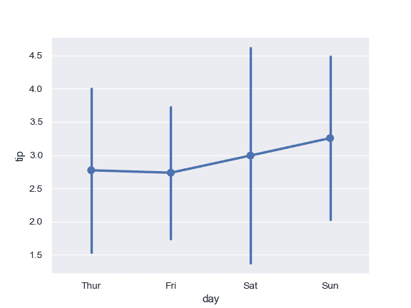
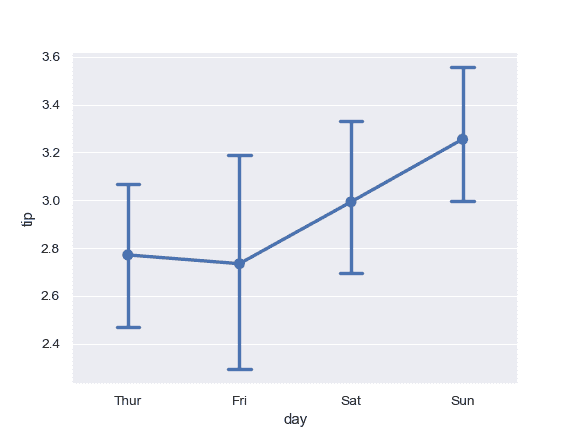

# seaborn.pointplot

```py
seaborn.pointplot(x=None, y=None, hue=None, data=None, order=None, hue_order=None, estimator=<function mean>, ci=95, n_boot=1000, units=None, markers='o', linestyles='-', dodge=False, join=True, scale=1, orient=None, color=None, palette=None, errwidth=None, capsize=None, ax=None, **kwargs)
```

Show point estimates and confidence intervals using scatter plot glyphs.

A point plot represents an estimate of central tendency for a numeric variable by the position of scatter plot points and provides some indication of the uncertainty around that estimate using error bars.

Point plots can be more useful than bar plots for focusing comparisons between different levels of one or more categorical variables. They are particularly adept at showing interactions: how the relationship between levels of one categorical variable changes across levels of a second categorical variable. The lines that join each point from the same `hue` level allow interactions to be judged by differences in slope, which is easier for the eyes than comparing the heights of several groups of points or bars.

It is important to keep in mind that a point plot shows only the mean (or other estimator) value, but in many cases it may be more informative to show the distribution of values at each level of the categorical variables. In that case, other approaches such as a box or violin plot may be more appropriate.

Input data can be passed in a variety of formats, including:

*   Vectors of data represented as lists, numpy arrays, or pandas Series objects passed directly to the `x`, `y`, and/or `hue` parameters.
*   A “long-form” DataFrame, in which case the `x`, `y`, and `hue` variables will determine how the data are plotted.
*   A “wide-form” DataFrame, such that each numeric column will be plotted.
*   An array or list of vectors.

In most cases, it is possible to use numpy or Python objects, but pandas objects are preferable because the associated names will be used to annotate the axes. Additionally, you can use Categorical types for the grouping variables to control the order of plot elements.

This function always treats one of the variables as categorical and draws data at ordinal positions (0, 1, … n) on the relevant axis, even when the data has a numeric or date type.

See the [tutorial](../tutorial/categorical.html#categorical-tutorial) for more information.

| Parameters: | **x, y, hue** : names of variables in `data` or vector data, optional

> Inputs for plotting long-form data. See examples for interpretation.

**data** : DataFrame, array, or list of arrays, optional

> Dataset for plotting. If `x` and `y` are absent, this is interpreted as wide-form. Otherwise it is expected to be long-form.

**order, hue_order** : lists of strings, optional

> Order to plot the categorical levels in, otherwise the levels are inferred from the data objects.

**estimator** : callable that maps vector -&gt; scalar, optional

> Statistical function to estimate within each categorical bin.

**ci** : float or “sd” or None, optional

> Size of confidence intervals to draw around estimated values. If “sd”, skip bootstrapping and draw the standard deviation of the observations. If `None`, no bootstrapping will be performed, and error bars will not be drawn.

**n_boot** : int, optional

> Number of bootstrap iterations to use when computing confidence intervals.

**units** : name of variable in `data` or vector data, optional

> Identifier of sampling units, which will be used to perform a multilevel bootstrap and account for repeated measures design.

**markers** : string or list of strings, optional

> Markers to use for each of the `hue` levels.

**linestyles** : string or list of strings, optional

> Line styles to use for each of the `hue` levels.

**dodge** : bool or float, optional

> Amount to separate the points for each level of the `hue` variable along the categorical axis.

**join** : bool, optional

> If `True`, lines will be drawn between point estimates at the same `hue` level.

**scale** : float, optional

> Scale factor for the plot elements.

**orient** : “v” &#124; “h”, optional

> Orientation of the plot (vertical or horizontal). This is usually inferred from the dtype of the input variables, but can be used to specify when the “categorical” variable is a numeric or when plotting wide-form data.

**color** : matplotlib color, optional

> Color for all of the elements, or seed for a gradient palette.

**palette** : palette name, list, or dict, optional

> Colors to use for the different levels of the `hue` variable. Should be something that can be interpreted by [`color_palette()`](seaborn.color_palette.html#seaborn.color_palette "seaborn.color_palette"), or a dictionary mapping hue levels to matplotlib colors.

**errwidth** : float, optional

> Thickness of error bar lines (and caps).

**capsize** : float, optional

> Width of the “caps” on error bars.

**ax** : matplotlib Axes, optional

> Axes object to draw the plot onto, otherwise uses the current Axes.

 |
| --- | --- |
| Returns: | **ax** : matplotlib Axes

> Returns the Axes object with the plot drawn onto it.

 |
| --- | --- |

See also

Show point estimates and confidence intervals using bars.Combine a categorical plot with a class:<cite>FacetGrid</cite>.

Examples

Draw a set of vertical point plots grouped by a categorical variable:

```py
>>> import seaborn as sns
>>> sns.set(style="darkgrid")
>>> tips = sns.load_dataset("tips")
>>> ax = sns.pointplot(x="time", y="total_bill", data=tips)

```



Draw a set of vertical points with nested grouping by a two variables:

```py
>>> ax = sns.pointplot(x="time", y="total_bill", hue="smoker",
...                    data=tips)

```


Separate the points for different hue levels along the categorical axis:

```py
>>> ax = sns.pointplot(x="time", y="total_bill", hue="smoker",
...                    data=tips, dodge=True)

```



Use a different marker and line style for the hue levels:

```py
>>> ax = sns.pointplot(x="time", y="total_bill", hue="smoker",
...                    data=tips,
...                    markers=["o", "x"],
...                    linestyles=["-", "--"])

```


Draw a set of horizontal points:

```py
>>> ax = sns.pointplot(x="tip", y="day", data=tips)

```


Don’t draw a line connecting each point:

```py
>>> ax = sns.pointplot(x="tip", y="day", data=tips, join=False)

```



Use a different color for a single-layer plot:

```py
>>> ax = sns.pointplot("time", y="total_bill", data=tips,
...                    color="#bb3f3f")

```


Use a different color palette for the points:

```py
>>> ax = sns.pointplot(x="time", y="total_bill", hue="smoker",
...                    data=tips, palette="Set2")

```



Control point order by passing an explicit order:

```py
>>> ax = sns.pointplot(x="time", y="tip", data=tips,
...                    order=["Dinner", "Lunch"])

```



Use median as the estimate of central tendency:

```py
>>> from numpy import median
>>> ax = sns.pointplot(x="day", y="tip", data=tips, estimator=median)

```



Show the standard error of the mean with the error bars:

```py
>>> ax = sns.pointplot(x="day", y="tip", data=tips, ci=68)

```



Show standard deviation of observations instead of a confidence interval:

```py
>>> ax = sns.pointplot(x="day", y="tip", data=tips, ci="sd")

```



Add “caps” to the error bars:

```py
>>> ax = sns.pointplot(x="day", y="tip", data=tips, capsize=.2)

```



Use [`catplot()`](seaborn.catplot.html#seaborn.catplot "seaborn.catplot") to combine a [`barplot()`](seaborn.barplot.html#seaborn.barplot "seaborn.barplot") and a [`FacetGrid`](seaborn.FacetGrid.html#seaborn.FacetGrid "seaborn.FacetGrid"). This allows grouping within additional categorical variables. Using [`catplot()`](seaborn.catplot.html#seaborn.catplot "seaborn.catplot") is safer than using [`FacetGrid`](seaborn.FacetGrid.html#seaborn.FacetGrid "seaborn.FacetGrid") directly, as it ensures synchronization of variable order across facets:

```py
>>> g = sns.catplot(x="sex", y="total_bill",
...                 hue="smoker", col="time",
...                 data=tips, kind="point",
...                 dodge=True,
...                 height=4, aspect=.7);

```

