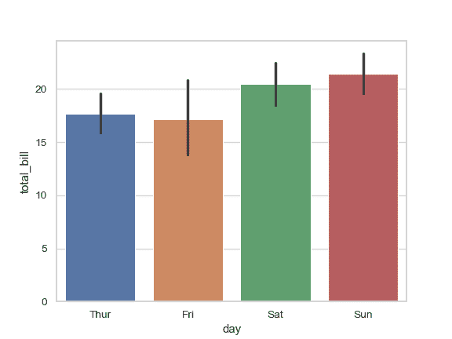
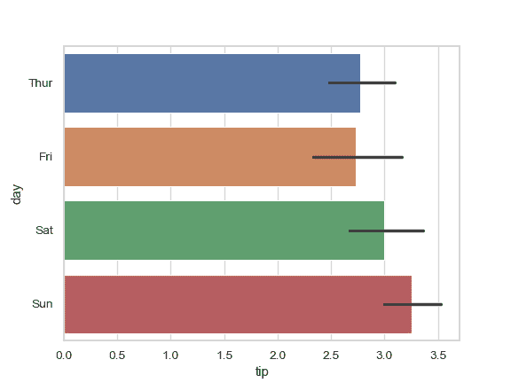
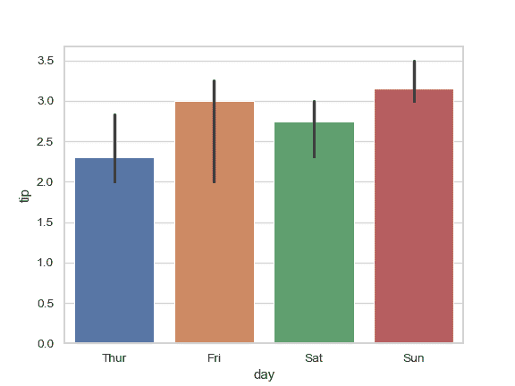
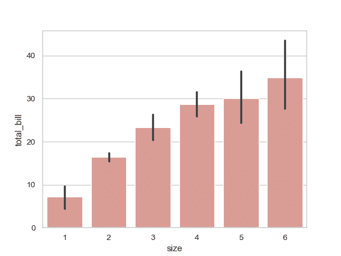

# seaborn.barplot

```py
seaborn.barplot(x=None, y=None, hue=None, data=None, order=None, hue_order=None, estimator=<function mean>, ci=95, n_boot=1000, units=None, orient=None, color=None, palette=None, saturation=0.75, errcolor='.26', errwidth=None, capsize=None, dodge=True, ax=None, **kwargs)
```

条形图以矩形条的方式展示数据的点估值和置信区间

条形图用每个矩形的高度来表示数值变量的集中趋势的估计值，并提供误差条来显示估计值得不确定度。条形图的纵轴是从零开始的，这对于0值是有意义的情况是非常好的。

对于数据集中的0值没有实际意义的情况，散点图可以让您专注于一个或多个分类变量之间的差异。

要注意的是，条形图只显示平均值（或者其他的估计值），但是在大部分情况下，展示数值在不同分类变量上的分布会更有用。如果要表示出数据的分布，用箱型图或者小提琴图会更恰当。

输入数据的格式可以不同，包括：

*   以列表，numpy array或者pandas中的Series object 表示的向量。这些向量可以直接传入 `x`, `y`, 以及 `hue` 参数。
*   长表, x值，y值和色相变量决定了数据是如何绘制的。
*   宽表，每个列的数值都会被绘制出来.
*   数组或者列表的向量。

大多数情况下，您可以使用numpy的对象或者python的对象，但是用pandas对象更好，因为相关的but pandas objects are preferable because the associated names will be used to annotate the axes. 另外，为了控制绘图元素 您也可以可以用分类类型来组合不同的变量。

这个函数始终把一个变量当做分类变量，即使这个数据是数值类型或者日期类型，并且按照序数顺序绘制在相关的轴上。


详情请看[教程](../tutorial/categorical.html#categorical-tutorial)。

| Parameters: | **x, y, hue** : names of variables in `data` or vector data, optional

> 用于绘制long-form数据的变量名称.

**data** : DataFrame, array, or list of arrays, optional

> 用于绘图的数据集。如果缺失X值和Y值, 这个数据集会被解释成wide-form，否则this is interpreted as wide-form. Otherwise it is expected to be long-form.

**order, hue_order** : lists of strings, optional

> Order to plot the categorical levels in, otherwise the levels are inferred from the data objects.

**estimator** : callable that maps vector -&gt; scalar, optional

> Statistical function to estimate within each categorical bin.

**ci** : float or “sd” or None, optional

> Size of confidence intervals to draw around estimated values. If “sd”, skip bootstrapping and draw the standard deviation of the observations. If `None`, no bootstrapping will be performed, and error bars will not be drawn.

**n_boot** : int, optional

> 计算置信区间需要的Boostrap迭代次数。

**units** : name of variable in `data` or vector data, optional

> Identifier of sampling units, which will be used to perform a multilevel bootstrap and account for repeated measures design.

**orient** : “v” &#124; “h”, optional

> Orientation of the plot (vertical or horizontal). This is usually inferred from the dtype of the input variables, but can be used to specify when the “categorical” variable is a numeric or when plotting wide-form data.

**color** : matplotlib color, optional

> 作用于所有元素的颜色，或者渐变色的种子。

**palette** : palette name, list, or dict, optional

> Colors to use for the different levels of the `hue` variable. Should be something that can be interpreted by [`color_palette()`](seaborn.color_palette.html#seaborn.color_palette "seaborn.color_palette"), or a dictionary mapping hue levels to matplotlib colors.

**saturation** : float, optional

> Proportion of the original saturation to draw colors at. Large patches often look better with slightly desaturated colors, but set this to `1` if you want the plot colors to perfectly match the input color spec.

**errcolor** : matplotlib color

> Color for the lines that represent the confidence interval.

**errwidth** : float, optional

> 错误条的线的厚度。

**capsize** : float, optional

> Width of the “caps” on error bars.

**dodge** : bool, optional

> When hue nesting is used, whether elements should be shifted along the categorical axis.

**ax** : matplotlib Axes, optional

> 指定一个Axes用于绘图，如果不指定，则使用当前的Axes。

**kwargs** : key, value mappings

> Other keyword arguments are passed through to `plt.bar` at draw time.

 |
| --- | --- |
| Returns: | **ax** : matplotlib Axes

> Returns the Axes object with the plot drawn onto it.

 |
| --- | --- |

See also

Show the counts of observations in each categorical bin.Show point estimates and confidence intervals using scatterplot glyphs.Combine a categorical plot with a class:<cite>FacetGrid</cite>.

Examples

Draw a set of vertical bar plots grouped by a categorical variable:

```py
>>> import seaborn as sns
>>> sns.set(style="whitegrid")
>>> tips = sns.load_dataset("tips")
>>> ax = sns.barplot(x="day", y="total_bill", data=tips)

```



Draw a set of vertical bars with nested grouping by a two variables:

```py
>>> ax = sns.barplot(x="day", y="total_bill", hue="sex", data=tips)

```


绘制一组水平柱状图：

```py
>>> ax = sns.barplot(x="tip", y="day", data=tips)

```



通过传入一个显式的顺序来控制条柱的顺序：

```py
>>> ax = sns.barplot(x="time", y="tip", data=tips,
...                  order=["Dinner", "Lunch"])

```


用中值来评估数据的集中趋势：

```py
>>> from numpy import median
>>> ax = sns.barplot(x="day", y="tip", data=tips, estimator=median)

```



Show the standard error of the mean with the error bars:

```py
>>> ax = sns.barplot(x="day", y="tip", data=tips, ci=68)

```


展示数据的标准差：

```py
>>> ax = sns.barplot(x="day", y="tip", data=tips, ci="sd")

```


Add “caps” to the error bars:

```py
>>> ax = sns.barplot(x="day", y="tip", data=tips, capsize=.2)

```


使用一个不同的调色盘来绘制图案：

```py
>>> ax = sns.barplot("size", y="total_bill", data=tips,
...                  palette="Blues_d")

```


Use `hue` without changing bar position or width:

```py
>>> tips["weekend"] = tips["day"].isin(["Sat", "Sun"])
>>> ax = sns.barplot(x="day", y="total_bill", hue="weekend",
...                  data=tips, dodge=False)

```


用同一种颜色绘制所有条柱：

```py
>>> ax = sns.barplot("size", y="total_bill", data=tips,
...                  color="salmon", saturation=.5)

```



用 `plt.bar` keyword arguments to further change the aesthetic:

```py
>>> ax = sns.barplot("day", "total_bill", data=tips,
...                  linewidth=2.5, facecolor=(1, 1, 1, 0),
...                  errcolor=".2", edgecolor=".2")

```


Use [`catplot()`](seaborn.catplot.html#seaborn.catplot "seaborn.catplot") to combine a [`barplot()`](#seaborn.barplot "seaborn.barplot") and a [`FacetGrid`](seaborn.FacetGrid.html#seaborn.FacetGrid "seaborn.FacetGrid"). This allows grouping within additional categorical variables. Using [`catplot()`](seaborn.catplot.html#seaborn.catplot "seaborn.catplot") is safer than using [`FacetGrid`](seaborn.FacetGrid.html#seaborn.FacetGrid "seaborn.FacetGrid") directly, as it ensures synchronization of variable order across facets:

```py
>>> g = sns.catplot(x="sex", y="total_bill",
...                 hue="smoker", col="time",
...                 data=tips, kind="bar",
...                 height=4, aspect=.7);

```


