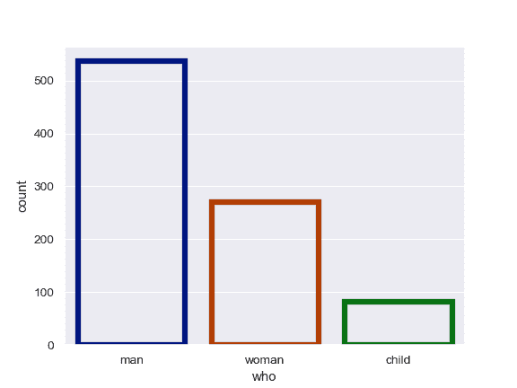

# seaborn.countplot

```py
seaborn.countplot(x=None, y=None, hue=None, data=None, order=None, hue_order=None, orient=None, color=None, palette=None, saturation=0.75, dodge=True, ax=None, **kwargs)
```

Show the counts of observations in each categorical bin using bars.

A count plot can be thought of as a histogram across a categorical, instead of quantitative, variable. The basic API and options are identical to those for [`barplot()`](seaborn.barplot.html#seaborn.barplot "seaborn.barplot"), so you can compare counts across nested variables.

Input data can be passed in a variety of formats, including:

*   Vectors of data represented as lists, numpy arrays, or pandas Series objects passed directly to the `x`, `y`, and/or `hue` parameters.
*   A “long-form” DataFrame, in which case the `x`, `y`, and `hue` variables will determine how the data are plotted.
*   A “wide-form” DataFrame, such that each numeric column will be plotted.
*   An array or list of vectors.

In most cases, it is possible to use numpy or Python objects, but pandas objects are preferable because the associated names will be used to annotate the axes. Additionally, you can use Categorical types for the grouping variables to control the order of plot elements.

This function always treats one of the variables as categorical and draws data at ordinal positions (0, 1, … n) on the relevant axis, even when the data has a numeric or date type.

See the [tutorial](../tutorial/categorical.html#categorical-tutorial) for more information.

| Parameters: | **x, y, hue** : names of variables in `data` or vector data, optional

> Inputs for plotting long-form data. See examples for interpretation.

**data** : DataFrame, array, or list of arrays, optional

> Dataset for plotting. If `x` and `y` are absent, this is interpreted as wide-form. Otherwise it is expected to be long-form.

**order, hue_order** : lists of strings, optional

> Order to plot the categorical levels in, otherwise the levels are inferred from the data objects.

**orient** : “v” &#124; “h”, optional

> Orientation of the plot (vertical or horizontal). This is usually inferred from the dtype of the input variables, but can be used to specify when the “categorical” variable is a numeric or when plotting wide-form data.

**color** : matplotlib color, optional

> Color for all of the elements, or seed for a gradient palette.

**palette** : palette name, list, or dict, optional

> Colors to use for the different levels of the `hue` variable. Should be something that can be interpreted by [`color_palette()`](seaborn.color_palette.html#seaborn.color_palette "seaborn.color_palette"), or a dictionary mapping hue levels to matplotlib colors.

**saturation** : float, optional

> Proportion of the original saturation to draw colors at. Large patches often look better with slightly desaturated colors, but set this to `1` if you want the plot colors to perfectly match the input color spec.

**dodge** : bool, optional

> When hue nesting is used, whether elements should be shifted along the categorical axis.

**ax** : matplotlib Axes, optional

> Axes object to draw the plot onto, otherwise uses the current Axes.

**kwargs** : key, value mappings

> Other keyword arguments are passed to `plt.bar`.

 |
| --- | --- |
| Returns: | **ax** : matplotlib Axes

> Returns the Axes object with the plot drawn onto it.

 |
| --- | --- |

See also

Show point estimates and confidence intervals using bars.Combine a categorical plot with a class:<cite>FacetGrid</cite>.

Examples

Show value counts for a single categorical variable:

```py
>>> import seaborn as sns
>>> sns.set(style="darkgrid")
>>> titanic = sns.load_dataset("titanic")
>>> ax = sns.countplot(x="class", data=titanic)

```


Show value counts for two categorical variables:

```py
>>> ax = sns.countplot(x="class", hue="who", data=titanic)

```


Plot the bars horizontally:

```py
>>> ax = sns.countplot(y="class", hue="who", data=titanic)

```


Use a different color palette:

```py
>>> ax = sns.countplot(x="who", data=titanic, palette="Set3")

```


Use `plt.bar` keyword arguments for a different look:

```py
>>> ax = sns.countplot(x="who", data=titanic,
...                    facecolor=(0, 0, 0, 0),
...                    linewidth=5,
...                    edgecolor=sns.color_palette("dark", 3))

```



Use [`catplot()`](seaborn.catplot.html#seaborn.catplot "seaborn.catplot") to combine a [`countplot()`](#seaborn.countplot "seaborn.countplot") and a [`FacetGrid`](seaborn.FacetGrid.html#seaborn.FacetGrid "seaborn.FacetGrid"). This allows grouping within additional categorical variables. Using [`catplot()`](seaborn.catplot.html#seaborn.catplot "seaborn.catplot") is safer than using [`FacetGrid`](seaborn.FacetGrid.html#seaborn.FacetGrid "seaborn.FacetGrid") directly, as it ensures synchronization of variable order across facets:

```py
>>> g = sns.catplot(x="class", hue="who", col="survived",
...                 data=titanic, kind="count",
...                 height=4, aspect=.7);

```

