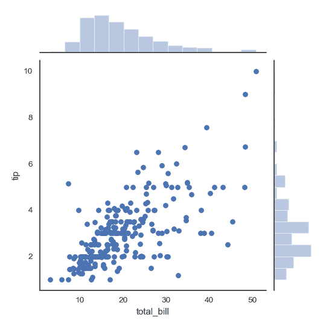
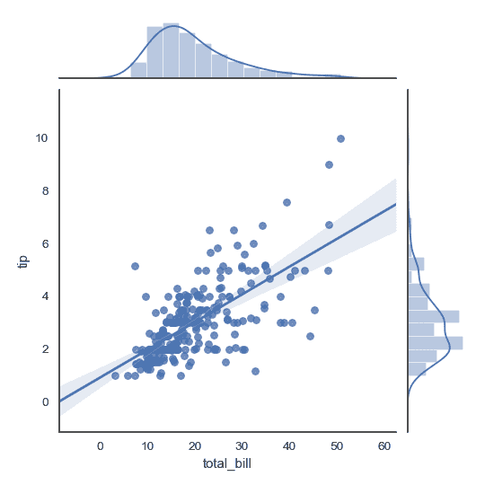
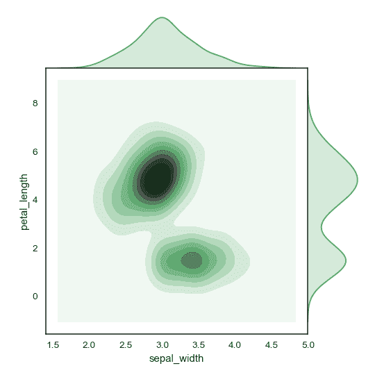
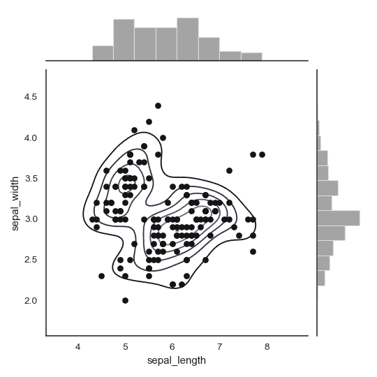
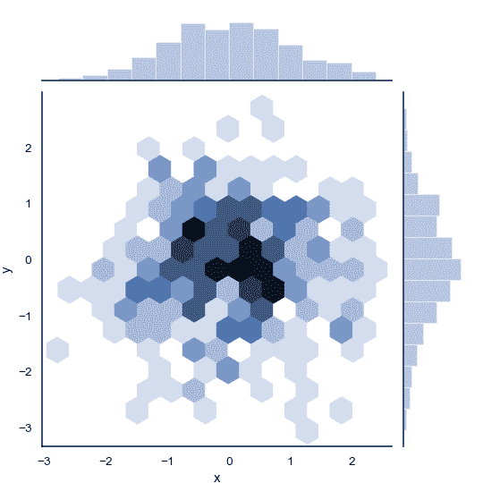
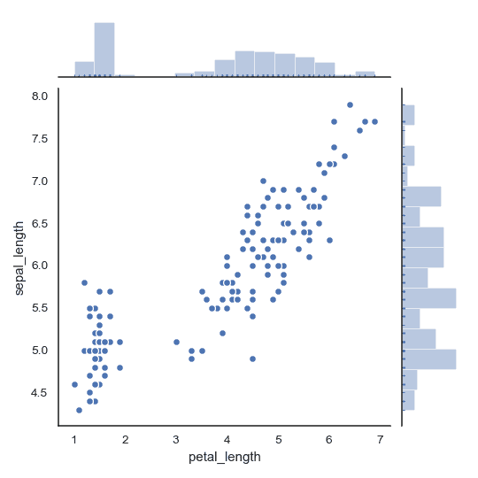

# seaborn.jointplot

```py
seaborn.jointplot(x, y, data=None, kind='scatter', stat_func=None, color=None, height=6, ratio=5, space=0.2, dropna=True, xlim=None, ylim=None, joint_kws=None, marginal_kws=None, annot_kws=None, **kwargs)
```

Draw a plot of two variables with bivariate and univariate graphs.

This function provides a convenient interface to the [`JointGrid`](seaborn.JointGrid.html#seaborn.JointGrid "seaborn.JointGrid") class, with several canned plot kinds. This is intended to be a fairly lightweight wrapper; if you need more flexibility, you should use [`JointGrid`](seaborn.JointGrid.html#seaborn.JointGrid "seaborn.JointGrid") directly.

参数：`x, y`：strings or vectors

> Data or names of variables in `data`.

`data`：DataFrame, optional

> DataFrame when `x` and `y` are variable names.

`kind`：{ “scatter” &#124; “reg” &#124; “resid” &#124; “kde” &#124; “hex” }, optional

> Kind of plot to draw.

`stat_func`：callable or None, optional

> _Deprecated_

`color`：matplotlib color, optional

> Color used for the plot elements.

`height`：numeric, optional

> Size of the figure (it will be square).

`ratio`：numeric, optional

> Ratio of joint axes height to marginal axes height.

`space`：numeric, optional

> Space between the joint and marginal axes

`dropna`：bool, optional

> If True, remove observations that are missing from `x` and `y`.

`{x, y}lim`：two-tuples, optional

> Axis limits to set before plotting.

`{joint, marginal, annot}_kws`：dicts, optional

> Additional keyword arguments for the plot components.

`kwargs`：key, value pairings

> Additional keyword arguments are passed to the function used to draw the plot on the joint Axes, superseding items in the `joint_kws` dictionary.


返回值：`grid`：[`JointGrid`](seaborn.JointGrid.html#seaborn.JointGrid "seaborn.JointGrid")

> [`JointGrid`](seaborn.JointGrid.html#seaborn.JointGrid "seaborn.JointGrid") object with the plot on it.


See also

The Grid class used for drawing this plot. Use it directly if you need more flexibility.

Examples

Draw a scatterplot with marginal histograms:

```py
>>> import numpy as np, pandas as pd; np.random.seed(0)
>>> import seaborn as sns; sns.set(style="white", color_codes=True)
>>> tips = sns.load_dataset("tips")
>>> g = sns.jointplot(x="total_bill", y="tip", data=tips)

```



Add regression and kernel density fits:

```py
>>> g = sns.jointplot("total_bill", "tip", data=tips, kind="reg")

```



Replace the scatterplot with a joint histogram using hexagonal bins:

```py
>>> g = sns.jointplot("total_bill", "tip", data=tips, kind="hex")

```


Replace the scatterplots and histograms with density estimates and align the marginal Axes tightly with the joint Axes:

```py
>>> iris = sns.load_dataset("iris")
>>> g = sns.jointplot("sepal_width", "petal_length", data=iris,
...                   kind="kde", space=0, color="g")

```



Draw a scatterplot, then add a joint density estimate:

```py
>>> g = (sns.jointplot("sepal_length", "sepal_width",
...                    data=iris, color="k")
...         .plot_joint(sns.kdeplot, zorder=0, n_levels=6))

```



Pass vectors in directly without using Pandas, then name the axes:

```py
>>> x, y = np.random.randn(2, 300)
>>> g = (sns.jointplot(x, y, kind="hex")
...         .set_axis_labels("x", "y"))

```



Draw a smaller figure with more space devoted to the marginal plots:

```py
>>> g = sns.jointplot("total_bill", "tip", data=tips,
...                   height=5, ratio=3, color="g")

```


Pass keyword arguments down to the underlying plots:

```py
>>> g = sns.jointplot("petal_length", "sepal_length", data=iris,
...                   marginal_kws=dict(bins=15, rug=True),
...                   annot_kws=dict(stat="r"),
...                   s=40, edgecolor="w", linewidth=1)

```

