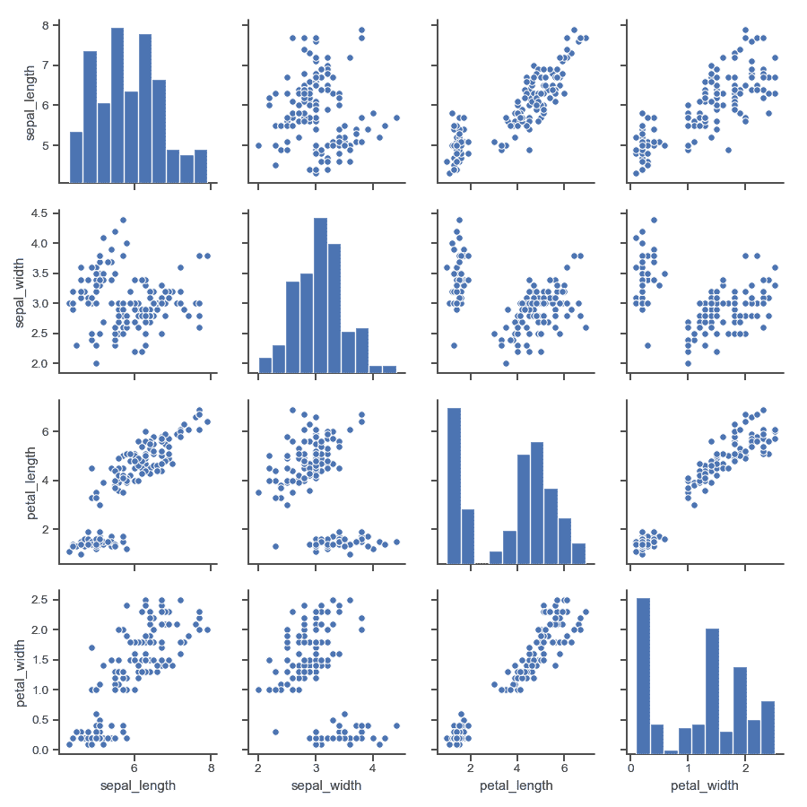
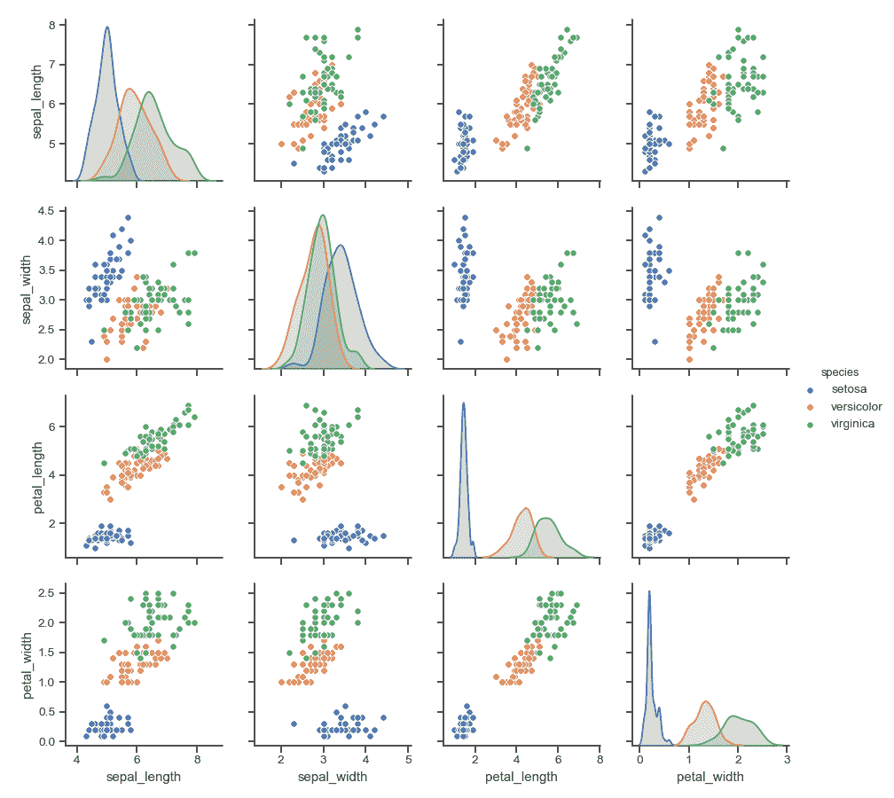
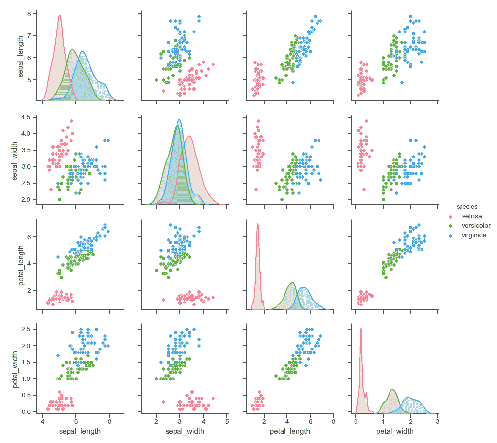
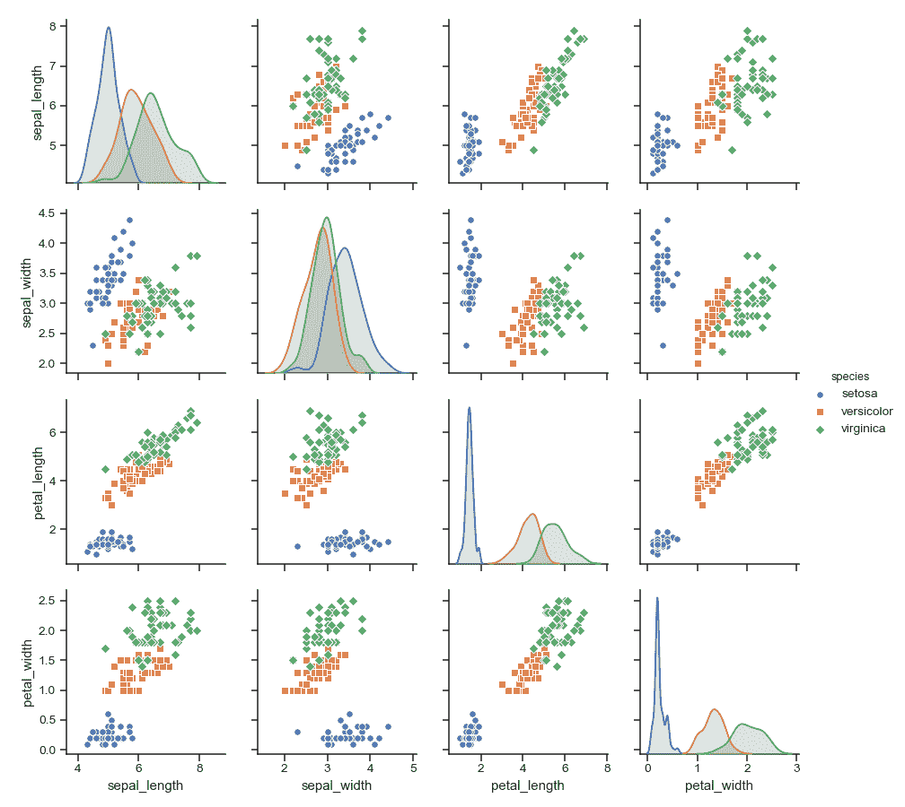
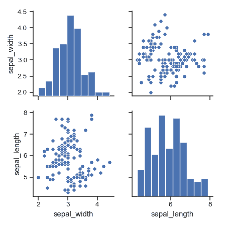
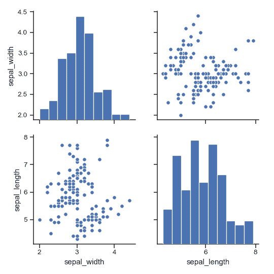
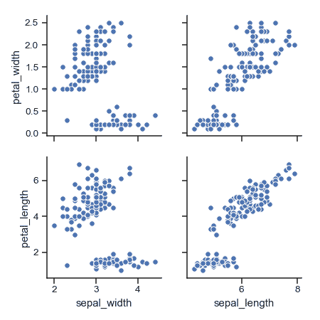
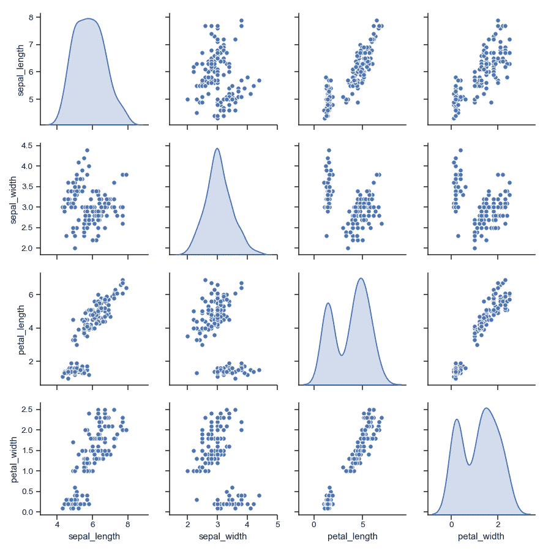
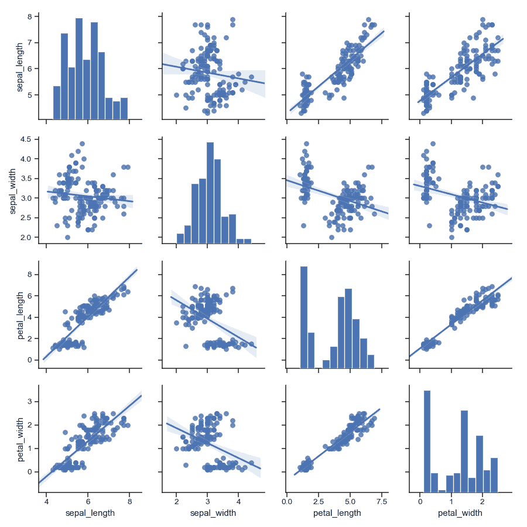
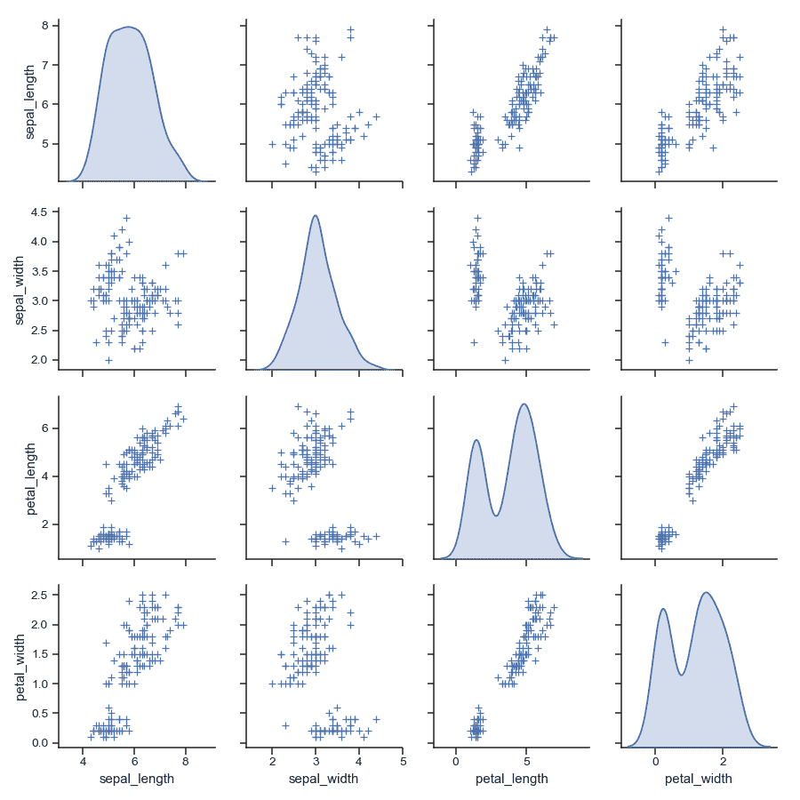

# seaborn.pairplot

```py
seaborn.pairplot(data, hue=None, hue_order=None, palette=None, vars=None, x_vars=None, y_vars=None, kind='scatter', diag_kind='auto', markers=None, height=2.5, aspect=1, dropna=True, plot_kws=None, diag_kws=None, grid_kws=None, size=None)
```

Plot pairwise relationships in a dataset.

By default, this function will create a grid of Axes such that each variable in `data` will by shared in the y-axis across a single row and in the x-axis across a single column. The diagonal Axes are treated differently, drawing a plot to show the univariate distribution of the data for the variable in that column.

It is also possible to show a subset of variables or plot different variables on the rows and columns.

This is a high-level interface for [`PairGrid`](seaborn.PairGrid.html#seaborn.PairGrid "seaborn.PairGrid") that is intended to make it easy to draw a few common styles. You should use [`PairGrid`](seaborn.PairGrid.html#seaborn.PairGrid "seaborn.PairGrid") directly if you need more flexibility.

参数：`data`：DataFrame

> Tidy (long-form) dataframe where each column is a variable and each row is an observation.

`hue`：string (variable name), optional

> Variable in `data` to map plot aspects to different colors.

`hue_order`：list of strings

> Order for the levels of the hue variable in the palette

`palette`：dict or seaborn color palette

> Set of colors for mapping the `hue` variable. If a dict, keys should be values in the `hue` variable.

`vars`：list of variable names, optional

> Variables within `data` to use, otherwise use every column with a numeric datatype.

`{x, y}_vars`：lists of variable names, optional

> Variables within `data` to use separately for the rows and columns of the figure; i.e. to make a non-square plot.

`kind`：{‘scatter’, ‘reg’}, optional

> Kind of plot for the non-identity relationships.

`diag_kind`：{‘auto’, ‘hist’, ‘kde’}, optional

> Kind of plot for the diagonal subplots. The default depends on whether `"hue"` is used or not.

`markers`：single matplotlib marker code or list, optional

> Either the marker to use for all datapoints or a list of markers with a length the same as the number of levels in the hue variable so that differently colored points will also have different scatterplot markers.

`height`：scalar, optional

> Height (in inches) of each facet.

`aspect`：scalar, optional

> Aspect * height gives the width (in inches) of each facet.

`dropna`：boolean, optional

> Drop missing values from the data before plotting.

`{plot, diag, grid}_kws`：dicts, optional

> Dictionaries of keyword arguments.


返回值：`grid`：PairGrid

> Returns the underlying `PairGrid` instance for further tweaking.


See also

Subplot grid for more flexible plotting of pairwise relationships.

Examples

Draw scatterplots for joint relationships and histograms for univariate distributions:

```py
>>> import seaborn as sns; sns.set(style="ticks", color_codes=True)
>>> iris = sns.load_dataset("iris")
>>> g = sns.pairplot(iris)

```



Show different levels of a categorical variable by the color of plot elements:

```py
>>> g = sns.pairplot(iris, hue="species")

```



Use a different color palette:

```py
>>> g = sns.pairplot(iris, hue="species", palette="husl")

```



Use different markers for each level of the hue variable:

```py
>>> g = sns.pairplot(iris, hue="species", markers=["o", "s", "D"])

```



Plot a subset of variables:

```py
>>> g = sns.pairplot(iris, vars=["sepal_width", "sepal_length"])

```



Draw larger plots:

```py
>>> g = sns.pairplot(iris, height=3,
...                  vars=["sepal_width", "sepal_length"])

```



Plot different variables in the rows and columns:

```py
>>> g = sns.pairplot(iris,
...                  x_vars=["sepal_width", "sepal_length"],
...                  y_vars=["petal_width", "petal_length"])

```



Use kernel density estimates for univariate plots:

```py
>>> g = sns.pairplot(iris, diag_kind="kde")

```



Fit linear regression models to the scatter plots:

```py
>>> g = sns.pairplot(iris, kind="reg")

```



Pass keyword arguments down to the underlying functions (it may be easier to use [`PairGrid`](seaborn.PairGrid.html#seaborn.PairGrid "seaborn.PairGrid") directly):

```py
>>> g = sns.pairplot(iris, diag_kind="kde", markers="+",
...                  plot_kws=dict(s=50, edgecolor="b", linewidth=1),
...                  diag_kws=dict(shade=True))

```

