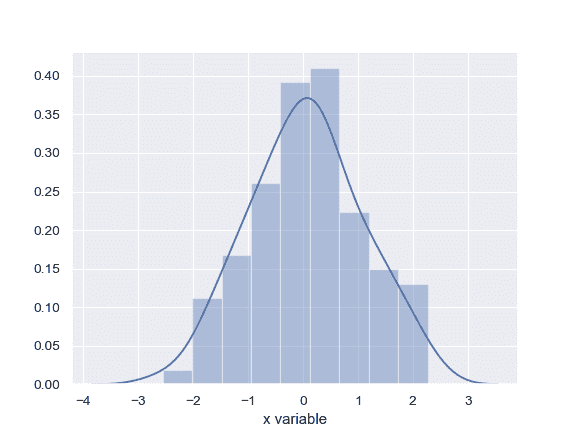
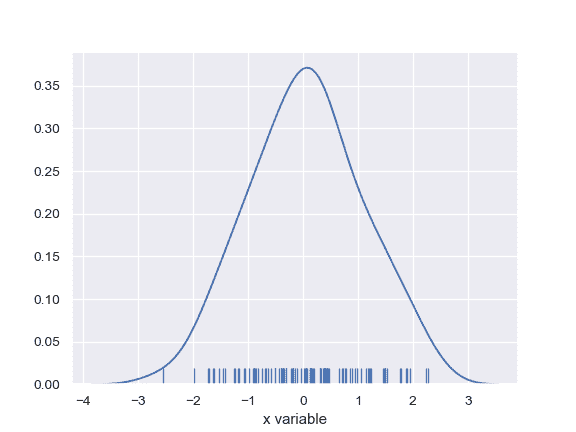
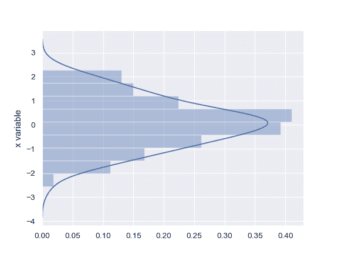
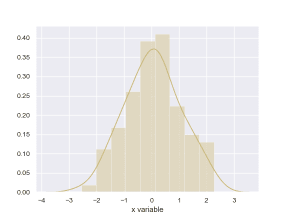
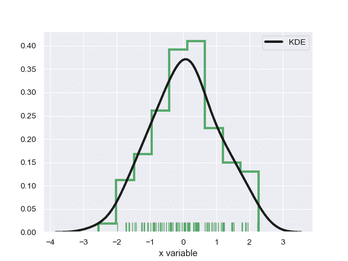

# seaborn.distplot 
```py
seaborn.distplot(a, bins=None, hist=True, kde=True, rug=False, fit=None, hist_kws=None, kde_kws=None, rug_kws=None, fit_kws=None, color=None, vertical=False, norm_hist=False, axlabel=None, label=None, ax=None)
```

灵活绘制单变量观测值分布图。

该函数结合了matplotlib中的 `hist`函数（自动计算一个默认的合适的bin大小）、seaborn的[`kdeplot()`](seaborn.kdeplot.html#seaborn.kdeplot "seaborn.kdeplot")和[`rugplot()`](seaborn.rugplot.html#seaborn.rugplot "seaborn.rugplot")函数。它还可以拟合`scipy.stats`分布并在数据上绘制估计的PDF（概率分布函数）。

参数：`a`：Series、1维数组或者列表。

> 观察数据。如果是具有`name`属性的Series对象，则该名称将用于标记数据轴。

`bins`：matplotlib hist()的参数，或None。可选参数。

> 直方图bins（柱）的数目，若填None，则默认使用Freedman-Diaconis规则指定柱的数目。

`hist`：布尔值，可选参数。

> 是否绘制（标准化）直方图。

`kde`：布尔值，可选参数。

> 是否绘制高斯核密度估计图。

`rug`：布尔值，可选参数。

> 是否在横轴上绘制观测值竖线。

`fit`：随机变量对象，可选参数。

> 一个带有*fit*方法的对象，返回一个元组，该元组可以传递给*pdf*方法一个位置参数，该位置参数遵循一个值的网格用于评估pdf。

`{hist, kde, rug, fit}_kws`：字典，可选参数。

> 底层绘图函数的关键字参数。

`color`：matplotlib color，可选参数。

> 可以绘制除了拟合曲线之外所有内容的颜色。

`vertical`：布尔值，可选参数。

> 如果为True，则观测值在y轴显示。

`norm_hist`：布尔值，可选参数。

> 如果为True，则直方图的高度显示密度而不是计数。如果绘制KDE图或拟合密度，则默认为True。

`axlabel`：字符串，False或者None，可选参数。

> 横轴的名称。如果为None，将尝试从a.name获取它；如果为False，则不设置标签。

`label`：字符串，可选参数。

> 图形相关组成部分的图例标签。

`ax`：matplotlib axis，可选参数。

> 若提供该参数，则在参数设定的轴上绘图。

返回值：`ax`：matplotlib Axes

> 返回Axes对象以及用于进一步调整的绘图。

**另请参见**

[`kdeplot`](seaborn.kdeplot.html#seaborn.kdeplot "seaborn.kdeplot")

显示具有核密度估计图的单变量或双变量分布。

[`rugplot`](seaborn.rugplot.html#seaborn.rugplot "seaborn.rugplot")

绘制小的垂直线以显示分布中的每个观测值。

**范例**

显示具有核密度估计的默认图和使用参考规则自动确定bin大小的直方图：
```py
>>> import seaborn as sns, numpy as np
>>> sns.set(); np.random.seed(0)
>>> x = np.random.randn(100)
>>> ax = sns.distplot(x)

```


使用Pandas对象获取信息轴标签：

```py
>>> import pandas as pd
>>> x = pd.Series(x, name="x variable")
>>> ax = sns.distplot(x)

```



使用核密度估计和小的垂直线绘制分布图：

```py
>>> ax = sns.distplot(x, rug=True, hist=False)

```



使用直方图和最大似然高斯分布拟合绘制分布图：

```py
>>> from scipy.stats import norm
>>> ax = sns.distplot(x, fit=norm, kde=False)

```


在垂直轴上绘制分布图：

```py
>>> ax = sns.distplot(x, vertical=True)

```



更改所有绘图元素的颜色：

```py
>>> sns.set_color_codes()
>>> ax = sns.distplot(x, color="y")

```



将特定参数传递给基础绘图函数：

```py
>>> ax = sns.distplot(x, rug=True, rug_kws={"color": "g"},
...                   kde_kws={"color": "k", "lw": 3, "label": "KDE"},
...                   hist_kws={"histtype": "step", "linewidth": 3,
...                             "alpha": 1, "color": "g"})

```


