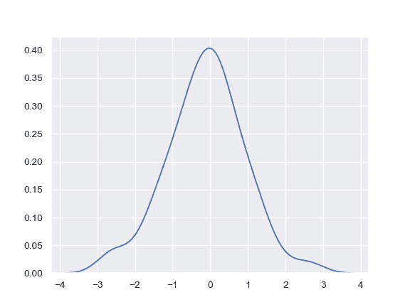
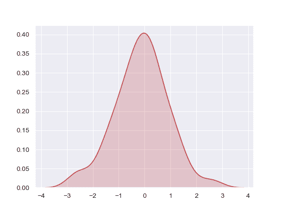
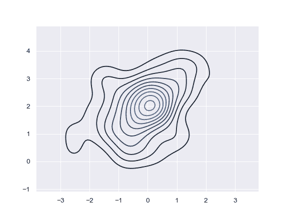
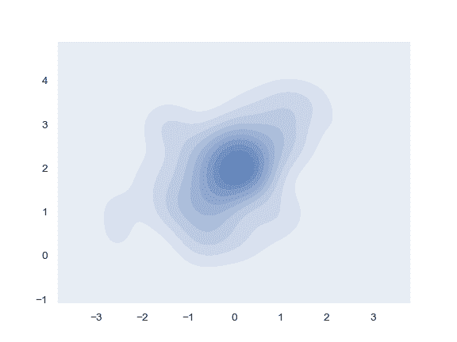
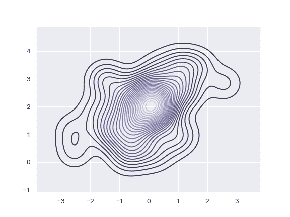
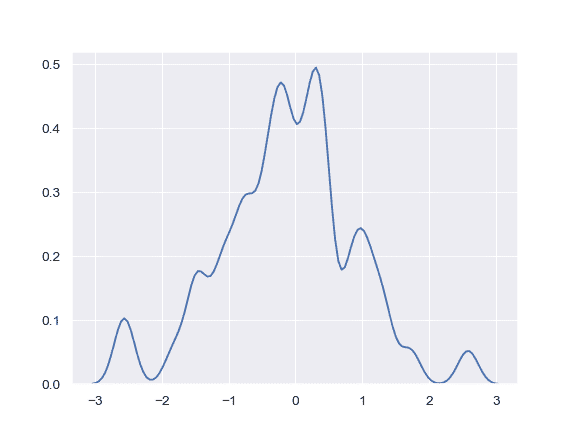
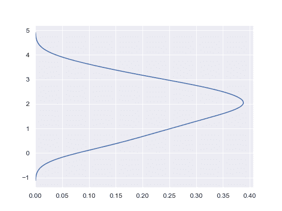
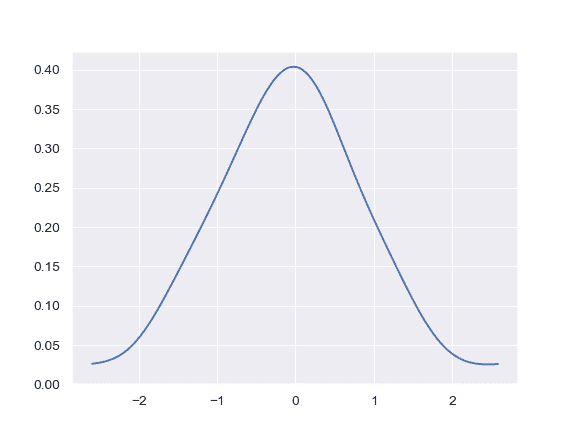
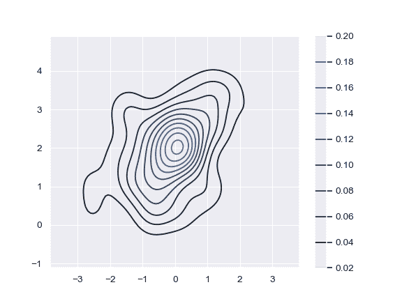
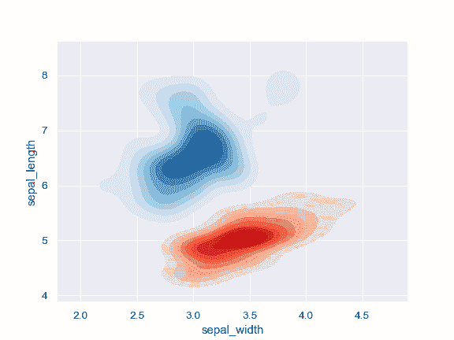

# seaborn.kdeplot

```py
seaborn.kdeplot(data, data2=None, shade=False, vertical=False, kernel='gau', bw='scott', gridsize=100, cut=3, clip=None, legend=True, cumulative=False, shade_lowest=True, cbar=False, cbar_ax=None, cbar_kws=None, ax=None, **kwargs)
```

Fit and plot a univariate or bivariate kernel density estimate.

参数：`data`：1d array-like

> Input data.

**data2: 1d array-like, optional**

> Second input data. If present, a bivariate KDE will be estimated.

`shade`：bool, optional

> If True, shade in the area under the KDE curve (or draw with filled contours when data is bivariate).

`vertical`：bool, optional

> If True, density is on x-axis.

`kernel`：{‘gau’ &#124; ‘cos’ &#124; ‘biw’ &#124; ‘epa’ &#124; ‘tri’ &#124; ‘triw’ }, optional

> Code for shape of kernel to fit with. Bivariate KDE can only use gaussian kernel.

`bw`：{‘scott’ &#124; ‘silverman’ &#124; scalar &#124; pair of scalars }, optional

> Name of reference method to determine kernel size, scalar factor, or scalar for each dimension of the bivariate plot. Note that the underlying computational libraries have different interperetations for this parameter: `statsmodels` uses it directly, but `scipy` treats it as a scaling factor for the standard deviation of the data.

`gridsize`：int, optional

> Number of discrete points in the evaluation grid.

`cut`：scalar, optional

> Draw the estimate to cut * bw from the extreme data points.

`clip`：pair of scalars, or pair of pair of scalars, optional

> Lower and upper bounds for datapoints used to fit KDE. Can provide a pair of (low, high) bounds for bivariate plots.

`legend`：bool, optional

> If True, add a legend or label the axes when possible.

`cumulative`：bool, optional

> If True, draw the cumulative distribution estimated by the kde.

`shade_lowest`：bool, optional

> If True, shade the lowest contour of a bivariate KDE plot. Not relevant when drawing a univariate plot or when `shade=False`. Setting this to `False` can be useful when you want multiple densities on the same Axes.

`cbar`：bool, optional

> If True and drawing a bivariate KDE plot, add a colorbar.

`cbar_ax`：matplotlib axes, optional

> Existing axes to draw the colorbar onto, otherwise space is taken from the main axes.

`cbar_kws`：dict, optional

> Keyword arguments for `fig.colorbar()`.

`ax`：matplotlib axes, optional

> Axes to plot on, otherwise uses current axes.

`kwargs`：key, value pairings

> Other keyword arguments are passed to `plt.plot()` or `plt.contour{f}` depending on whether a univariate or bivariate plot is being drawn.


返回值：`ax`：matplotlib Axes

> Axes with plot.


See also

Flexibly plot a univariate distribution of observations.Plot a joint dataset with bivariate and marginal distributions.

Examples

Plot a basic univariate density:

```py
>>> import numpy as np; np.random.seed(10)
>>> import seaborn as sns; sns.set(color_codes=True)
>>> mean, cov = [0, 2], [(1, .5), (.5, 1)]
>>> x, y = np.random.multivariate_normal(mean, cov, size=50).T
>>> ax = sns.kdeplot(x)

```



Shade under the density curve and use a different color:

```py
>>> ax = sns.kdeplot(x, shade=True, color="r")

```



Plot a bivariate density:

```py
>>> ax = sns.kdeplot(x, y)

```



Use filled contours:

```py
>>> ax = sns.kdeplot(x, y, shade=True)

```



Use more contour levels and a different color palette:

```py
>>> ax = sns.kdeplot(x, y, n_levels=30, cmap="Purples_d")

```



Use a narrower bandwith:

```py
>>> ax = sns.kdeplot(x, bw=.15)

```



Plot the density on the vertical axis:

```py
>>> ax = sns.kdeplot(y, vertical=True)

```



Limit the density curve within the range of the data:

```py
>>> ax = sns.kdeplot(x, cut=0)

```



Add a colorbar for the contours:

```py
>>> ax = sns.kdeplot(x, y, cbar=True)

```



Plot two shaded bivariate densities:

```py
>>> iris = sns.load_dataset("iris")
>>> setosa = iris.loc[iris.species == "setosa"]
>>> virginica = iris.loc[iris.species == "virginica"]
>>> ax = sns.kdeplot(setosa.sepal_width, setosa.sepal_length,
...                  cmap="Reds", shade=True, shade_lowest=False)
>>> ax = sns.kdeplot(virginica.sepal_width, virginica.sepal_length,
...                  cmap="Blues", shade=True, shade_lowest=False)

```

