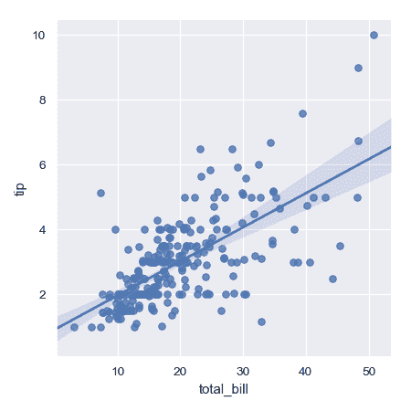
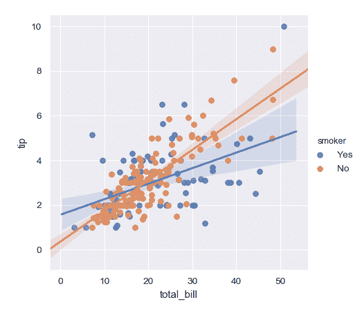
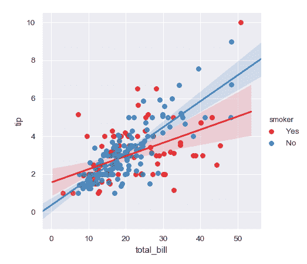
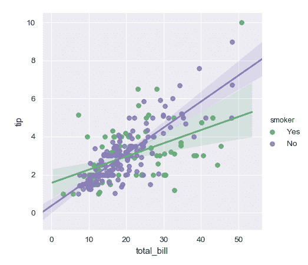
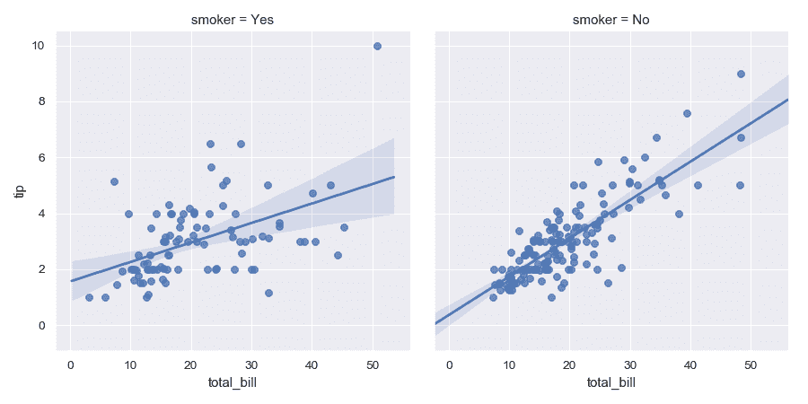
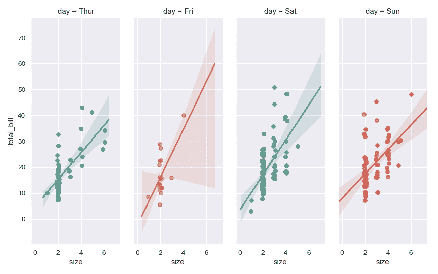
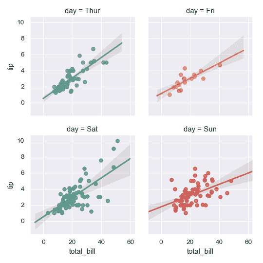
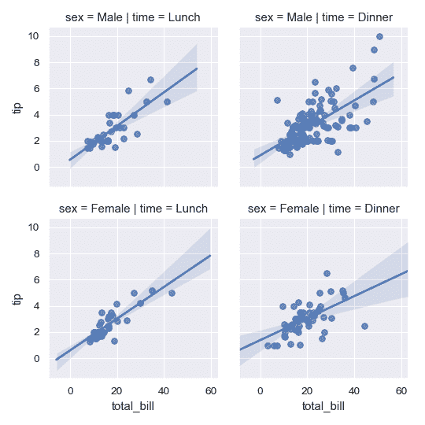
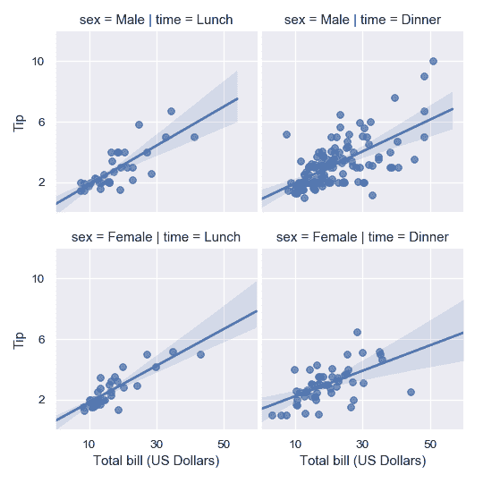

# seaborn.lmplot

```py
seaborn.lmplot(x, y, data, hue=None, col=None, row=None, palette=None, col_wrap=None, height=5, aspect=1, markers='o', sharex=True, sharey=True, hue_order=None, col_order=None, row_order=None, legend=True, legend_out=True, x_estimator=None, x_bins=None, x_ci='ci', scatter=True, fit_reg=True, ci=95, n_boot=1000, units=None, order=1, logistic=False, lowess=False, robust=False, logx=False, x_partial=None, y_partial=None, truncate=False, x_jitter=None, y_jitter=None, scatter_kws=None, line_kws=None, size=None)
```

Plot data and regression model fits across a FacetGrid.

This function combines [`regplot()`](seaborn.regplot.html#seaborn.regplot "seaborn.regplot") and [`FacetGrid`](seaborn.FacetGrid.html#seaborn.FacetGrid "seaborn.FacetGrid"). It is intended as a convenient interface to fit regression models across conditional subsets of a dataset.

When thinking about how to assign variables to different facets, a general rule is that it makes sense to use `hue` for the most important comparison, followed by `col` and `row`. However, always think about your particular dataset and the goals of the visualization you are creating.

There are a number of mutually exclusive options for estimating the regression model. See the [tutorial](../tutorial/regression.html#regression-tutorial) for more information.

The parameters to this function span most of the options in [`FacetGrid`](seaborn.FacetGrid.html#seaborn.FacetGrid "seaborn.FacetGrid"), although there may be occasional cases where you will want to use that class and [`regplot()`](seaborn.regplot.html#seaborn.regplot "seaborn.regplot") directly.

参数：`x, y`：strings, optional

> Input variables; these should be column names in `data`.

`data`：DataFrame

> Tidy (“long-form”) dataframe where each column is a variable and each row is an observation.

`hue, col, row`：strings

> Variables that define subsets of the data, which will be drawn on separate facets in the grid. See the `*_order` parameters to control the order of levels of this variable.

`palette`：palette name, list, or dict, optional

> Colors to use for the different levels of the `hue` variable. Should be something that can be interpreted by [`color_palette()`](seaborn.color_palette.html#seaborn.color_palette "seaborn.color_palette"), or a dictionary mapping hue levels to matplotlib colors.

`col_wrap`：int, optional

> “Wrap” the column variable at this width, so that the column facets span multiple rows. Incompatible with a `row` facet.

`height`：scalar, optional

> Height (in inches) of each facet. See also: `aspect`.

`aspect`：scalar, optional

> Aspect ratio of each facet, so that `aspect * height` gives the width of each facet in inches.

`markers`：matplotlib marker code or list of marker codes, optional

> Markers for the scatterplot. If a list, each marker in the list will be used for each level of the `hue` variable.

`share{x,y}`：bool, ‘col’, or ‘row’ optional

> If true, the facets will share y axes across columns and/or x axes across rows.

`{hue,col,row}_order`：lists, optional

> Order for the levels of the faceting variables. By default, this will be the order that the levels appear in `data` or, if the variables are pandas categoricals, the category order.

`legend`：bool, optional

> If `True` and there is a `hue` variable, add a legend.

`legend_out`：bool, optional

> If `True`, the figure size will be extended, and the legend will be drawn outside the plot on the center right.

`x_estimator`：callable that maps vector -&gt; scalar, optional

> Apply this function to each unique value of `x` and plot the resulting estimate. This is useful when `x` is a discrete variable. If `x_ci` is given, this estimate will be bootstrapped and a confidence interval will be drawn.

`x_bins`：int or vector, optional

> Bin the `x` variable into discrete bins and then estimate the central tendency and a confidence interval. This binning only influences how the scatterplot is drawn; the regression is still fit to the original data. This parameter is interpreted either as the number of evenly-sized (not necessary spaced) bins or the positions of the bin centers. When this parameter is used, it implies that the default of `x_estimator` is `numpy.mean`.

`x_ci`：“ci”, “sd”, int in [0, 100] or None, optional

> Size of the confidence interval used when plotting a central tendency for discrete values of `x`. If `"ci"`, defer to the value of the `ci` parameter. If `"sd"`, skip bootstrapping and show the standard deviation of the observations in each bin.

`scatter`：bool, optional

> If `True`, draw a scatterplot with the underlying observations (or the `x_estimator` values).

`fit_reg`：bool, optional

> If `True`, estimate and plot a regression model relating the `x` and `y` variables.

`ci`：int in [0, 100] or None, optional

> Size of the confidence interval for the regression estimate. This will be drawn using translucent bands around the regression line. The confidence interval is estimated using a bootstrap; for large datasets, it may be advisable to avoid that computation by setting this parameter to None.

`n_boot`：int, optional

> Number of bootstrap resamples used to estimate the `ci`. The default value attempts to balance time and stability; you may want to increase this value for “final” versions of plots.

`units`：variable name in `data`, optional

> If the `x` and `y` observations are nested within sampling units, those can be specified here. This will be taken into account when computing the confidence intervals by performing a multilevel bootstrap that resamples both units and observations (within unit). This does not otherwise influence how the regression is estimated or drawn.

`order`：int, optional

> If `order` is greater than 1, use `numpy.polyfit` to estimate a polynomial regression.

`logistic`：bool, optional

> If `True`, assume that `y` is a binary variable and use `statsmodels` to estimate a logistic regression model. Note that this is substantially more computationally intensive than linear regression, so you may wish to decrease the number of bootstrap resamples (`n_boot`) or set `ci` to None.

`lowess`：bool, optional

> If `True`, use `statsmodels` to estimate a nonparametric lowess model (locally weighted linear regression). Note that confidence intervals cannot currently be drawn for this kind of model.

`robust`：bool, optional

> If `True`, use `statsmodels` to estimate a robust regression. This will de-weight outliers. Note that this is substantially more computationally intensive than standard linear regression, so you may wish to decrease the number of bootstrap resamples (`n_boot`) or set `ci` to None.

`logx`：bool, optional

> If `True`, estimate a linear regression of the form y ~ log(x), but plot the scatterplot and regression model in the input space. Note that `x` must be positive for this to work.

`{x,y}_partial`：strings in `data` or matrices

> Confounding variables to regress out of the `x` or `y` variables before plotting.

`truncate`：bool, optional

> By default, the regression line is drawn to fill the x axis limits after the scatterplot is drawn. If `truncate` is `True`, it will instead by bounded by the data limits.

`{x,y}_jitter`：floats, optional

> Add uniform random noise of this size to either the `x` or `y` variables. The noise is added to a copy of the data after fitting the regression, and only influences the look of the scatterplot. This can be helpful when plotting variables that take discrete values.

`{scatter,line}_kws`：dictionaries

> Additional keyword arguments to pass to `plt.scatter` and `plt.plot`.


See also

Plot data and a conditional model fit.Subplot grid for plotting conditional relationships.Combine [`regplot()`](seaborn.regplot.html#seaborn.regplot "seaborn.regplot") and [`PairGrid`](seaborn.PairGrid.html#seaborn.PairGrid "seaborn.PairGrid") (when used with `kind="reg"`).

Notes

The [`regplot()`](seaborn.regplot.html#seaborn.regplot "seaborn.regplot") and [`lmplot()`](#seaborn.lmplot "seaborn.lmplot") functions are closely related, but the former is an axes-level function while the latter is a figure-level function that combines [`regplot()`](seaborn.regplot.html#seaborn.regplot "seaborn.regplot") and [`FacetGrid`](seaborn.FacetGrid.html#seaborn.FacetGrid "seaborn.FacetGrid").

Examples

These examples focus on basic regression model plots to exhibit the various faceting options; see the [`regplot()`](seaborn.regplot.html#seaborn.regplot "seaborn.regplot") docs for demonstrations of the other options for plotting the data and models. There are also other examples for how to manipulate plot using the returned object on the [`FacetGrid`](seaborn.FacetGrid.html#seaborn.FacetGrid "seaborn.FacetGrid") docs.

Plot a simple linear relationship between two variables:

```py
>>> import seaborn as sns; sns.set(color_codes=True)
>>> tips = sns.load_dataset("tips")
>>> g = sns.lmplot(x="total_bill", y="tip", data=tips)

```



Condition on a third variable and plot the levels in different colors:

```py
>>> g = sns.lmplot(x="total_bill", y="tip", hue="smoker", data=tips)

```



Use different markers as well as colors so the plot will reproduce to black-and-white more easily:

```py
>>> g = sns.lmplot(x="total_bill", y="tip", hue="smoker", data=tips,
...                markers=["o", "x"])

```


Use a different color palette:

```py
>>> g = sns.lmplot(x="total_bill", y="tip", hue="smoker", data=tips,
...                palette="Set1")

```



Map `hue` levels to colors with a dictionary:

```py
>>> g = sns.lmplot(x="total_bill", y="tip", hue="smoker", data=tips,
...                palette=dict(Yes="g", No="m"))

```



Plot the levels of the third variable across different columns:

```py
>>> g = sns.lmplot(x="total_bill", y="tip", col="smoker", data=tips)

```



Change the height and aspect ratio of the facets:

```py
>>> g = sns.lmplot(x="size", y="total_bill", hue="day", col="day",
...                data=tips, height=6, aspect=.4, x_jitter=.1)

```



Wrap the levels of the column variable into multiple rows:

```py
>>> g = sns.lmplot(x="total_bill", y="tip", col="day", hue="day",
...                data=tips, col_wrap=2, height=3)

```



Condition on two variables to make a full grid:

```py
>>> g = sns.lmplot(x="total_bill", y="tip", row="sex", col="time",
...                data=tips, height=3)

```



Use methods on the returned [`FacetGrid`](seaborn.FacetGrid.html#seaborn.FacetGrid "seaborn.FacetGrid") instance to further tweak the plot:

```py
>>> g = sns.lmplot(x="total_bill", y="tip", row="sex", col="time",
...                data=tips, height=3)
>>> g = (g.set_axis_labels("Total bill (US Dollars)", "Tip")
...       .set(xlim=(0, 60), ylim=(0, 12),
...            xticks=[10, 30, 50], yticks=[2, 6, 10])
...       .fig.subplots_adjust(wspace=.02))

```

