# seaborn.regplot

```py
seaborn.regplot(x, y, data=None, x_estimator=None, x_bins=None, x_ci='ci', scatter=True, fit_reg=True, ci=95, n_boot=1000, units=None, order=1, logistic=False, lowess=False, robust=False, logx=False, x_partial=None, y_partial=None, truncate=False, dropna=True, x_jitter=None, y_jitter=None, label=None, color=None, marker='o', scatter_kws=None, line_kws=None, ax=None)
```

Plot data and a linear regression model fit.

There are a number of mutually exclusive options for estimating the regression model. See the [tutorial](../tutorial/regression.html#regression-tutorial) for more information.

参数：**x, y：string, series, or vector array**

> Input variables. If strings, these should correspond with column names in `data`. When pandas objects are used, axes will be labeled with the series name.

`data`：DataFrame

> Tidy (“long-form”) dataframe where each column is a variable and each row is an observation.

`x_estimator`：callable that maps vector -&gt; scalar, optional

> Apply this function to each unique value of `x` and plot the resulting estimate. This is useful when `x` is a discrete variable. If `x_ci` is given, this estimate will be bootstrapped and a confidence interval will be drawn.

`x_bins`：int or vector, optional

> Bin the `x` variable into discrete bins and then estimate the central tendency and a confidence interval. This binning only influences how the scatterplot is drawn; the regression is still fit to the original data. This parameter is interpreted either as the number of evenly-sized (not necessary spaced) bins or the positions of the bin centers. When this parameter is used, it implies that the default of `x_estimator` is `numpy.mean`.

`x_ci`：“ci”, “sd”, int in [0, 100] or None, optional

> Size of the confidence interval used when plotting a central tendency for discrete values of `x`. If `"ci"`, defer to the value of the `ci` parameter. If `"sd"`, skip bootstrapping and show the standard deviation of the observations in each bin.

`scatter`：bool, optional

> If `True`, draw a scatterplot with the underlying observations (or the `x_estimator` values).

`fit_reg`：bool, optional

> If `True`, estimate and plot a regression model relating the `x` and `y` variables.

`ci`：int in [0, 100] or None, optional

> Size of the confidence interval for the regression estimate. This will be drawn using translucent bands around the regression line. The confidence interval is estimated using a bootstrap; for large datasets, it may be advisable to avoid that computation by setting this parameter to None.

`n_boot`：int, optional

> Number of bootstrap resamples used to estimate the `ci`. The default value attempts to balance time and stability; you may want to increase this value for “final” versions of plots.

`units`：variable name in `data`, optional

> If the `x` and `y` observations are nested within sampling units, those can be specified here. This will be taken into account when computing the confidence intervals by performing a multilevel bootstrap that resamples both units and observations (within unit). This does not otherwise influence how the regression is estimated or drawn.

`order`：int, optional

> If `order` is greater than 1, use `numpy.polyfit` to estimate a polynomial regression.

`logistic`：bool, optional

> If `True`, assume that `y` is a binary variable and use `statsmodels` to estimate a logistic regression model. Note that this is substantially more computationally intensive than linear regression, so you may wish to decrease the number of bootstrap resamples (`n_boot`) or set `ci` to None.

`lowess`：bool, optional

> If `True`, use `statsmodels` to estimate a nonparametric lowess model (locally weighted linear regression). Note that confidence intervals cannot currently be drawn for this kind of model.

`robust`：bool, optional

> If `True`, use `statsmodels` to estimate a robust regression. This will de-weight outliers. Note that this is substantially more computationally intensive than standard linear regression, so you may wish to decrease the number of bootstrap resamples (`n_boot`) or set `ci` to None.

`logx`：bool, optional

> If `True`, estimate a linear regression of the form y ~ log(x), but plot the scatterplot and regression model in the input space. Note that `x` must be positive for this to work.

`{x,y}_partial`：strings in `data` or matrices

> Confounding variables to regress out of the `x` or `y` variables before plotting.

`truncate`：bool, optional

> By default, the regression line is drawn to fill the x axis limits after the scatterplot is drawn. If `truncate` is `True`, it will instead by bounded by the data limits.

`{x,y}_jitter`：floats, optional

> Add uniform random noise of this size to either the `x` or `y` variables. The noise is added to a copy of the data after fitting the regression, and only influences the look of the scatterplot. This can be helpful when plotting variables that take discrete values.

`label`：string

> Label to apply to ether the scatterplot or regression line (if `scatter` is `False`) for use in a legend.

`color`：matplotlib color

> Color to apply to all plot elements; will be superseded by colors passed in `scatter_kws` or `line_kws`.

`marker`：matplotlib marker code

> Marker to use for the scatterplot glyphs.

`{scatter,line}_kws`：dictionaries

> Additional keyword arguments to pass to `plt.scatter` and `plt.plot`.

`ax`：matplotlib Axes, optional

> Axes object to draw the plot onto, otherwise uses the current Axes.


返回值：`ax`：matplotlib Axes

> The Axes object containing the plot.


See also

Combine [`regplot()`](#seaborn.regplot "seaborn.regplot") and [`FacetGrid`](seaborn.FacetGrid.html#seaborn.FacetGrid "seaborn.FacetGrid") to plot multiple linear relationships in a dataset.Combine [`regplot()`](#seaborn.regplot "seaborn.regplot") and [`JointGrid`](seaborn.JointGrid.html#seaborn.JointGrid "seaborn.JointGrid") (when used with `kind="reg"`).Combine [`regplot()`](#seaborn.regplot "seaborn.regplot") and [`PairGrid`](seaborn.PairGrid.html#seaborn.PairGrid "seaborn.PairGrid") (when used with `kind="reg"`).Plot the residuals of a linear regression model.

Notes

The [`regplot()`](#seaborn.regplot "seaborn.regplot") and [`lmplot()`](seaborn.lmplot.html#seaborn.lmplot "seaborn.lmplot") functions are closely related, but the former is an axes-level function while the latter is a figure-level function that combines [`regplot()`](#seaborn.regplot "seaborn.regplot") and [`FacetGrid`](seaborn.FacetGrid.html#seaborn.FacetGrid "seaborn.FacetGrid").

It’s also easy to combine combine [`regplot()`](#seaborn.regplot "seaborn.regplot") and [`JointGrid`](seaborn.JointGrid.html#seaborn.JointGrid "seaborn.JointGrid") or [`PairGrid`](seaborn.PairGrid.html#seaborn.PairGrid "seaborn.PairGrid") through the [`jointplot()`](seaborn.jointplot.html#seaborn.jointplot "seaborn.jointplot") and [`pairplot()`](seaborn.pairplot.html#seaborn.pairplot "seaborn.pairplot") functions, although these do not directly accept all of [`regplot()`](#seaborn.regplot "seaborn.regplot")’s parameters.

Examples

Plot the relationship between two variables in a DataFrame:

```py
>>> import seaborn as sns; sns.set(color_codes=True)
>>> tips = sns.load_dataset("tips")
>>> ax = sns.regplot(x="total_bill", y="tip", data=tips)

```

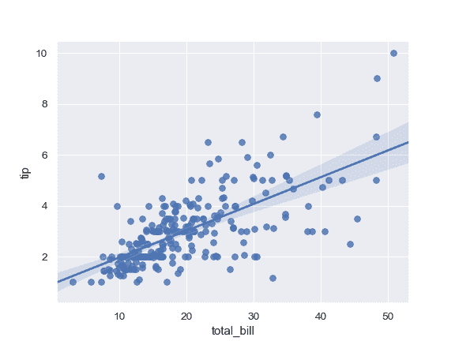

Plot with two variables defined as numpy arrays; use a different color:

```py
>>> import numpy as np; np.random.seed(8)
>>> mean, cov = [4, 6], [(1.5, .7), (.7, 1)]
>>> x, y = np.random.multivariate_normal(mean, cov, 80).T
>>> ax = sns.regplot(x=x, y=y, color="g")

```

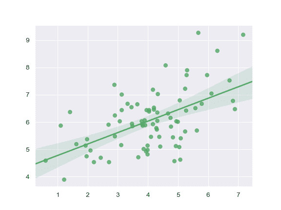

Plot with two variables defined as pandas Series; use a different marker:

```py
>>> import pandas as pd
>>> x, y = pd.Series(x, name="x_var"), pd.Series(y, name="y_var")
>>> ax = sns.regplot(x=x, y=y, marker="+")

```

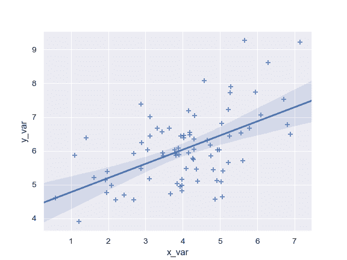

Use a 68% confidence interval, which corresponds with the standard error of the estimate:

```py
>>> ax = sns.regplot(x=x, y=y, ci=68)

```

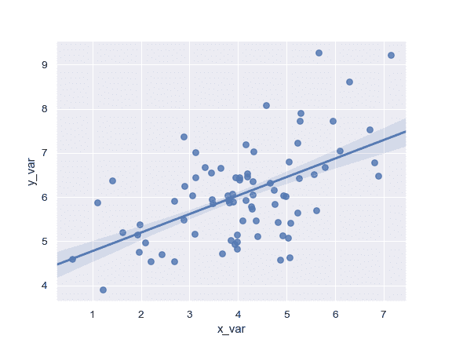

Plot with a discrete `x` variable and add some jitter:

```py
>>> ax = sns.regplot(x="size", y="total_bill", data=tips, x_jitter=.1)

```

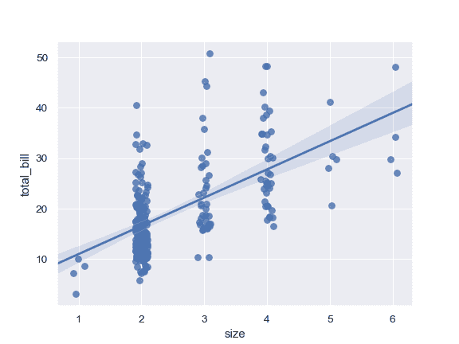

Plot with a discrete `x` variable showing means and confidence intervals for unique values:

```py
>>> ax = sns.regplot(x="size", y="total_bill", data=tips,
...                  x_estimator=np.mean)

```

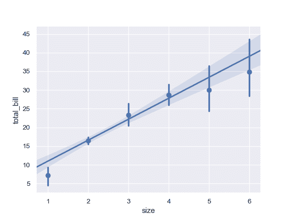

Plot with a continuous variable divided into discrete bins:

```py
>>> ax = sns.regplot(x=x, y=y, x_bins=4)

```

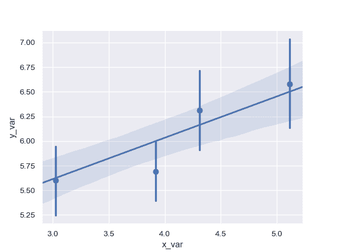

Fit a higher-order polynomial regression and truncate the model prediction:

```py
>>> ans = sns.load_dataset("anscombe")
>>> ax = sns.regplot(x="x", y="y", data=ans.loc[ans.dataset == "II"],
...                  scatter_kws={"s": 80},
...                  order=2, ci=None, truncate=True)

```

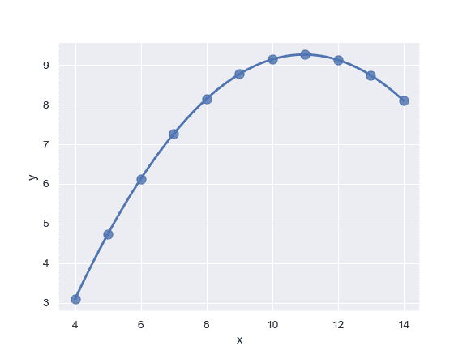

Fit a robust regression and don’t plot a confidence interval:

```py
>>> ax = sns.regplot(x="x", y="y", data=ans.loc[ans.dataset == "III"],
...                  scatter_kws={"s": 80},
...                  robust=True, ci=None)

```

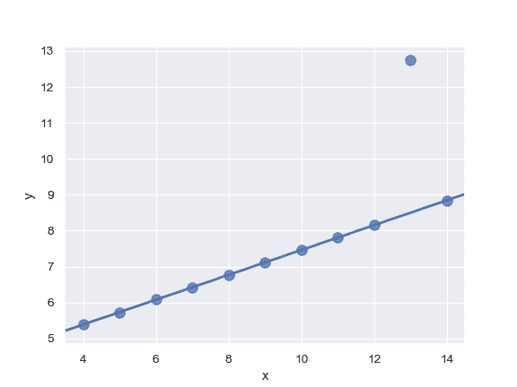

Fit a logistic regression; jitter the y variable and use fewer bootstrap iterations:

```py
>>> tips["big_tip"] = (tips.tip / tips.total_bill) > .175
>>> ax = sns.regplot(x="total_bill", y="big_tip", data=tips,
...                  logistic=True, n_boot=500, y_jitter=.03)

```

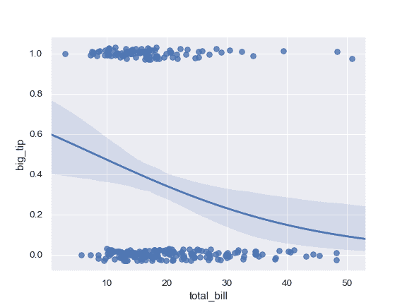

Fit the regression model using log(x) and truncate the model prediction:

```py
>>> ax = sns.regplot(x="size", y="total_bill", data=tips,
...                  x_estimator=np.mean, logx=True, truncate=True)

```

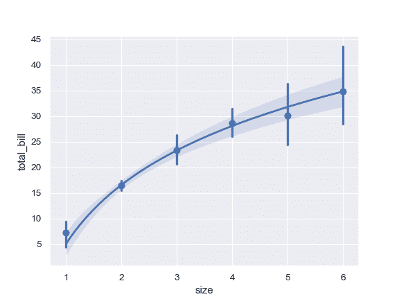