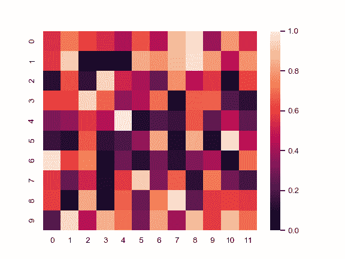
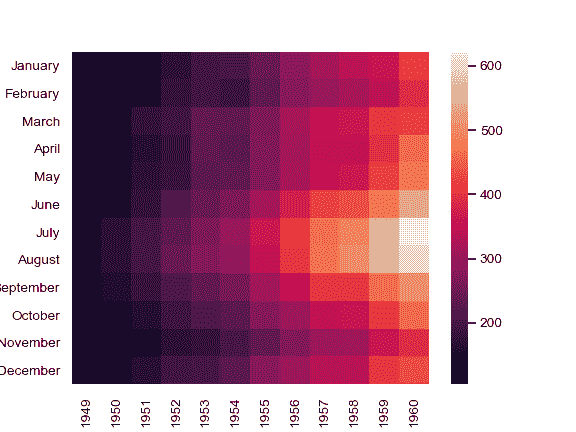
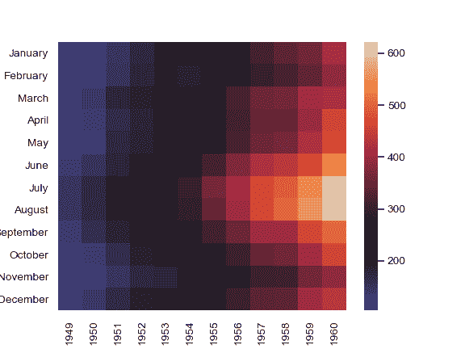
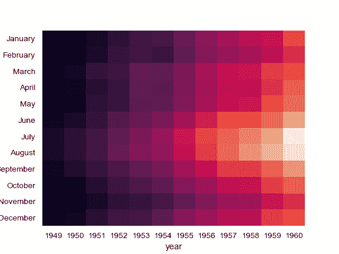
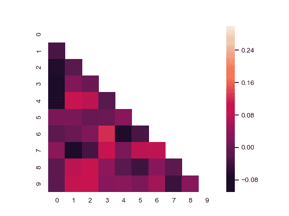

# seaborn.heatmap

```py
seaborn.heatmap(data, vmin=None, vmax=None, cmap=None, center=None, robust=False, annot=None, fmt='.2g', annot_kws=None, linewidths=0, linecolor='white', cbar=True, cbar_kws=None, cbar_ax=None, square=False, xticklabels='auto', yticklabels='auto', mask=None, ax=None, **kwargs)
```

Plot rectangular data as a color-encoded matrix.

This is an Axes-level function and will draw the heatmap into the currently-active Axes if none is provided to the `ax` argument. Part of this Axes space will be taken and used to plot a colormap, unless `cbar` is False or a separate Axes is provided to `cbar_ax`.

参数：`data`：rectangular dataset

> 2D dataset that can be coerced into an ndarray. If a Pandas DataFrame is provided, the index/column information will be used to label the columns and rows.

`vmin, vmax`：floats, optional

> Values to anchor the colormap, otherwise they are inferred from the data and other keyword arguments.

`cmap`：matplotlib colormap name or object, or list of colors, optional

> The mapping from data values to color space. If not provided, the default will depend on whether `center` is set.

`center`：float, optional

> The value at which to center the colormap when plotting divergant data. Using this parameter will change the default `cmap` if none is specified.

`robust`：bool, optional

> If True and `vmin` or `vmax` are absent, the colormap range is computed with robust quantiles instead of the extreme values.

`annot`：bool or rectangular dataset, optional

> If True, write the data value in each cell. If an array-like with the same shape as `data`, then use this to annotate the heatmap instead of the raw data.

`fmt`：string, optional

> String formatting code to use when adding annotations.

`annot_kws`：dict of key, value mappings, optional

> Keyword arguments for `ax.text` when `annot` is True.

`linewidths`：float, optional

> Width of the lines that will divide each cell.

`linecolor`：color, optional

> Color of the lines that will divide each cell.

`cbar`：boolean, optional

> Whether to draw a colorbar.

`cbar_kws`：dict of key, value mappings, optional

> Keyword arguments for &lt;cite&gt;fig.colorbar&lt;/cite&gt;.

`cbar_ax`：matplotlib Axes, optional

> Axes in which to draw the colorbar, otherwise take space from the main Axes.

`square`：boolean, optional

> If True, set the Axes aspect to “equal” so each cell will be square-shaped.

`xticklabels, yticklabels`：“auto”, bool, list-like, or int, optional

> If True, plot the column names of the dataframe. If False, don’t plot the column names. If list-like, plot these alternate labels as the xticklabels. If an integer, use the column names but plot only every n label. If “auto”, try to densely plot non-overlapping labels.

`mask`：boolean array or DataFrame, optional

> If passed, data will not be shown in cells where `mask` is True. Cells with missing values are automatically masked.

`ax`：matplotlib Axes, optional

> Axes in which to draw the plot, otherwise use the currently-active Axes.

`kwargs`：other keyword arguments

> All other keyword arguments are passed to `ax.pcolormesh`.


返回值：`ax`：matplotlib Axes

> Axes object with the heatmap.


See also

Plot a matrix using hierachical clustering to arrange the rows and columns.

Examples

Plot a heatmap for a numpy array:

```py
>>> import numpy as np; np.random.seed(0)
>>> import seaborn as sns; sns.set()
>>> uniform_data = np.random.rand(10, 12)
>>> ax = sns.heatmap(uniform_data)

```


Change the limits of the colormap:

```py
>>> ax = sns.heatmap(uniform_data, vmin=0, vmax=1)

```



Plot a heatmap for data centered on 0 with a diverging colormap:

```py
>>> normal_data = np.random.randn(10, 12)
>>> ax = sns.heatmap(normal_data, center=0)

```


Plot a dataframe with meaningful row and column labels:

```py
>>> flights = sns.load_dataset("flights")
>>> flights = flights.pivot("month", "year", "passengers")
>>> ax = sns.heatmap(flights)

```



Annotate each cell with the numeric value using integer formatting:

```py
>>> ax = sns.heatmap(flights, annot=True, fmt="d")

```


Add lines between each cell:

```py
>>> ax = sns.heatmap(flights, linewidths=.5)

```


Use a different colormap:

```py
>>> ax = sns.heatmap(flights, cmap="YlGnBu")

```


Center the colormap at a specific value:

```py
>>> ax = sns.heatmap(flights, center=flights.loc["January", 1955])

```



Plot every other column label and don’t plot row labels:

```py
>>> data = np.random.randn(50, 20)
>>> ax = sns.heatmap(data, xticklabels=2, yticklabels=False)

```


Don’t draw a colorbar:

```py
>>> ax = sns.heatmap(flights, cbar=False)

```



Use different axes for the colorbar:

```py
>>> grid_kws = {"height_ratios": (.9, .05), "hspace": .3}
>>> f, (ax, cbar_ax) = plt.subplots(2, gridspec_kw=grid_kws)
>>> ax = sns.heatmap(flights, ax=ax,
...                  cbar_ax=cbar_ax,
...                  cbar_kws={"orientation": "horizontal"})

```


Use a mask to plot only part of a matrix

```py
>>> corr = np.corrcoef(np.random.randn(10, 200))
>>> mask = np.zeros_like(corr)
>>> mask[np.triu_indices_from(mask)] = True
>>> with sns.axes_style("white"):
...     ax = sns.heatmap(corr, mask=mask, vmax=.3, square=True)

```

