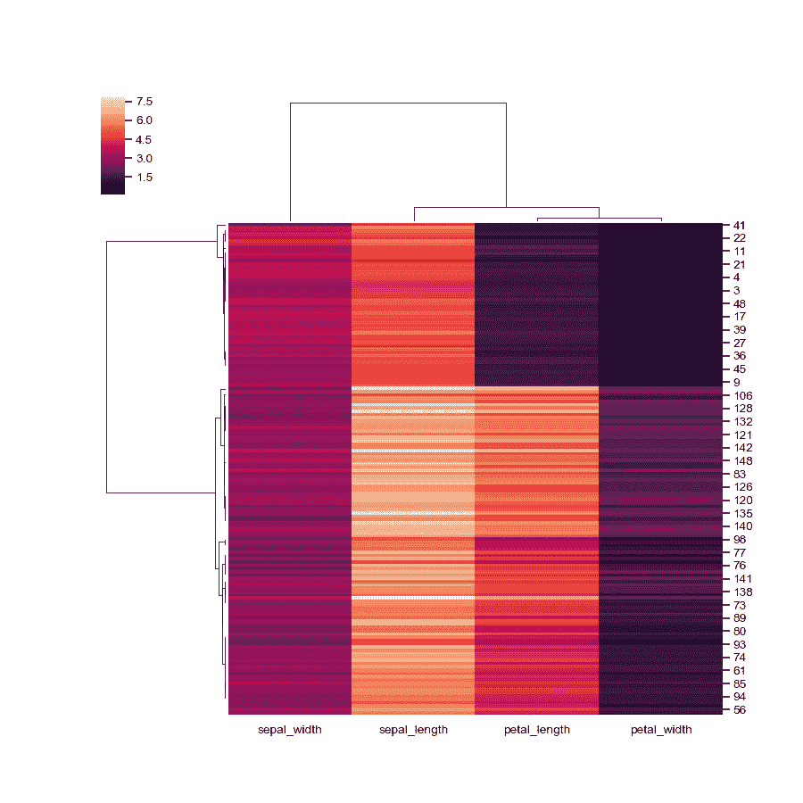
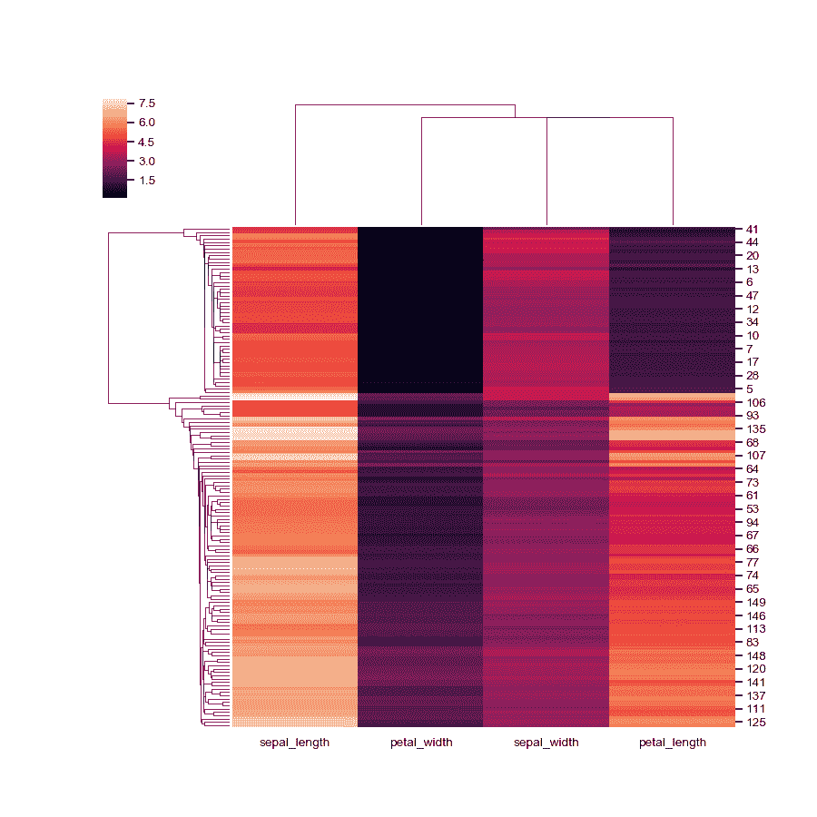
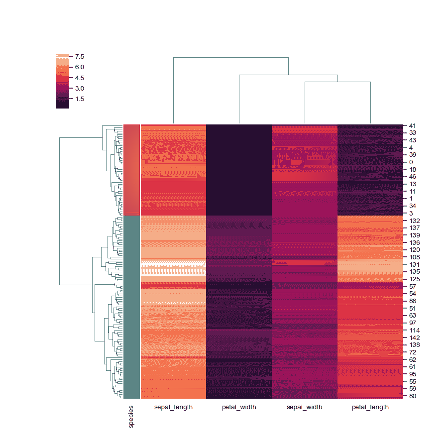
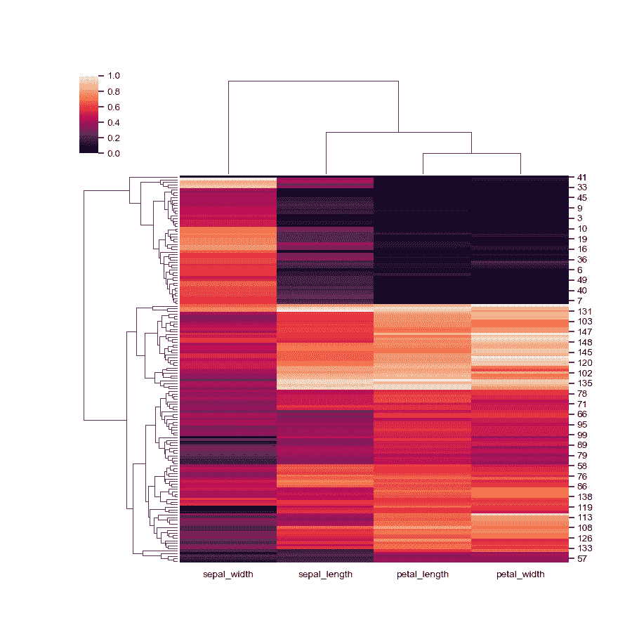

# seaborn.clustermap

```py
seaborn.clustermap(data, pivot_kws=None, method='average', metric='euclidean', z_score=None, standard_scale=None, figsize=None, cbar_kws=None, row_cluster=True, col_cluster=True, row_linkage=None, col_linkage=None, row_colors=None, col_colors=None, mask=None, **kwargs)
```

Plot a matrix dataset as a hierarchically-clustered heatmap.

参数：**data：2D array-like**

> Rectangular data for clustering. Cannot contain NAs.

`pivot_kws`：dict, optional

> If &lt;cite&gt;data&lt;/cite&gt; is a tidy dataframe, can provide keyword arguments for pivot to create a rectangular dataframe.

`method`：str, optional

> Linkage method to use for calculating clusters. See scipy.cluster.hierarchy.linkage documentation for more information: [https://docs.scipy.org/doc/scipy/reference/generated/scipy.cluster.hierarchy.linkage.html](https://docs.scipy.org/doc/scipy/reference/generated/scipy.cluster.hierarchy.linkage.html)

`metric`：str, optional

> Distance metric to use for the data. See scipy.spatial.distance.pdist documentation for more options [https://docs.scipy.org/doc/scipy/reference/generated/scipy.spatial.distance.pdist.html](https://docs.scipy.org/doc/scipy/reference/generated/scipy.spatial.distance.pdist.html) To use different metrics (or methods) for rows and columns, you may construct each linkage matrix yourself and provide them as {row,col}_linkage.

`z_score`：int or None, optional

> Either 0 (rows) or 1 (columns). Whether or not to calculate z-scores for the rows or the columns. Z scores are: z = (x - mean)/std, so values in each row (column) will get the mean of the row (column) subtracted, then divided by the standard deviation of the row (column). This ensures that each row (column) has mean of 0 and variance of 1.

`standard_scale`：int or None, optional

> Either 0 (rows) or 1 (columns). Whether or not to standardize that dimension, meaning for each row or column, subtract the minimum and divide each by its maximum.

**figsize: tuple of two ints, optional**

> Size of the figure to create.

`cbar_kws`：dict, optional

> Keyword arguments to pass to `cbar_kws` in `heatmap`, e.g. to add a label to the colorbar.

`{row,col}_cluster`：bool, optional

> If True, cluster the {rows, columns}.

`{row,col}_linkage`：numpy.array, optional

> Precomputed linkage matrix for the rows or columns. See scipy.cluster.hierarchy.linkage for specific formats.

`{row,col}_colors`：list-like or pandas DataFrame/Series, optional

> List of colors to label for either the rows or columns. Useful to evaluate whether samples within a group are clustered together. Can use nested lists or DataFrame for multiple color levels of labeling. If given as a DataFrame or Series, labels for the colors are extracted from the DataFrames column names or from the name of the Series. DataFrame/Series colors are also matched to the data by their index, ensuring colors are drawn in the correct order.

`mask`：boolean array or DataFrame, optional

> If passed, data will not be shown in cells where `mask` is True. Cells with missing values are automatically masked. Only used for visualizing, not for calculating.

`kwargs`：other keyword arguments

> All other keyword arguments are passed to `sns.heatmap`


返回值：`clustergrid`：ClusterGrid

> A ClusterGrid instance.


Notes

The returned object has a `savefig` method that should be used if you want to save the figure object without clipping the dendrograms.

To access the reordered row indices, use: `clustergrid.dendrogram_row.reordered_ind`

Column indices, use: `clustergrid.dendrogram_col.reordered_ind`

Examples

Plot a clustered heatmap:

```py
>>> import seaborn as sns; sns.set(color_codes=True)
>>> iris = sns.load_dataset("iris")
>>> species = iris.pop("species")
>>> g = sns.clustermap(iris)

```


Use a different similarity metric:

```py
>>> g = sns.clustermap(iris, metric="correlation")

```



Use a different clustering method:

```py
>>> g = sns.clustermap(iris, method="single")

```



Use a different colormap and ignore outliers in colormap limits:

```py
>>> g = sns.clustermap(iris, cmap="mako", robust=True)

```


Change the size of the figure:

```py
>>> g = sns.clustermap(iris, figsize=(6, 7))

```


Plot one of the axes in its original organization:

```py
>>> g = sns.clustermap(iris, col_cluster=False)

```


Add colored labels:

```py
>>> lut = dict(zip(species.unique(), "rbg"))
>>> row_colors = species.map(lut)
>>> g = sns.clustermap(iris, row_colors=row_colors)

```



Standardize the data within the columns:

```py
>>> g = sns.clustermap(iris, standard_scale=1)

```



Normalize the data within the rows:

```py
>>> g = sns.clustermap(iris, z_score=0)

```

