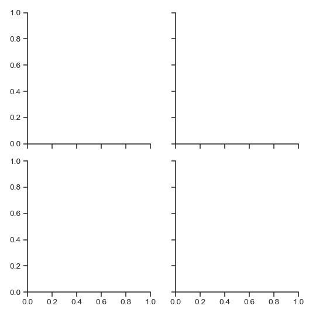
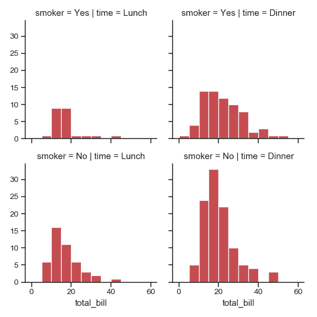
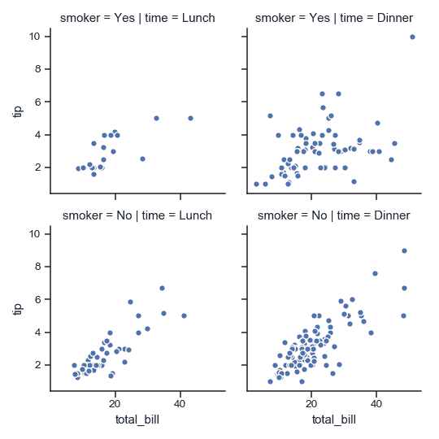
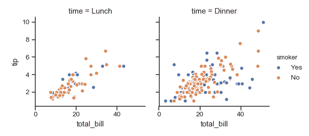
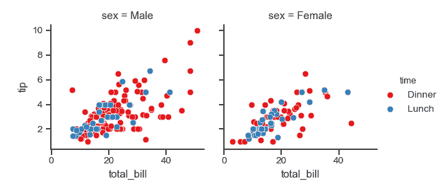
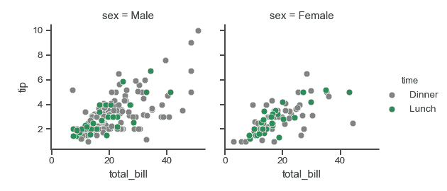
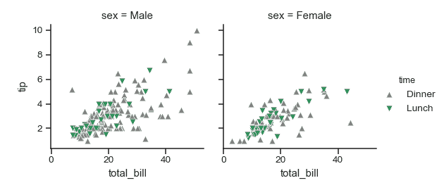
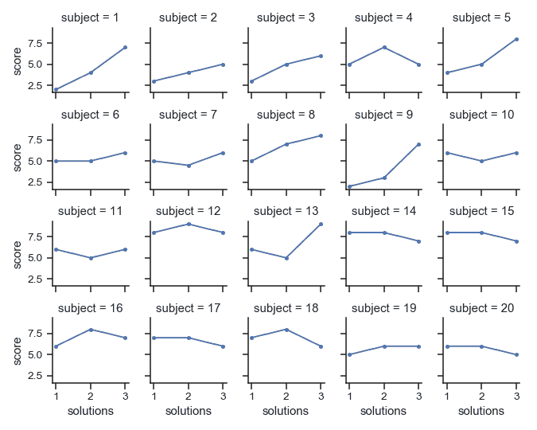

# seaborn.FacetGrid

```py
class seaborn.FacetGrid(data, row=None, col=None, hue=None, col_wrap=None, sharex=True, sharey=True, height=3, aspect=1, palette=None, row_order=None, col_order=None, hue_order=None, hue_kws=None, dropna=True, legend_out=True, despine=True, margin_titles=False, xlim=None, ylim=None, subplot_kws=None, gridspec_kws=None, size=None)
```

Multi-plot grid for plotting conditional relationships.

```py
__init__(data, row=None, col=None, hue=None, col_wrap=None, sharex=True, sharey=True, height=3, aspect=1, palette=None, row_order=None, col_order=None, hue_order=None, hue_kws=None, dropna=True, legend_out=True, despine=True, margin_titles=False, xlim=None, ylim=None, subplot_kws=None, gridspec_kws=None, size=None)
```

Initialize the matplotlib figure and FacetGrid object.

This class maps a dataset onto multiple axes arrayed in a grid of rows and columns that correspond to _levels_ of variables in the dataset. The plots it produces are often called “lattice”, “trellis”, or “small-multiple” graphics.

It can also represent levels of a third varaible with the `hue` parameter, which plots different subets of data in different colors. This uses color to resolve elements on a third dimension, but only draws subsets on top of each other and will not tailor the `hue` parameter for the specific visualization the way that axes-level functions that accept `hue` will.

When using seaborn functions that infer semantic mappings from a dataset, care must be taken to synchronize those mappings across facets. In most cases, it will be better to use a figure-level function (e.g. [`relplot()`](seaborn.relplot.html#seaborn.relplot "seaborn.relplot") or [`catplot()`](seaborn.catplot.html#seaborn.catplot "seaborn.catplot")) than to use [`FacetGrid`](#seaborn.FacetGrid "seaborn.FacetGrid") directly.

The basic workflow is to initialize the [`FacetGrid`](#seaborn.FacetGrid "seaborn.FacetGrid") object with the dataset and the variables that are used to structure the grid. Then one or more plotting functions can be applied to each subset by calling [`FacetGrid.map()`](seaborn.FacetGrid.map.html#seaborn.FacetGrid.map "seaborn.FacetGrid.map") or [`FacetGrid.map_dataframe()`](seaborn.FacetGrid.map_dataframe.html#seaborn.FacetGrid.map_dataframe "seaborn.FacetGrid.map_dataframe"). Finally, the plot can be tweaked with other methods to do things like change the axis labels, use different ticks, or add a legend. See the detailed code examples below for more information.

See the [tutorial](../tutorial/axis_grids.html#grid-tutorial) for more information.

| Parameters: | **data** : DataFrame

> Tidy (“long-form”) dataframe where each column is a variable and each row is an observation.

**row, col, hue** : strings

> Variables that define subsets of the data, which will be drawn on separate facets in the grid. See the `*_order` parameters to control the order of levels of this variable.

**col_wrap** : int, optional

> “Wrap” the column variable at this width, so that the column facets span multiple rows. Incompatible with a `row` facet.

**share{x,y}** : bool, ‘col’, or ‘row’ optional

> If true, the facets will share y axes across columns and/or x axes across rows.

**height** : scalar, optional

> Height (in inches) of each facet. See also: `aspect`.

**aspect** : scalar, optional

> Aspect ratio of each facet, so that `aspect * height` gives the width of each facet in inches.

**palette** : palette name, list, or dict, optional

> Colors to use for the different levels of the `hue` variable. Should be something that can be interpreted by [`color_palette()`](seaborn.color_palette.html#seaborn.color_palette "seaborn.color_palette"), or a dictionary mapping hue levels to matplotlib colors.

**{row,col,hue}_order** : lists, optional

> Order for the levels of the faceting variables. By default, this will be the order that the levels appear in `data` or, if the variables are pandas categoricals, the category order.

**hue_kws** : dictionary of param -&gt; list of values mapping

> Other keyword arguments to insert into the plotting call to let other plot attributes vary across levels of the hue variable (e.g. the markers in a scatterplot).

**legend_out** : bool, optional

> If `True`, the figure size will be extended, and the legend will be drawn outside the plot on the center right.

**despine** : boolean, optional

> Remove the top and right spines from the plots.

**margin_titles** : bool, optional

> If `True`, the titles for the row variable are drawn to the right of the last column. This option is experimental and may not work in all cases.

**{x, y}lim: tuples, optional**

> Limits for each of the axes on each facet (only relevant when share{x, y} is True.

**subplot_kws** : dict, optional

> Dictionary of keyword arguments passed to matplotlib subplot(s) methods.

**gridspec_kws** : dict, optional

> Dictionary of keyword arguments passed to matplotlib’s `gridspec` module (via `plt.subplots`). Requires matplotlib &gt;= 1.4 and is ignored if `col_wrap` is not `None`.

 |
| --- | --- |

See also

Subplot grid for plotting pairwise relationships.Combine a relational plot and a [`FacetGrid`](#seaborn.FacetGrid "seaborn.FacetGrid").Combine a categorical plot and a [`FacetGrid`](#seaborn.FacetGrid "seaborn.FacetGrid").Combine a regression plot and a [`FacetGrid`](#seaborn.FacetGrid "seaborn.FacetGrid").

Examples

Initialize a 2x2 grid of facets using the tips dataset:

```py
>>> import seaborn as sns; sns.set(style="ticks", color_codes=True)
>>> tips = sns.load_dataset("tips")
>>> g = sns.FacetGrid(tips, col="time", row="smoker")

```



Draw a univariate plot on each facet:

```py
>>> import matplotlib.pyplot as plt
>>> g = sns.FacetGrid(tips, col="time",  row="smoker")
>>> g = g.map(plt.hist, "total_bill")

```


(Note that it’s not necessary to re-catch the returned variable; it’s the same object, but doing so in the examples makes dealing with the doctests somewhat less annoying).

Pass additional keyword arguments to the mapped function:

```py
>>> import numpy as np
>>> bins = np.arange(0, 65, 5)
>>> g = sns.FacetGrid(tips, col="time",  row="smoker")
>>> g = g.map(plt.hist, "total_bill", bins=bins, color="r")

```



Plot a bivariate function on each facet:

```py
>>> g = sns.FacetGrid(tips, col="time",  row="smoker")
>>> g = g.map(plt.scatter, "total_bill", "tip", edgecolor="w")

```



Assign one of the variables to the color of the plot elements:

```py
>>> g = sns.FacetGrid(tips, col="time",  hue="smoker")
>>> g = (g.map(plt.scatter, "total_bill", "tip", edgecolor="w")
...       .add_legend())

```



Change the height and aspect ratio of each facet:

```py
>>> g = sns.FacetGrid(tips, col="day", height=4, aspect=.5)
>>> g = g.map(plt.hist, "total_bill", bins=bins)

```


Specify the order for plot elements:

```py
>>> g = sns.FacetGrid(tips, col="smoker", col_order=["Yes", "No"])
>>> g = g.map(plt.hist, "total_bill", bins=bins, color="m")

```


Use a different color palette:

```py
>>> kws = dict(s=50, linewidth=.5, edgecolor="w")
>>> g = sns.FacetGrid(tips, col="sex", hue="time", palette="Set1",
...                   hue_order=["Dinner", "Lunch"])
>>> g = (g.map(plt.scatter, "total_bill", "tip", **kws)
...      .add_legend())

```



Use a dictionary mapping hue levels to colors:

```py
>>> pal = dict(Lunch="seagreen", Dinner="gray")
>>> g = sns.FacetGrid(tips, col="sex", hue="time", palette=pal,
...                   hue_order=["Dinner", "Lunch"])
>>> g = (g.map(plt.scatter, "total_bill", "tip", **kws)
...      .add_legend())

```



Additionally use a different marker for the hue levels:

```py
>>> g = sns.FacetGrid(tips, col="sex", hue="time", palette=pal,
...                   hue_order=["Dinner", "Lunch"],
...                   hue_kws=dict(marker=["^", "v"]))
>>> g = (g.map(plt.scatter, "total_bill", "tip", **kws)
...      .add_legend())

```



“Wrap” a column variable with many levels into the rows:

```py
>>> att = sns.load_dataset("attention")
>>> g = sns.FacetGrid(att, col="subject", col_wrap=5, height=1.5)
>>> g = g.map(plt.plot, "solutions", "score", marker=".")

```



Define a custom bivariate function to map onto the grid:

```py
>>> from scipy import stats
>>> def qqplot(x, y, **kwargs):
...     _, xr = stats.probplot(x, fit=False)
...     _, yr = stats.probplot(y, fit=False)
...     plt.scatter(xr, yr, **kwargs)
>>> g = sns.FacetGrid(tips, col="smoker", hue="sex")
>>> g = (g.map(qqplot, "total_bill", "tip", **kws)
...       .add_legend())

```


Define a custom function that uses a `DataFrame` object and accepts column names as positional variables:

```py
>>> import pandas as pd
>>> df = pd.DataFrame(
...     data=np.random.randn(90, 4),
...     columns=pd.Series(list("ABCD"), name="walk"),
...     index=pd.date_range("2015-01-01", "2015-03-31",
...                         name="date"))
>>> df = df.cumsum(axis=0).stack().reset_index(name="val")
>>> def dateplot(x, y, **kwargs):
...     ax = plt.gca()
...     data = kwargs.pop("data")
...     data.plot(x=x, y=y, ax=ax, grid=False, **kwargs)
>>> g = sns.FacetGrid(df, col="walk", col_wrap=2, height=3.5)
>>> g = g.map_dataframe(dateplot, "date", "val")

```


Use different axes labels after plotting:

```py
>>> g = sns.FacetGrid(tips, col="smoker", row="sex")
>>> g = (g.map(plt.scatter, "total_bill", "tip", color="g", **kws)
...       .set_axis_labels("Total bill (US Dollars)", "Tip"))

```


Set other attributes that are shared across the facetes:

```py
>>> g = sns.FacetGrid(tips, col="smoker", row="sex")
>>> g = (g.map(plt.scatter, "total_bill", "tip", color="r", **kws)
...       .set(xlim=(0, 60), ylim=(0, 12),
...            xticks=[10, 30, 50], yticks=[2, 6, 10]))

```


Use a different template for the facet titles:

```py
>>> g = sns.FacetGrid(tips, col="size", col_wrap=3)
>>> g = (g.map(plt.hist, "tip", bins=np.arange(0, 13), color="c")
...       .set_titles("{col_name} diners"))

```


Tighten the facets:

```py
>>> g = sns.FacetGrid(tips, col="smoker", row="sex",
...                   margin_titles=True)
>>> g = (g.map(plt.scatter, "total_bill", "tip", color="m", **kws)
...       .set(xlim=(0, 60), ylim=(0, 12),
...            xticks=[10, 30, 50], yticks=[2, 6, 10])
...       .fig.subplots_adjust(wspace=.05, hspace=.05))

```


Methods

| [`__init__`](#seaborn.FacetGrid.__init__ "seaborn.FacetGrid.__init__")(data[, row, col, hue, col_wrap, …]) | Initialize the matplotlib figure and FacetGrid object. |
| `add_legend`([legend_data, title, label_order]) | Draw a legend, maybe placing it outside axes and resizing the figure. |
| `despine`(**kwargs) | Remove axis spines from the facets. |
| `facet_axis`(row_i, col_j) | Make the axis identified by these indices active and return it. |
| `facet_data`() | Generator for name indices and data subsets for each facet. |
| [`map`](seaborn.FacetGrid.map.html#seaborn.FacetGrid.map "seaborn.FacetGrid.map")(func, *args, **kwargs) | Apply a plotting function to each facet’s subset of the data. |
| [`map_dataframe`](seaborn.FacetGrid.map_dataframe.html#seaborn.FacetGrid.map_dataframe "seaborn.FacetGrid.map_dataframe")(func, *args, **kwargs) | Like `.map` but passes args as strings and inserts data in kwargs. |
| `savefig`(*args, **kwargs) | Save the figure. |
| `set`(**kwargs) | Set attributes on each subplot Axes. |
| `set_axis_labels`([x_var, y_var]) | Set axis labels on the left column and bottom row of the grid. |
| `set_titles`([template, row_template, …]) | Draw titles either above each facet or on the grid margins. |
| `set_xlabels`([label]) | Label the x axis on the bottom row of the grid. |
| `set_xticklabels`([labels, step]) | Set x axis tick labels on the bottom row of the grid. |
| `set_ylabels`([label]) | Label the y axis on the left column of the grid. |
| `set_yticklabels`([labels]) | Set y axis tick labels on the left column of the grid. |

Attributes

| `ax` | Easy access to single axes. |