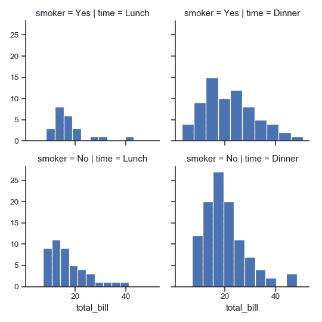
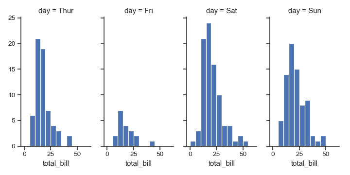
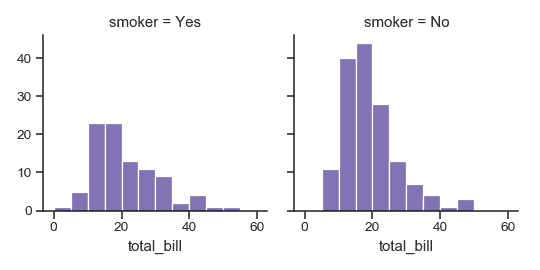
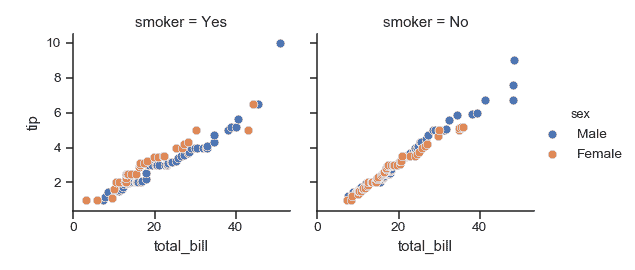
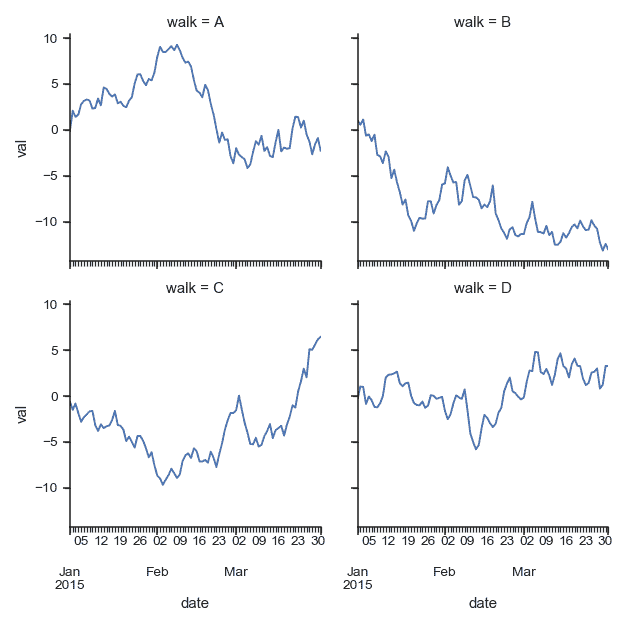
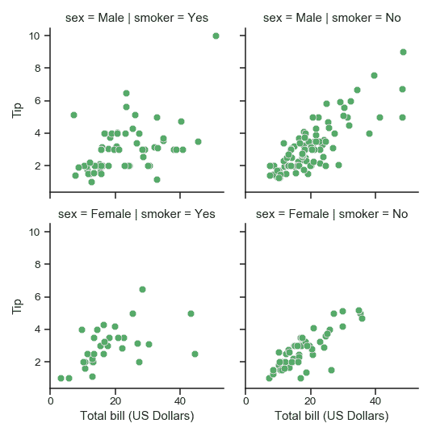
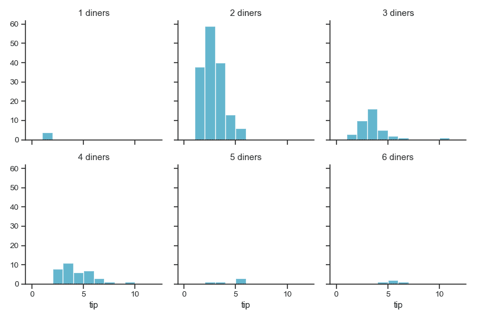
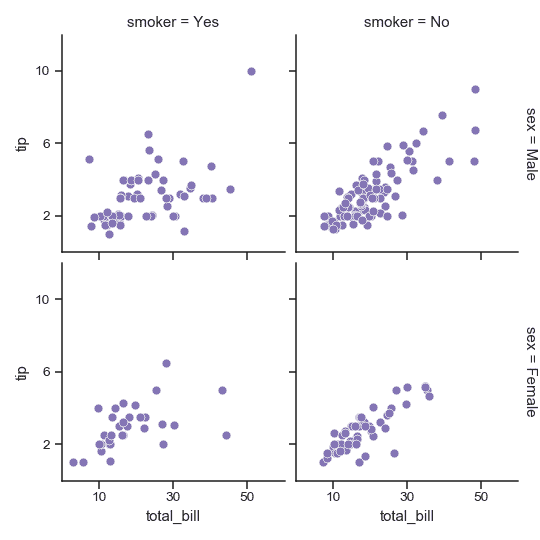

# seaborn.FacetGrid

> 译者：[hyuuo](https://github.com/hyuuo)

```py
class seaborn.FacetGrid(data, row=None, col=None, hue=None, col_wrap=None, sharex=True, sharey=True, height=3, aspect=1, palette=None, row_order=None, col_order=None, hue_order=None, hue_kws=None, dropna=True, legend_out=True, despine=True, margin_titles=False, xlim=None, ylim=None, subplot_kws=None, gridspec_kws=None, size=None)
```

用于绘制条件关系的多图网格。

```py
__init__(data, row=None, col=None, hue=None, col_wrap=None, sharex=True, sharey=True, height=3, aspect=1, palette=None, row_order=None, col_order=None, hue_order=None, hue_kws=None, dropna=True, legend_out=True, despine=True, margin_titles=False, xlim=None, ylim=None, subplot_kws=None, gridspec_kws=None, size=None)
```

初始化matplotlib画布和FacetGrid对象。

该类将数据集映射到由行和列组成的网格中的多个轴上，这些轴与数据集中变量的级别对应。它产生的图通常被称为“lattice”，“trellis”或“small-multiple”图形。

它还可以用`hue`参数表示第三个变量的级别，该参数绘制不同颜色的不同数据子集。它使用颜色来解析第三维度上的元素，但是只绘制相互重叠的子集，并且不会像接受“hue”的坐标轴级函数那样为特定的可视化定制“hue”参数。

当使用从数据集推断语义映射的seaborn函数时，必须注意在各个方面之间同步这些映射。在大多数情况下，使用图形级函数（例如[`relplot()`](seaborn.relplot.html#seaborn.relplot "seaborn.relplot")或[`catplot()`](seaborn.catplot.html#seaborn.catplot "seaborn.catplot")）比直接使用[`FacetGrid`](seaborn.FacetGrid.html#seaborn.FacetGrid "seaborn.FacetGrid")更好。

基本工作流程是使用数据集和用于构造网格的变量初始化FacetGrid对象。然后，通过调用[`FacetGrid.map()`](seaborn.FacetGrid.map.html#seaborn.FacetGrid.map "seaborn.FacetGrid.map")或[`FacetGrid.map_dataframe()`](seaborn.FacetGrid.map_dataframe.html#seaborn.FacetGrid.map_dataframe "seaborn.FacetGrid.map_dataframe")，可以将一个或多个绘图函数应用于每个子集。最后，可以使用其他方法调整绘图，以执行更改轴标签、使用不同刻度或添加图例等操作。有关详细信息，请参阅下面的详细代码示例。

更多相关信息请参阅[`教程`](../tutorial/axis_grids.html#grid-tutorial)。

参数：`data`：DataFrame数据。

> 整洁的（“长形式”）dataframe数据，其中每一列是一个变量，每一行是一个观察实例。

`row, col, hue`：字符串。

> 定义数据子集的变量，这些变量将在网格的不同方面绘制。请参阅`*_order`参数以控制此变量的级别顺序。

`col_wrap`：整形数值，可选参数。

> 以此参数值来限制网格的列维度，以便列面跨越多行。与`row`面不兼容。

`share{x,y}`：布尔值，'col' 或 'row'可选

> 如果为true，则跨列共享y轴或者跨行共享x轴。

`height`：标量，可选参数。

> 每个图片的高度设定（以英寸为单位）。另见：*aspect*

`aspect`：标量，可选参数。

> 每个图片的纵横比，因此aspect * height给出每个图片的宽度，单位为英寸。

`palette`：调色板名称，列表或字典，可选参数。

> 用于色调变量的不同级别的颜色。应为[`color_palette()`](seaborn.color_palette.html#seaborn.color_palette "seaborn.color_palette")可以解释的参数，或者是将色调级别映射到matplotlib颜色的字典。

`{row,col,hue}_order`：列表，可选参数。

> 对所给命令级别进行排序。默认情况下，这将是在数据中显示的级别，或者，如果变量是pandas分类，则为类别顺序。

`hue_kws`：参数-列表值的映射字典

> 插入到绘图调用中的其他关键字参数，使得其他绘图属性在色调变量的级别上有所不同（例如散点图中的标记）。

`legend_out`：布尔值，可选参数。

> 如果为True，则图形尺寸将被扩展，图例将绘制在中间右侧的图形之外。

`despine`：布尔值，可选参数。

> 从图中移除顶部和右侧边缘框架。

`margin_titles`：布尔值，可选参数。

> 如果为True，则行变量的标题将绘制在最后一列的右侧。此选项是实验性的，可能无法在所有情况下使用。

`{x, y}lim`：元组，可选参数。

> 每个图片上每个轴的限制（仅当share {x，y}为True时才相关）。

`subplot_kws`：字典，可选参数。

> 传递给matplotlib subplot（s）方法的关键字参数字典。

`gridspec_kws`：字典，可选参数。

> 传递给matplotlib的`gridspec`模块（通过`plt.subplots`）的关键字参数字典。需要matplotlib> = 1.4，如果`col_wrap`不是`None`，则忽略它。

**另请参见**

用于绘制成对关系的子图网格。

[`relplot`](#seaborn.relplot "seaborn.relplot")

结合关系图和[`FacetGrid`](#seaborn.FacetGrid "seaborn.FacetGrid")。

[`catplot`](#seaborn.catplot "seaborn.catplot")

结合分类图和[`FacetGrid`](#seaborn.FacetGrid "seaborn.FacetGrid")。

[`lmplot`](#seaborn.lmplot "seaborn.lmplot")

结合回归图和[`FacetGrid`](#seaborn.FacetGrid "seaborn.FacetGrid")。

范例

使用tips数据集初始化2x2网格图：

```py
>>> import seaborn as sns; sns.set(style="ticks", color_codes=True)
>>> tips = sns.load_dataset("tips")
>>> g = sns.FacetGrid(tips, col="time", row="smoker")

```


在每个子图绘制一个单变量图：

```py
>>> import matplotlib.pyplot as plt
>>> g = sns.FacetGrid(tips, col="time",  row="smoker")
>>> g = g.map(plt.hist, "total_bill")

```



（注意，没有必要重新捕获返回的变量;它是相同的对象，但在示例中这样做使得处理doctests更加方便）。

将其他关键字参数传递给映射函数：

```py
>>> import numpy as np
>>> bins = np.arange(0, 65, 5)
>>> g = sns.FacetGrid(tips, col="time",  row="smoker")
>>> g = g.map(plt.hist, "total_bill", bins=bins, color="r")

```


在每个子图绘制一个双变量函数：

```py
>>> g = sns.FacetGrid(tips, col="time",  row="smoker")
>>> g = g.map(plt.scatter, "total_bill", "tip", edgecolor="w")

```


将其中一个变量分配给绘图元素的颜色：

```py
>>> g = sns.FacetGrid(tips, col="time",  hue="smoker")
>>> g = (g.map(plt.scatter, "total_bill", "tip", edgecolor="w")
...       .add_legend())

```


更改每个子图的高度和纵横比：

```py
>>> g = sns.FacetGrid(tips, col="day", height=4, aspect=.5)
>>> g = g.map(plt.hist, "total_bill", bins=bins)

```



指定绘图元素的顺序：

```py
>>> g = sns.FacetGrid(tips, col="smoker", col_order=["Yes", "No"])
>>> g = g.map(plt.hist, "total_bill", bins=bins, color="m")

```



使用不同的调色板：

```py
>>> kws = dict(s=50, linewidth=.5, edgecolor="w")
>>> g = sns.FacetGrid(tips, col="sex", hue="time", palette="Set1",
...                   hue_order=["Dinner", "Lunch"])
>>> g = (g.map(plt.scatter, "total_bill", "tip", **kws)
...      .add_legend())

```


使用字典将色调级别映射到颜色：

```py
>>> pal = dict(Lunch="seagreen", Dinner="gray")
>>> g = sns.FacetGrid(tips, col="sex", hue="time", palette=pal,
...                   hue_order=["Dinner", "Lunch"])
>>> g = (g.map(plt.scatter, "total_bill", "tip", **kws)
...      .add_legend())

```


另外，为色调级别使用不同的标记：

```py
>>> g = sns.FacetGrid(tips, col="sex", hue="time", palette=pal,
...                   hue_order=["Dinner", "Lunch"],
...                   hue_kws=dict(marker=["^", "v"]))
>>> g = (g.map(plt.scatter, "total_bill", "tip", **kws)
...      .add_legend())

```


将包含多个级别的列变量“换行”到行中：

```py
>>> att = sns.load_dataset("attention")
>>> g = sns.FacetGrid(att, col="subject", col_wrap=5, height=1.5)
>>> g = g.map(plt.plot, "solutions", "score", marker=".")

```


定义一个自定义双变量函数来映射到网格：

```py
>>> from scipy import stats
>>> def qqplot(x, y, **kwargs):
...     _, xr = stats.probplot(x, fit=False)
...     _, yr = stats.probplot(y, fit=False)
...     plt.scatter(xr, yr, **kwargs)
>>> g = sns.FacetGrid(tips, col="smoker", hue="sex")
>>> g = (g.map(qqplot, "total_bill", "tip", **kws)
...       .add_legend())

```



定义一个使用`DataFrame`对象的自定义函数，并接受列名作为位置变量：

```py
>>> import pandas as pd
>>> df = pd.DataFrame(
...     data=np.random.randn(90, 4),
...     columns=pd.Series(list("ABCD"), name="walk"),
...     index=pd.date_range("2015-01-01", "2015-03-31",
...                         name="date"))
>>> df = df.cumsum(axis=0).stack().reset_index(name="val")
>>> def dateplot(x, y, **kwargs):
...     ax = plt.gca()
...     data = kwargs.pop("data")
...     data.plot(x=x, y=y, ax=ax, grid=False, **kwargs)
>>> g = sns.FacetGrid(df, col="walk", col_wrap=2, height=3.5)
>>> g = g.map_dataframe(dateplot, "date", "val")

```



绘图后使用不同的轴标签：

```py
>>> g = sns.FacetGrid(tips, col="smoker", row="sex")
>>> g = (g.map(plt.scatter, "total_bill", "tip", color="g", **kws)
...       .set_axis_labels("Total bill (US Dollars)", "Tip"))

```



设置每个子图共享的其他属性：

```py
>>> g = sns.FacetGrid(tips, col="smoker", row="sex")
>>> g = (g.map(plt.scatter, "total_bill", "tip", color="r", **kws)
...       .set(xlim=(0, 60), ylim=(0, 12),
...            xticks=[10, 30, 50], yticks=[2, 6, 10]))

```


为子图标题使用不同的模板：

```py
>>> g = sns.FacetGrid(tips, col="size", col_wrap=3)
>>> g = (g.map(plt.hist, "tip", bins=np.arange(0, 13), color="c")
...       .set_titles("{col_name} diners"))

```



收紧每个子图:

```py
>>> g = sns.FacetGrid(tips, col="smoker", row="sex",
...                   margin_titles=True)
>>> g = (g.map(plt.scatter, "total_bill", "tip", color="m", **kws)
...       .set(xlim=(0, 60), ylim=(0, 12),
...            xticks=[10, 30, 50], yticks=[2, 6, 10])
...       .fig.subplots_adjust(wspace=.05, hspace=.05))

```



方法

| [`__init__`](#seaborn.FacetGrid.__init__ "seaborn.FacetGrid.__init__")(data[, row, col, hue, col_wrap, …]) | 初始化matplotlib画布和FacetGrid对象。 |

| `add_legend`([legend_data, title, label_order]) | 绘制一个图例，可能将其放在轴外并调整图形大小。|

| `despine`(\**kwargs) | 从子图中移除轴的边缘框架。 |

| `facet_axis`(row_i, col_j) | 使这些索引识别的轴处于活动状态并返回。 |

| `facet_data`() | 用于每个子图的名称索引和数据子集的生成器。 |

| [`map`](seaborn.FacetGrid.map.html#seaborn.FacetGrid.map "seaborn.FacetGrid.map")(func, *args, \**kwargs) | 将绘图功能应用于每个子图的数据子集。 |

| [`map_dataframe`](seaborn.FacetGrid.map_dataframe.html#seaborn.FacetGrid.map_dataframe "seaborn.FacetGrid.map_dataframe")(func, *args, \**kwargs) | 像`.map`一样，但是将args作为字符串传递并在kwargs中插入数据。 |

| `savefig`(*args, \**kwargs) | 保存图片。 |

| `set`(\**kwargs) | 在每个子图集坐标轴上设置属性。|

| `set_axis_labels`([x_var, y_var]) | 在网格的左列和底行设置轴标签。 |

| `set_titles`([template, row_template, …]) | 在每个子图上方或网格边缘绘制标题。 |

| `set_xlabels`([label]) | 在网格的底行标记x轴。 |

| `set_xticklabels`([labels, step]) | 在网格的底行设置x轴刻度标签。 |

| `set_ylabels`([label]) | 在网格的左列标记y轴。 |

| `set_yticklabels`([labels]) | 在网格的左列上设置y轴刻度标签。 |

属性

| `ax` | 轻松访问单个坐标轴。 |