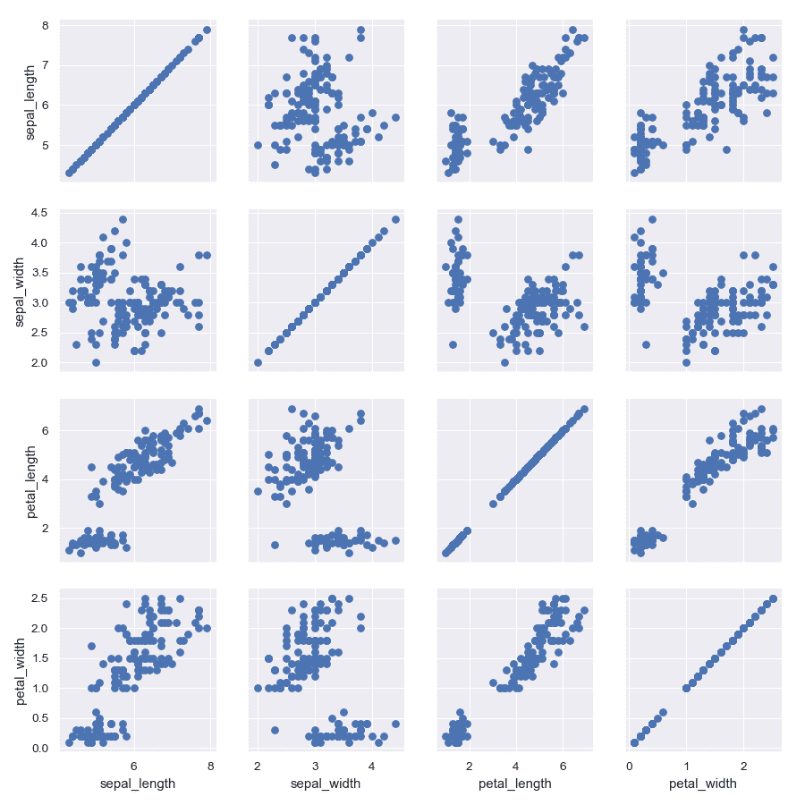
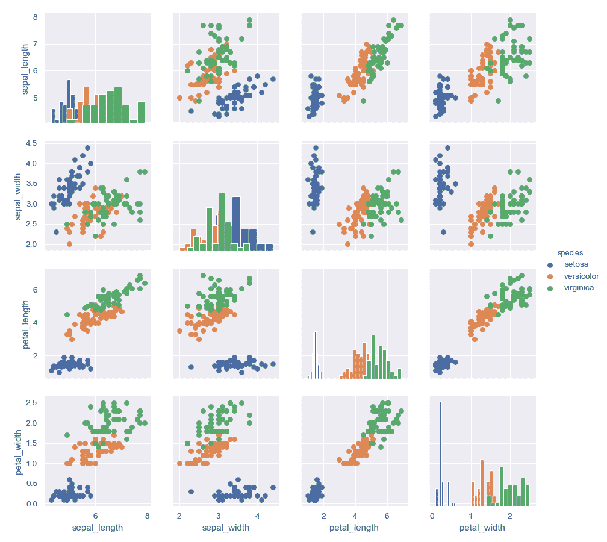
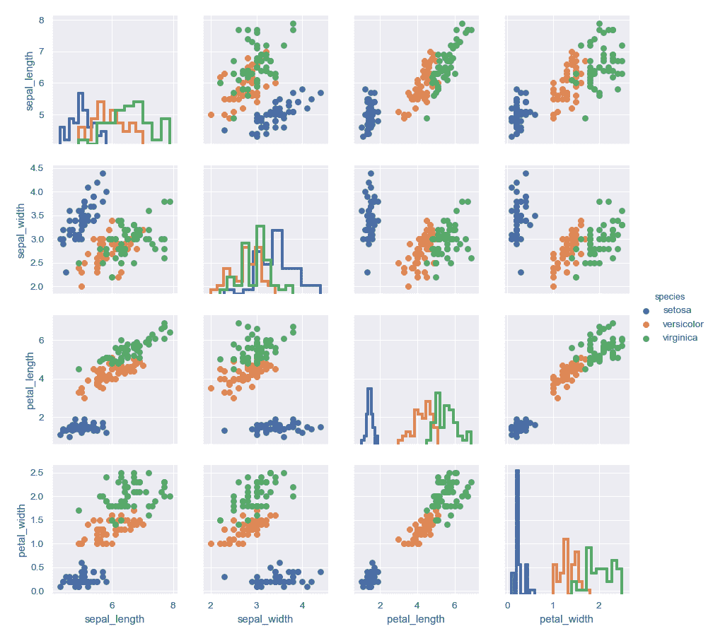
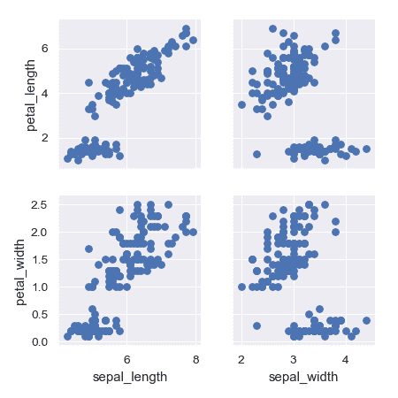
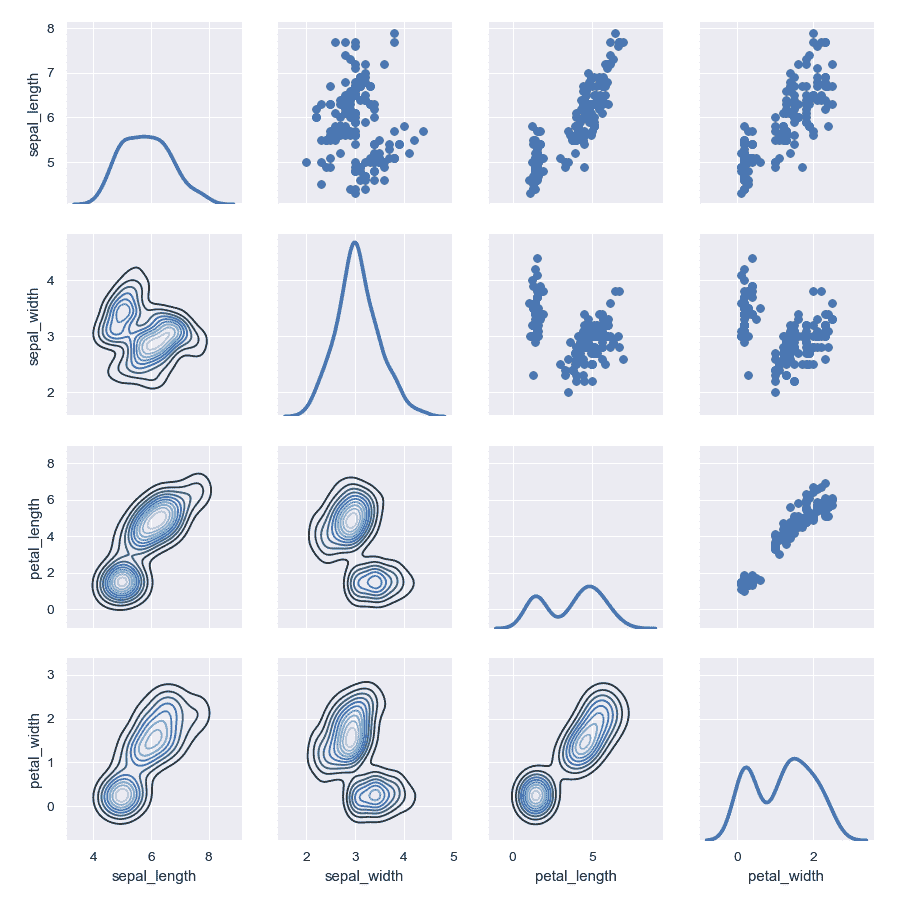
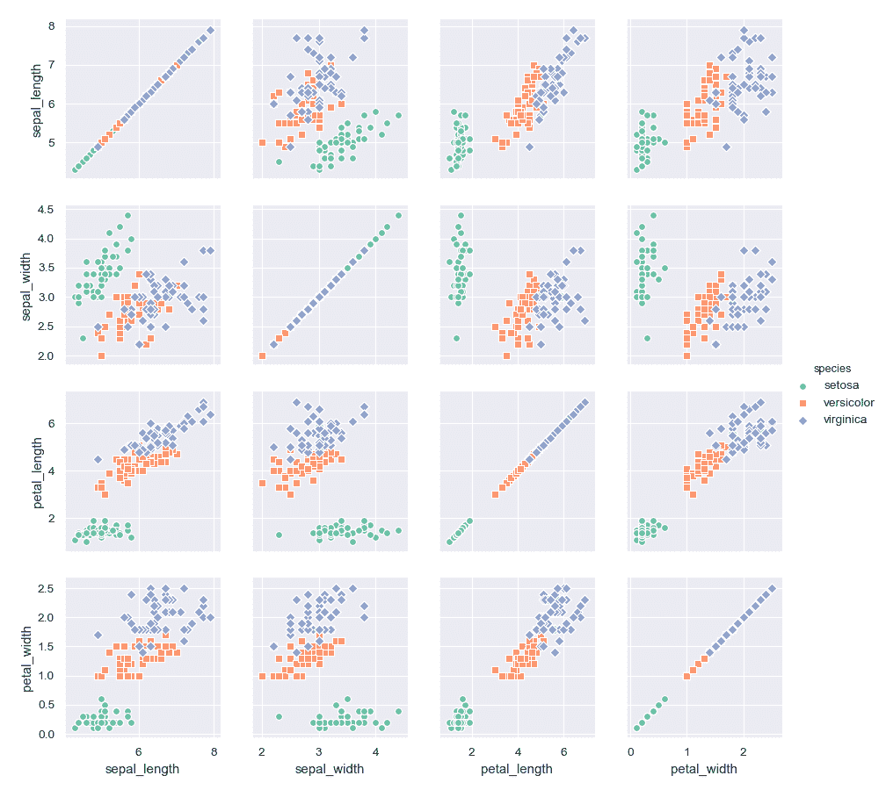

# seaborn.PairGrid

```py
class seaborn.PairGrid(data, hue=None, hue_order=None, palette=None, hue_kws=None, vars=None, x_vars=None, y_vars=None, diag_sharey=True, height=2.5, aspect=1, despine=True, dropna=True, size=None)
```

用于绘制数据集中成对关系的子图网格。

此类将数据集中的每个变量映射到多个轴的网格中的列和行。可以使用不同的轴级绘图函数来绘制上三角和下三角的双变量图，并且对角线上可以显示每个变量的边际分布。 

它还可以通过`hue`参数用不同颜色绘制不同的数据子集来表示附加级别的条件化。这使用颜色来解析第三维的元素，但只是在彼此之上绘制子集，并且不会像接受`hue`的轴级函数那样为特定可视化定制`hue`参数。

参考[教程](../tutorial/axis_grids.html#grid-tutorial)获取更多信息。

```py
__init__(data, hue=None, hue_order=None, palette=None, hue_kws=None, vars=None, x_vars=None, y_vars=None, diag_sharey=True, height=2.5, aspect=1, despine=True, dropna=True, size=None)
```

初始化绘图和PairGrid对象。

参数：`data`：DataFrame格式

> 整洁（长形式）数据框，其中每列是一个变量，每行是一个观察。

`hue`：字符串 （变量名）, 可选

> `data`中的变量，将绘图的不同面映射为不同的颜色。

`hue_order`：字符串列表

> 调色板中色调变量的等级顺序

`palette`：字典或者seaborn调色板

> 用于映射`hue`变量的颜色集.如果是一个字典，键应为`hue`变量中的值。

`hue_kws`：参数字典 -&gt; 值列表映射

> Other keyword arguments to insert into the plotting call to let other plot attributes vary across levels of the hue variable (e.g. the markers in a scatterplot).

`vars`：变量名列表, 可选

> Variables within `data` to use, otherwise use every column with a numeric datatype.

`{x, y}_vars`：lists of variable names, optional

> Variables within `data` to use separately for the rows and columns of the figure; i.e. to make a non-square plot.

`height`：scalar, optional

> Height (in inches) of each facet.

`aspect`：scalar, optional

> Aspect * height gives the width (in inches) of each facet.

`despine`：boolean, optional

> Remove the top and right spines from the plots.

`dropna`：boolean, optional

> Drop missing values from the data before plotting.


See also

Easily drawing common uses of [`PairGrid`](#seaborn.PairGrid "seaborn.PairGrid").Subplot grid for plotting conditional relationships.

Examples

Draw a scatterplot for each pairwise relationship:

```py
>>> import matplotlib.pyplot as plt
>>> import seaborn as sns; sns.set()
>>> iris = sns.load_dataset("iris")
>>> g = sns.PairGrid(iris)
>>> g = g.map(plt.scatter)

```



Show a univariate distribution on the diagonal:

```py
>>> g = sns.PairGrid(iris)
>>> g = g.map_diag(plt.hist)
>>> g = g.map_offdiag(plt.scatter)

```


(It’s not actually necessary to catch the return value every time, as it is the same object, but it makes it easier to deal with the doctests).

Color the points using a categorical variable:

```py
>>> g = sns.PairGrid(iris, hue="species")
>>> g = g.map_diag(plt.hist)
>>> g = g.map_offdiag(plt.scatter)
>>> g = g.add_legend()

```



Use a different style to show multiple histograms:

```py
>>> g = sns.PairGrid(iris, hue="species")
>>> g = g.map_diag(plt.hist, histtype="step", linewidth=3)
>>> g = g.map_offdiag(plt.scatter)
>>> g = g.add_legend()

```



Plot a subset of variables

```py
>>> g = sns.PairGrid(iris, vars=["sepal_length", "sepal_width"])
>>> g = g.map(plt.scatter)

```


Pass additional keyword arguments to the functions

```py
>>> g = sns.PairGrid(iris)
>>> g = g.map_diag(plt.hist, edgecolor="w")
>>> g = g.map_offdiag(plt.scatter, edgecolor="w", s=40)

```


Use different variables for the rows and columns:

```py
>>> g = sns.PairGrid(iris,
...                  x_vars=["sepal_length", "sepal_width"],
...                  y_vars=["petal_length", "petal_width"])
>>> g = g.map(plt.scatter)

```



Use different functions on the upper and lower triangles:

```py
>>> g = sns.PairGrid(iris)
>>> g = g.map_upper(plt.scatter)
>>> g = g.map_lower(sns.kdeplot, cmap="Blues_d")
>>> g = g.map_diag(sns.kdeplot, lw=3, legend=False)

```



Use different colors and markers for each categorical level:

```py
>>> g = sns.PairGrid(iris, hue="species", palette="Set2",
...                  hue_kws={"marker": ["o", "s", "D"]})
>>> g = g.map(plt.scatter, linewidths=1, edgecolor="w", s=40)
>>> g = g.add_legend()

```



Methods

| [`__init__`](#seaborn.PairGrid.__init__ "seaborn.PairGrid.__init__")(data[, hue, hue_order, palette, …]) | Initialize the plot figure and PairGrid object. |
| `add_legend`([legend_data, title, label_order]) | Draw a legend, maybe placing it outside axes and resizing the figure. |
| [`map`](seaborn.PairGrid.map.html#seaborn.PairGrid.map "seaborn.PairGrid.map")(func, **kwargs) | Plot with the same function in every subplot. |
| [`map_diag`](seaborn.PairGrid.map_diag.html#seaborn.PairGrid.map_diag "seaborn.PairGrid.map_diag")(func, **kwargs) | Plot with a univariate function on each diagonal subplot. |
| [`map_lower`](seaborn.PairGrid.map_lower.html#seaborn.PairGrid.map_lower "seaborn.PairGrid.map_lower")(func, **kwargs) | Plot with a bivariate function on the lower diagonal subplots. |
| [`map_offdiag`](seaborn.PairGrid.map_offdiag.html#seaborn.PairGrid.map_offdiag "seaborn.PairGrid.map_offdiag")(func, **kwargs) | Plot with a bivariate function on the off-diagonal subplots. |
| [`map_upper`](seaborn.PairGrid.map_upper.html#seaborn.PairGrid.map_upper "seaborn.PairGrid.map_upper")(func, **kwargs) | Plot with a bivariate function on the upper diagonal subplots. |
| `savefig`(*args, **kwargs) | Save the figure. |
| `set`(**kwargs) | Set attributes on each subplot Axes. |
