# Plotting with categorical data

在[绘制关系图](relational.html#relational-tutorial)的教程中，我们学习了如何使用不同的可视化方法来展示数据集中多个变量之间的关系。在示例中，我们专注于两个数值变量之间的主要关系。如果其中一个主要变量是“可分类的”（能被分为不同的组），那么我们可以使用更专业的可视化方法。

在seaborn中，有几种不同的方法可以对分类数据进行可视化。类似于[`relplot()`](../generated/seaborn.relplot.html#seaborn.relplot "seaborn.relplot")与[`scatterplot()`](../generated/seaborn.scatterplot.html#seaborn.scatterplot "seaborn.scatterplot")或者[`lineplot()`](../generated/seaborn.lineplot.html#seaborn.lineplot "seaborn.lineplot")之间的关系，有两种方法可以制作这些图。有许多axes-level函数可以用不同的方式绘制分类数据，还有一个figure-level接口[`catplot()`](../generated/seaborn.catplot.html#seaborn.catplot "seaborn.catplot")，可以对它们进行统一的高级访问。

将不同的分类图类型视为属于三个不同的族，这是很有帮助的。下面我们将详细讨论，它们是：

分类散点图：

*   [`stripplot()`](../generated/seaborn.stripplot.html#seaborn.stripplot "seaborn.stripplot") (with `kind="strip"`; the default)
*   [`swarmplot()`](../generated/seaborn.swarmplot.html#seaborn.swarmplot "seaborn.swarmplot") (with `kind="swarm"`)

分类分布图：

*   [`boxplot()`](../generated/seaborn.boxplot.html#seaborn.boxplot "seaborn.boxplot") (with `kind="box"`)
*   [`violinplot()`](../generated/seaborn.violinplot.html#seaborn.violinplot "seaborn.violinplot") (with `kind="violin"`)
*   [`boxenplot()`](../generated/seaborn.boxenplot.html#seaborn.boxenplot "seaborn.boxenplot") (with `kind="boxen"`)

分类估计图：

*   [`pointplot()`](../generated/seaborn.pointplot.html#seaborn.pointplot "seaborn.pointplot") (with `kind="point"`)
*   [`barplot()`](../generated/seaborn.barplot.html#seaborn.barplot "seaborn.barplot") (with `kind="bar"`)
*   [`countplot()`](../generated/seaborn.countplot.html#seaborn.countplot "seaborn.countplot") (with `kind="count"`)

这些系列使用不同的粒度级别来表示数据，我们应该根据需要解决的问题来决定到底要使用哪个。它们有统一的API，所以我们可以轻松地在不同类型之间进行切换，并从多个角度来观察数据。

在本教程中，我们主要关注figure-level接口[`catplot()`](../generated/seaborn.catplot.html#seaborn.catplot "seaborn.catplot")。这个函数是上述每个函数更高级别的接口，因此当我们显示每种绘图时都会引用它们，保留更详细的特定类型的API文档。

```py
import seaborn as sns
import matplotlib.pyplot as plt
sns.set(style="ticks", color_codes=True)

```

## 分类散点图

在[`catplot()`](../generated/seaborn.catplot.html#seaborn.catplot "seaborn.catplot")中，数据默认使用散点图表示。在seaborn中有两种不同的分类散点图，它们采用不同的方法来表示分类数据。 其中一种是属于一个类别的所有点，将沿着与分类变量对应的轴落在相同位置。[`stripplot()`](../generated/seaborn.stripplot.html#seaborn.stripplot "seaborn.stripplot")方法是[`catplot()`](../generated/seaborn.catplot.html#seaborn.catplot "seaborn.catplot")中kind的默认参数，它是用少量随机“抖动”调整分类轴上的点的位置：

```py
tips = sns.load_dataset("tips")
sns.catplot(x="day", y="total_bill", data=tips);

```


`jitter`参数控制抖动的大小或完全禁用它：

```py
sns.catplot(x="day", y="total_bill", jitter=False, data=tips);

```

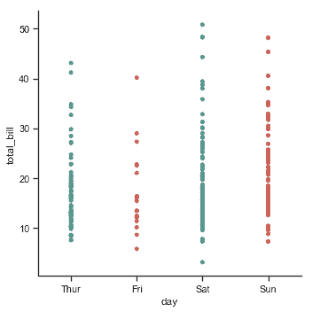

另一种方法使用防止它们重叠的算法沿着分类轴调整点。我们可以用它更好地表示观测分布，但是只适用于相对较小的数据集。这种绘图有时被称为“beeswarm”，可以使用seaborn中的[`swarmplot()`](../generated/seaborn.swarmplot.html#seaborn.swarmplot "seaborn.swarmplot")绘制，通过在[`catplot()`](../generated/seaborn.catplot.html#seaborn.catplot "seaborn.catplot")中设置`kind="swarm"`来激活：

```py
sns.catplot(x="day", y="total_bill", kind="swarm", data=tips);

```

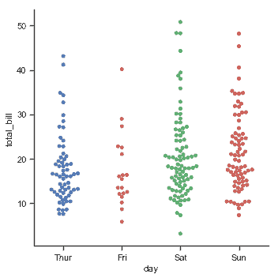

与关系图类似，可以通过使用`hue`语义向分类图添加另一个维。（分类图当前不支持`size`和`style`语义 ）。 每个不同的分类绘图函数以不同方式处理`hue` 语义。对于散点图，我们只需要更改点的颜色：

```py
sns.catplot(x="day", y="total_bill", hue="sex", kind="swarm", data=tips);

```


与数值数据不同，如何沿着轴顺序排列分类变量并不总是显而易见的。通常，seaborn分类绘图函数试图从数据中推断出类别的顺序。 如果您的数据具有pandas中的`Categorical`数据类型，则可以在此处设置类别的默认顺序。如果传递给分类轴的变量看起来是数字，则将对级别进行排序。但是数据仍然被视为分类并在分类轴上的序数位置（特别是0，1，......）处理，即使用数字来标记它们：

```py
sns.catplot(x="size", y="total_bill", kind="swarm",
            data=tips.query("size != 3"));

```


选择默认排序的另一个选项是获取数据集中出现的类别级别。也可以使用`order`参数在特定图表的基础上控制排序。在同一图中绘制多个分类图时，这很重要，我们将在下面看到更多：
```py
sns.catplot(x="smoker", y="tip", order=["No", "Yes"], data=tips);

```


我们已经提到了“分类轴”的概念。在这些示例中，它始终对应于水平轴。但是将分类变量放在垂直轴上通常很有帮助（特别是当类别名称相对较长或有许多类别时）。为此，我们交换轴上的变量赋值：

```py
sns.catplot(x="total_bill", y="day", hue="time", kind="swarm", data=tips);

```


## 类别内观察点的分布

随着数据集的大小增加，分类散点图在它们可以提供的关于每个类别中的值分布的信息中受到限制。当发生这种情况时，有几种方法可以总结分发信息，以便于跨类别级别进行简单比较。

### Boxplots

第一个是熟悉的[`boxplot()`](../generated/seaborn.boxplot.html#seaborn.boxplot "seaborn.boxplot")。这张绘图显示了分布的三个四分位数值以及极值。“胡须”延伸到位于下四分位数和上四分位数的1.5 IQR内的点，然后独立显示超出此范围的观察值。这意味着箱线图中的每个值对应于数据中的实际观察值。

```py
sns.catplot(x="day", y="total_bill", kind="box", data=tips);

```


添加`hue`语义, 语义变量的每个级别的框沿着分类轴移动，因此它们将不会重叠：
```py
sns.catplot(x="day", y="total_bill", hue="smoker", kind="box", data=tips);

```

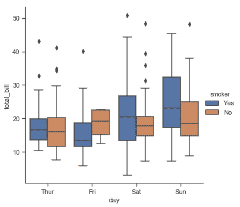

此行为称为“dodging”，默认情况下处于启用状态，因为假定语义变量嵌套在主分类变量中。 如果不是这样，你可以禁用dodging：

```py
tips["weekend"] = tips["day"].isin(["Sat", "Sun"])
sns.catplot(x="day", y="total_bill", hue="weekend",
            kind="box", dodge=False, data=tips);

```


一个相关的函数[`boxenplot()`](../generated/seaborn.boxenplot.html#seaborn.boxenplot "seaborn.boxenplot")可以绘制一个与Box-plot类似的图。它为了显示更多信息而对分布的形状进行了优化，比较适合于较大的数据集：

```py
diamonds = sns.load_dataset("diamonds")
sns.catplot(x="color", y="price", kind="boxen",
            data=diamonds.sort_values("color"));

```


### Violinplots

另一种方法是[`violinplot()`](../generated/seaborn.violinplot.html#seaborn.violinplot "seaborn.violinplot")，它将箱线图与[分布](distributions.html#distribution-tutorial)教程中描述的核密度估算程序结合起来：

```py
sns.catplot(x="total_bill", y="day", hue="time",
            kind="violin", data=tips);

```

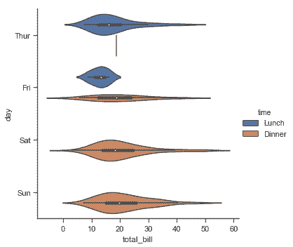

该方法使用核密度估计来提供更丰富的值分布描述。 此外，violin中还显示了来自箱线图的四分位数和whikser值。 缺点是由于violinplot使用KDE，我们需要调整一些其他参数，相对于箱形图增加了一些复杂性：

```py
sns.catplot(x="total_bill", y="day", hue="time",
            kind="violin", bw=.15, cut=0,
            data=tips);

```

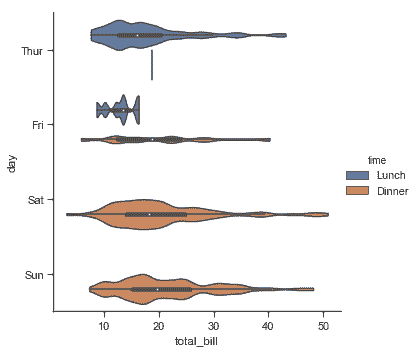

当hue参数只有两个级别时，也可以“拆分”小提琴，这样可以更有效地利用空间：

```py
sns.catplot(x="day", y="total_bill", hue="sex",
            kind="violin", split=True, data=tips);

```


最后，在violin内部绘制的绘图有几种选项，包括显示每个单独观察而不是摘要箱图值的方法：

```py
sns.catplot(x="day", y="total_bill", hue="sex",
            kind="violin", inner="stick", split=True,
            palette="pastel", data=tips);

```


我们也可以将[`swarmplot()`](../generated/seaborn.swarmplot.html#seaborn.swarmplot "seaborn.swarmplot")或`striplot()`与箱形图或violin plot结合起来，展示每次观察以及分布摘要：

```py
g = sns.catplot(x="day", y="total_bill", kind="violin", inner=None, data=tips)
sns.swarmplot(x="day", y="total_bill", color="k", size=3, data=tips, ax=g.ax);

```


## 类别内的统计估计

For other applications, rather than showing the distribution within each category, you might want to show an estimate of the central tendency of the values. Seaborn has two main ways to show this information. Importantly, the basic API for these functions is identical to that for the ones discussed above.

### Bar plots

A familiar style of plot that accomplishes this goal is a bar plot. In seaborn, the [`barplot()`](../generated/seaborn.barplot.html#seaborn.barplot "seaborn.barplot") function operates on a full dataset and applies a function to obtain the estimate (taking the mean by default). When there are multiple observations in each category, it also uses bootstrapping to compute a confidence interval around the estimate and plots that using error bars:

```py
titanic = sns.load_dataset("titanic")
sns.catplot(x="sex", y="survived", hue="class", kind="bar", data=titanic);

```

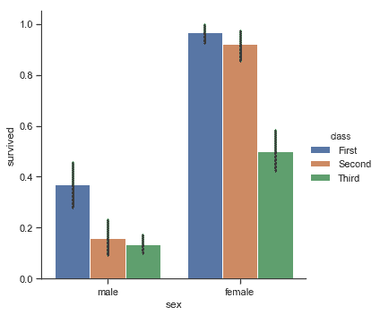

A special case for the bar plot is when you want to show the number of observations in each category rather than computing a statistic for a second variable. This is similar to a histogram over a categorical, rather than quantitative, variable. In seaborn, it’s easy to do so with the [`countplot()`](../generated/seaborn.countplot.html#seaborn.countplot "seaborn.countplot") function:

```py
sns.catplot(x="deck", kind="count", palette="ch:.25", data=titanic);

```

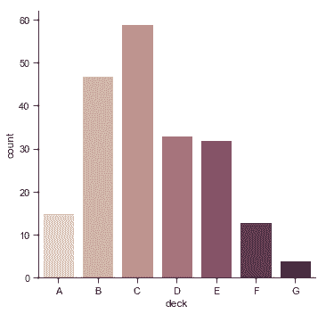

Both [`barplot()`](../generated/seaborn.barplot.html#seaborn.barplot "seaborn.barplot") and [`countplot()`](../generated/seaborn.countplot.html#seaborn.countplot "seaborn.countplot") can be invoked with all of the options discussed above, along with others that are demonstrated in the detailed documentation for each function:

```py
sns.catplot(y="deck", hue="class", kind="count",
            palette="pastel", edgecolor=".6",
            data=titanic);

```

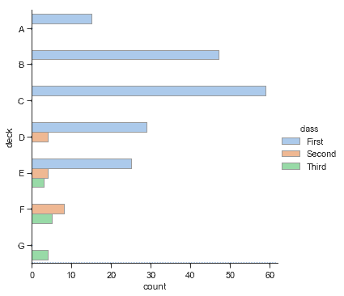

### Point plots

An alternative style for visualizing the same information is offered by the [`pointplot()`](../generated/seaborn.pointplot.html#seaborn.pointplot "seaborn.pointplot") function. This function also encodes the value of the estimate with height on the other axis, but rather than showing a full bar, it plots the point estimate and confidence interval. Additionally, [`pointplot()`](../generated/seaborn.pointplot.html#seaborn.pointplot "seaborn.pointplot") connects points from the same `hue` category. This makes it easy to see how the main relationship is changing as a function of the hue semantic, because your eyes are quite good at picking up on differences of slopes:

```py
sns.catplot(x="sex", y="survived", hue="class", kind="point", data=titanic);

```

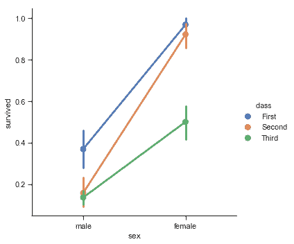

When the categorical functions lack the `style` semantic of the relational functions, it can still be a good idea to vary the marker and/or linestyle along with the hue to make figures that are maximally accessible and reproduce well in black and white:

```py
sns.catplot(x="class", y="survived", hue="sex",
            palette={"male": "g", "female": "m"},
            markers=["^", "o"], linestyles=["-", "--"],
            kind="point", data=titanic);

```

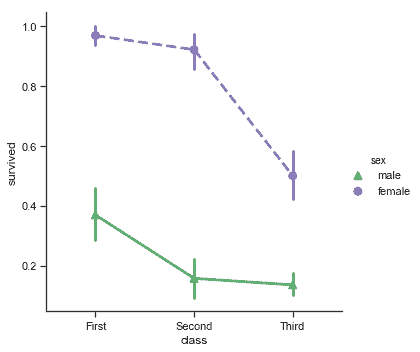

## Plotting “wide-form” data

While using “long-form” or “tidy” data is preferred, these functions can also by applied to “wide-form” data in a variety of formats, including pandas DataFrames or two-dimensional numpy arrays. These objects should be passed directly to the `data` parameter:

```py
iris = sns.load_dataset("iris")
sns.catplot(data=iris, orient="h", kind="box");

```

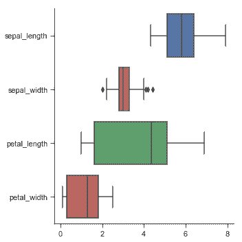

Additionally, the axes-level functions accept vectors of Pandas or numpy objects rather than variables in a `DataFrame`:

```py
sns.violinplot(x=iris.species, y=iris.sepal_length);

```

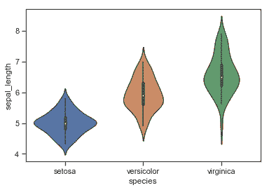

To control the size and shape of plots made by the functions discussed above, you must set up the figure yourself using matplotlib commands:

```py
f, ax = plt.subplots(figsize=(7, 3))
sns.countplot(y="deck", data=titanic, color="c");

```

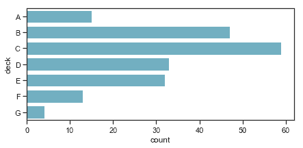

This is the approach you should take when you need a categorical figure to happily coexist in a more complex figure with other kinds of plots.

## Showing multiple relationships with facets

Just like [`relplot()`](../generated/seaborn.relplot.html#seaborn.relplot "seaborn.relplot"), the fact that [`catplot()`](../generated/seaborn.catplot.html#seaborn.catplot "seaborn.catplot") is built on a [`FacetGrid`](../generated/seaborn.FacetGrid.html#seaborn.FacetGrid "seaborn.FacetGrid") means that it is easy to add faceting variables to visualize higher-dimensional relationships:

```py
sns.catplot(x="day", y="total_bill", hue="smoker",
            col="time", aspect=.6,
            kind="swarm", data=tips);

```


For further customization of the plot, you can use the methods on the [`FacetGrid`](../generated/seaborn.FacetGrid.html#seaborn.FacetGrid "seaborn.FacetGrid") object that it returns:

```py
g = sns.catplot(x="fare", y="survived", row="class",
                kind="box", orient="h", height=1.5, aspect=4,
                data=titanic.query("fare > 0"))
g.set(xscale="log");

```


