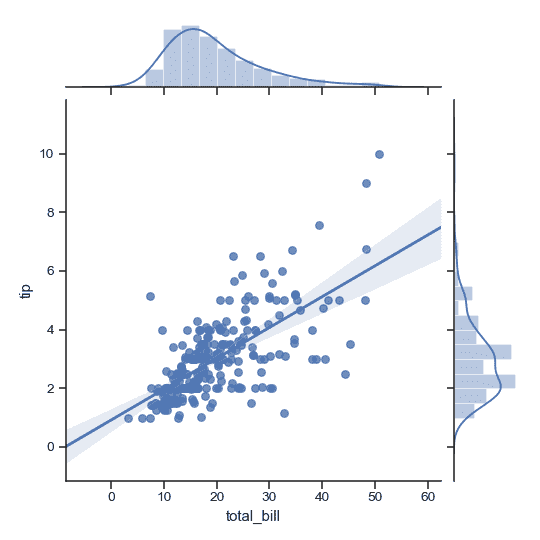
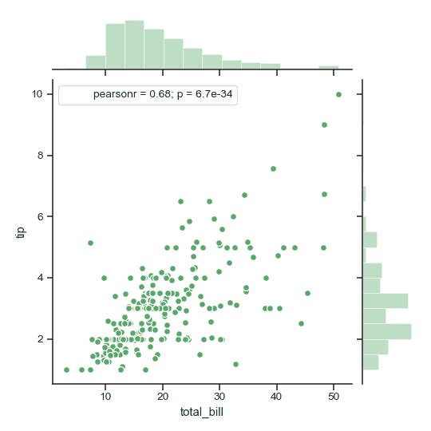
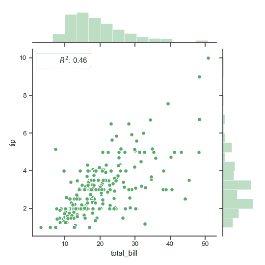
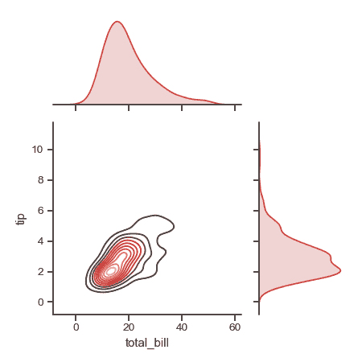

# seaborn.JointGrid

> 译者：[Yet-sun](https://github.com/Yet-sun)

```py
class seaborn.JointGrid(x, y, data=None, height=6, ratio=5, space=0.2, dropna=True, xlim=None, ylim=None, size=None)
```

用于绘制具有边际单变量图的双变量图的网格。

```py
__init__(x, y, data=None, height=6, ratio=5, space=0.2, dropna=True, xlim=None, ylim=None, size=None)
```

设置子图的网格。

参数：`x, y`：字符串或向量

> 在 `data`中的数据或变量名

`data`：DataFrame, 可选

> 当 `x` and `y` 是变量名的时候为DataFrame。

`height`：数字

> 图中每一条边的大小（以英寸为单位）

`ratio`：数字

> 联合轴大小与边缘轴高度的比率。

`space`：数字，可选

> 联合轴和边缘轴之间的空间

`dropna`：bool, 可选

> 如果为True，则删除 `x` 和 `y`中缺少的观察结果。

`{x, y}lim`：二元组，可选

> 在绘图之前设置轴限制。

也可以看看

用于绘制具有多种不同默认绘图类型的双变量图的高级界面。

例子：

初始化图形，但不在其上绘制任何图形：

```py
>>> import seaborn as sns; sns.set(style="ticks", color_codes=True)
>>> tips = sns.load_dataset("tips")
>>> g = sns.JointGrid(x="total_bill", y="tip", data=tips)

```


使用默认参数添加绘图：

```py
>>> g = sns.JointGrid(x="total_bill", y="tip", data=tips)
>>> g = g.plot(sns.regplot, sns.distplot)

```



分别绘制联合分布图和边缘直方图，这可以以更精细的级别控制其他参数：

```py
>>> import matplotlib.pyplot as plt
>>> g = sns.JointGrid(x="total_bill", y="tip", data=tips)
>>> g = g.plot_joint(plt.scatter, color=".5", edgecolor="white")
>>> g = g.plot_marginals(sns.distplot, kde=False, color=".5")

```


分别绘制两个边缘直方图：

```py
>>> import numpy as np
>>> g = sns.JointGrid(x="total_bill", y="tip", data=tips)
>>> g = g.plot_joint(plt.scatter, color="m", edgecolor="white")
>>> _ = g.ax_marg_x.hist(tips["total_bill"], color="b", alpha=.6,
...                      bins=np.arange(0, 60, 5))
>>> _ = g.ax_marg_y.hist(tips["tip"], color="r", alpha=.6,
...                      orientation="horizontal",
...                      bins=np.arange(0, 12, 1))

```


添加注释，其中包含总结双变量关系的统计信息：

```py
>>> from scipy import stats
>>> g = sns.JointGrid(x="total_bill", y="tip", data=tips)
>>> g = g.plot_joint(plt.scatter,
...                  color="g", s=40, edgecolor="white")
>>> g = g.plot_marginals(sns.distplot, kde=False, color="g")
>>> g = g.annotate(stats.pearsonr)

```



使用自定义的函数和注释格式

```py
>>> g = sns.JointGrid(x="total_bill", y="tip", data=tips)
>>> g = g.plot_joint(plt.scatter,
...                  color="g", s=40, edgecolor="white")
>>> g = g.plot_marginals(sns.distplot, kde=False, color="g")
>>> rsquare = lambda a, b: stats.pearsonr(a, b)[0] ** 2
>>> g = g.annotate(rsquare, template="{stat}: {val:.2f}",
...                stat="$R^2$", loc="upper left", fontsize=12)

```



移除联合轴和边缘轴之间的空间：

```py
>>> g = sns.JointGrid(x="total_bill", y="tip", data=tips, space=0)
>>> g = g.plot_joint(sns.kdeplot, cmap="Blues_d")
>>> g = g.plot_marginals(sns.kdeplot, shade=True)

```


绘制具有相对较大边缘轴的较小图：

```py
>>> g = sns.JointGrid(x="total_bill", y="tip", data=tips,
...                   height=5, ratio=2)
>>> g = g.plot_joint(sns.kdeplot, cmap="Reds_d")
>>> g = g.plot_marginals(sns.kdeplot, color="r", shade=True)

```



设置轴的限制：

```py
>>> g = sns.JointGrid(x="total_bill", y="tip", data=tips,
...                   xlim=(0, 50), ylim=(0, 8))
>>> g = g.plot_joint(sns.kdeplot, cmap="Purples_d")
>>> g = g.plot_marginals(sns.kdeplot, color="m", shade=True)

```


方法

[`__init__`](#seaborn.JointGrid.__init__ "seaborn.JointGrid.__init__")(x, y[, data, height, ratio, space, …]) | 设置子图的网格设置子图的网格。

`annotate`(func[, template, stat, loc]) | 用关于关系的统计数据来标注绘图。

[`plot`](seaborn.JointGrid.plot.html#seaborn.JointGrid.plot "seaborn.JointGrid.plot")(joint_func, marginal_func[, annot_func]) | 绘制完整绘图的快捷方式。

 [`plot_joint`](seaborn.JointGrid.plot_joint.html#seaborn.JointGrid.plot_joint "seaborn.JointGrid.plot_joint")(func, **kwargs) | 绘制 `x` 和 `y`的双变量图。

[`plot_marginals`](seaborn.JointGrid.plot_marginals.html#seaborn.JointGrid.plot_marginals "seaborn.JointGrid.plot_marginals")(func, **kwargs) | 分别绘制 `x` 和 `y` 的单变量图。

 `savefig`(*args, **kwargs) | 封装 figure.savefig 默认为紧边界框。

`set_axis_labels`([xlabel, ylabel]) |在双变量轴上设置轴标签。
