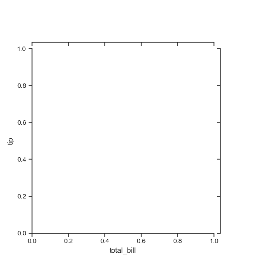
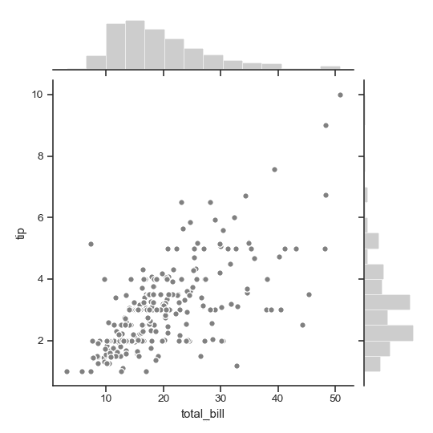
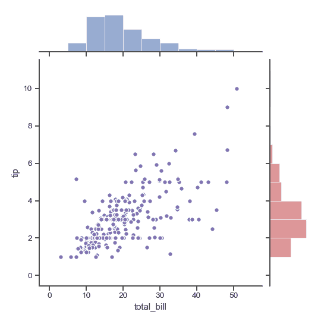
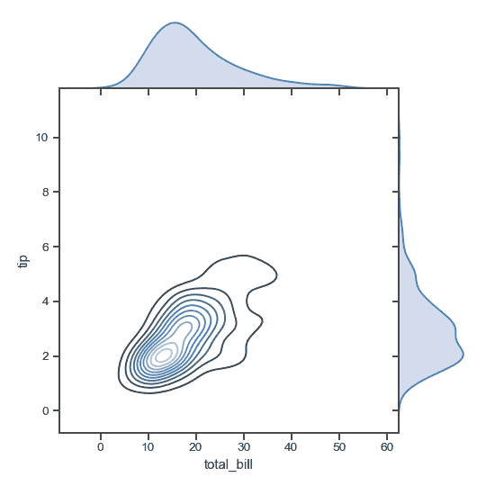
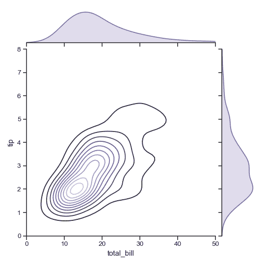

# seaborn.JointGrid

```py
class seaborn.JointGrid(x, y, data=None, height=6, ratio=5, space=0.2, dropna=True, xlim=None, ylim=None, size=None)
```

Grid for drawing a bivariate plot with marginal univariate plots.

```py
__init__(x, y, data=None, height=6, ratio=5, space=0.2, dropna=True, xlim=None, ylim=None, size=None)
```

Set up the grid of subplots.

| Parameters: | **x, y** : strings or vectors

> Data or names of variables in `data`.

**data** : DataFrame, optional

> DataFrame when `x` and `y` are variable names.

**height** : numeric

> Size of each side of the figure in inches (it will be square).

**ratio** : numeric

> Ratio of joint axes size to marginal axes height.

**space** : numeric, optional

> Space between the joint and marginal axes

**dropna** : bool, optional

> If True, remove observations that are missing from &lt;cite&gt;x&lt;/cite&gt; and &lt;cite&gt;y&lt;/cite&gt;.

**{x, y}lim** : two-tuples, optional

> Axis limits to set before plotting.

 |
| --- | --- |

See also

High-level interface for drawing bivariate plots with several different default plot kinds.

Examples

Initialize the figure but don’t draw any plots onto it:

```py
>>> import seaborn as sns; sns.set(style="ticks", color_codes=True)
>>> tips = sns.load_dataset("tips")
>>> g = sns.JointGrid(x="total_bill", y="tip", data=tips)

```



Add plots using default parameters:

```py
>>> g = sns.JointGrid(x="total_bill", y="tip", data=tips)
>>> g = g.plot(sns.regplot, sns.distplot)

```


Draw the join and marginal plots separately, which allows finer-level control other parameters:

```py
>>> import matplotlib.pyplot as plt
>>> g = sns.JointGrid(x="total_bill", y="tip", data=tips)
>>> g = g.plot_joint(plt.scatter, color=".5", edgecolor="white")
>>> g = g.plot_marginals(sns.distplot, kde=False, color=".5")

```



Draw the two marginal plots separately:

```py
>>> import numpy as np
>>> g = sns.JointGrid(x="total_bill", y="tip", data=tips)
>>> g = g.plot_joint(plt.scatter, color="m", edgecolor="white")
>>> _ = g.ax_marg_x.hist(tips["total_bill"], color="b", alpha=.6,
...                      bins=np.arange(0, 60, 5))
>>> _ = g.ax_marg_y.hist(tips["tip"], color="r", alpha=.6,
...                      orientation="horizontal",
...                      bins=np.arange(0, 12, 1))

```



Add an annotation with a statistic summarizing the bivariate relationship:

```py
>>> from scipy import stats
>>> g = sns.JointGrid(x="total_bill", y="tip", data=tips)
>>> g = g.plot_joint(plt.scatter,
...                  color="g", s=40, edgecolor="white")
>>> g = g.plot_marginals(sns.distplot, kde=False, color="g")
>>> g = g.annotate(stats.pearsonr)

```


Use a custom function and formatting for the annotation

```py
>>> g = sns.JointGrid(x="total_bill", y="tip", data=tips)
>>> g = g.plot_joint(plt.scatter,
...                  color="g", s=40, edgecolor="white")
>>> g = g.plot_marginals(sns.distplot, kde=False, color="g")
>>> rsquare = lambda a, b: stats.pearsonr(a, b)[0] ** 2
>>> g = g.annotate(rsquare, template="{stat}: {val:.2f}",
...                stat="$R^2$", loc="upper left", fontsize=12)

```


Remove the space between the joint and marginal axes:

```py
>>> g = sns.JointGrid(x="total_bill", y="tip", data=tips, space=0)
>>> g = g.plot_joint(sns.kdeplot, cmap="Blues_d")
>>> g = g.plot_marginals(sns.kdeplot, shade=True)

```



Draw a smaller plot with relatively larger marginal axes:

```py
>>> g = sns.JointGrid(x="total_bill", y="tip", data=tips,
...                   height=5, ratio=2)
>>> g = g.plot_joint(sns.kdeplot, cmap="Reds_d")
>>> g = g.plot_marginals(sns.kdeplot, color="r", shade=True)

```


Set limits on the axes:

```py
>>> g = sns.JointGrid(x="total_bill", y="tip", data=tips,
...                   xlim=(0, 50), ylim=(0, 8))
>>> g = g.plot_joint(sns.kdeplot, cmap="Purples_d")
>>> g = g.plot_marginals(sns.kdeplot, color="m", shade=True)

```



Methods

| [`__init__`](#seaborn.JointGrid.__init__ "seaborn.JointGrid.__init__")(x, y[, data, height, ratio, space, …]) | Set up the grid of subplots. |
| `annotate`(func[, template, stat, loc]) | Annotate the plot with a statistic about the relationship. |
| [`plot`](seaborn.JointGrid.plot.html#seaborn.JointGrid.plot "seaborn.JointGrid.plot")(joint_func, marginal_func[, annot_func]) | Shortcut to draw the full plot. |
| [`plot_joint`](seaborn.JointGrid.plot_joint.html#seaborn.JointGrid.plot_joint "seaborn.JointGrid.plot_joint")(func, **kwargs) | Draw a bivariate plot of &lt;cite&gt;x&lt;/cite&gt; and &lt;cite&gt;y&lt;/cite&gt;. |
| [`plot_marginals`](seaborn.JointGrid.plot_marginals.html#seaborn.JointGrid.plot_marginals "seaborn.JointGrid.plot_marginals")(func, **kwargs) | Draw univariate plots for &lt;cite&gt;x&lt;/cite&gt; and &lt;cite&gt;y&lt;/cite&gt; separately. |
| `savefig`(*args, **kwargs) | Wrap figure.savefig defaulting to tight bounding box. |
| `set_axis_labels`([xlabel, ylabel]) | Set the axis labels on the bivariate axes. |