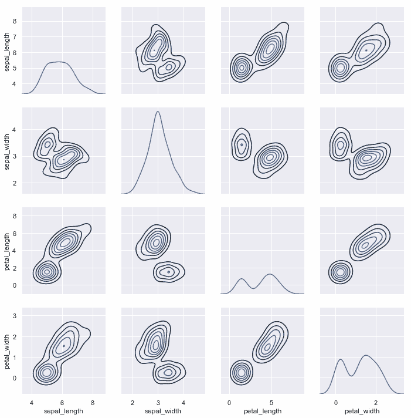

# 可视化数据集的分布

在处理一组数据时，您通常想做的第一件事就是了解变量的分布情况。本教程的这一章将简要介绍seaborn中用于检查单变量和双变量分布的一些工具。 您可能还需要查看[categorical.html]（categorical.html #categical-tutorial）章节中的函数示例，这些函数可以轻松地比较变量在其他变量级别上的分布。

import seaborn as sns
import matplotlib.pyplot as plt
from scipy import stats

```

```py
sns.set(color_codes=True)

```

## 绘制单变量分布

在seaborn中想要快速查看单变量分布的最方便的方法是使用[`distplot()`](../generated/seaborn.distplot.html#seaborn.distplot "seaborn.distplot")函数。默认情况下，该方法将会绘制直方图[histogram](https://en.wikipedia.org/wiki/Histogram)并拟合[内核密度估计] [kernel density estimate](https://en.wikipedia.org/wiki/Kernel_density_estimation) (KDE).

```py
x = np.random.normal(size=100)
sns.distplot(x);

```


### 直方图

对于直方图我们可能很熟悉，而且matplotlib中已经存在`hist`函数。 直方图首先确定数据区间，然后观察数据落入这些区间中的数量来绘制柱形图以此来表征数据的分布情况。
为了说明这一点，让我们删除密度曲线并添加一个rug plot，它在每个观察值上画一个小的垂直刻度。您可以使用[`rugplot()`](../generated/seaborn.rugplot.html#seaborn.rugplot "seaborn.rugplot") 函数来创建rugplot本身，但是也可以在 [`distplot()`](../generated/seaborn.distplot.html#seaborn.distplot "seaborn.distplot")中使用:

```py
sns.distplot(x, kde=False, rug=True);

```


在绘制柱状图时，您的主要选择是要使用的“桶”的数量和放置它们的位置。 [`distplot()`](../generated/seaborn.distplot.html#seaborn.distplot "seaborn.distplot") 使用一个简单的规则来很好地猜测默认情况下正确的数字是多少，但是尝试更多或更少的“桶”可能会揭示数据中的其他特性:

```py
sns.distplot(x, bins=20, kde=False, rug=True);

```


### 核密度估计

可能你对核密度估计不太熟悉，但它可以是绘制分布形状的有力工具。和直方图一样，KDE图沿另一个轴的高度，编码一个轴上的观测密度：
```py
sns.distplot(x, hist=False, rug=True);

```


绘制KDE比绘制直方图更需要计算。每个观测值首先被一个以该值为中心的正态(高斯)曲线所取代:
```py
x = np.random.normal(0, 1, size=30)
bandwidth = 1.06 * x.std() * x.size ** (-1 / 5.)
support = np.linspace(-4, 4, 200)

kernels = []
for x_i in x:

    kernel = stats.norm(x_i, bandwidth).pdf(support)
    kernels.append(kernel)
    plt.plot(support, kernel, color="r")

sns.rugplot(x, color=".2", linewidth=3);

```


接下来，对这些曲线求和，计算支持网格(support grid)中每个点的密度值。然后对得到的曲线进行归一化，使曲线下的面积等于1:

```py
from scipy.integrate import trapz
density = np.sum(kernels, axis=0)
density /= trapz(density, support)
plt.plot(support, density);

```


我们可以看到，如果在seaborn中使用[`kdeplot()`](../generated/seaborn.kdeplot.html#seaborn.kdeplot "seaborn.kdeplot") 函数， 我们可以得到相同的曲线。这个函数也被[`distplot()`](../generated/seaborn.distplot.html#seaborn.distplot "seaborn.distplot")所使用, 但是当您只想要密度估计时，它提供了一个更直接的接口，可以更容易地访问其他选项:

```py
sns.kdeplot(x, shade=True);

```


KDE的带宽（`bw`）参数控制估计与数据的拟合程度，就像直方图中的bin大小一样。 它对应于我们在上面绘制的内核的宽度。 默认行为尝试使用常用参考规则猜测一个好的值，但尝试更大或更小的值可能会有所帮助：
```py
sns.kdeplot(x)
sns.kdeplot(x, bw=.2, label="bw: 0.2")
sns.kdeplot(x, bw=2, label="bw: 2")
plt.legend();

```


正如您在上面所看到的，高斯KDE过程的本质意味着估计超出了数据集中最大和最小的值。有可能控制超过极值多远的曲线是由'cut'参数绘制的;然而，这只影响曲线的绘制方式，而不影响曲线的拟合方式:

```py
sns.kdeplot(x, shade=True, cut=0)
sns.rugplot(x);

```


### Fitting parametric distributions

You can also use [`distplot()`](../generated/seaborn.distplot.html#seaborn.distplot "seaborn.distplot") to fit a parametric distribution to a dataset and visually evaluate how closely it corresponds to the observed data:

```py
x = np.random.gamma(6, size=200)
sns.distplot(x, kde=False, fit=stats.gamma);

```


## Plotting bivariate distributions

It can also be useful to visualize a bivariate distribution of two variables. The easiest way to do this in seaborn is to just use the [`jointplot()`](../generated/seaborn.jointplot.html#seaborn.jointplot "seaborn.jointplot") function, which creates a multi-panel figure that shows both the bivariate (or joint) relationship between two variables along with the univariate (or marginal) distribution of each on separate axes.

```py
mean, cov = [0, 1], [(1, .5), (.5, 1)]
data = np.random.multivariate_normal(mean, cov, 200)
df = pd.DataFrame(data, columns=["x", "y"])

```

### Scatterplots

The most familiar way to visualize a bivariate distribution is a scatterplot, where each observation is shown with point at the _x_ and _y_ values. This is analgous to a rug plot on two dimensions. You can draw a scatterplot with the matplotlib `plt.scatter` function, and it is also the default kind of plot shown by the [`jointplot()`](../generated/seaborn.jointplot.html#seaborn.jointplot "seaborn.jointplot") function:

```py
sns.jointplot(x="x", y="y", data=df);

```


### Hexbin plots

The bivariate analogue of a histogram is known as a “hexbin” plot, because it shows the counts of observations that fall within hexagonal bins. This plot works best with relatively large datasets. It’s available through the matplotlib `plt.hexbin` function and as a style in [`jointplot()`](../generated/seaborn.jointplot.html#seaborn.jointplot "seaborn.jointplot"). It looks best with a white background:

```py
x, y = np.random.multivariate_normal(mean, cov, 1000).T
with sns.axes_style("white"):
    sns.jointplot(x=x, y=y, kind="hex", color="k");

```


### Kernel density estimation

It is also possible to use the kernel density estimation procedure described above to visualize a bivariate distribution. In seaborn, this kind of plot is shown with a contour plot and is available as a style in [`jointplot()`](../generated/seaborn.jointplot.html#seaborn.jointplot "seaborn.jointplot"):

```py
sns.jointplot(x="x", y="y", data=df, kind="kde");

```


You can also draw a two-dimensional kernel density plot with the [`kdeplot()`](../generated/seaborn.kdeplot.html#seaborn.kdeplot "seaborn.kdeplot") function. This allows you to draw this kind of plot onto a specific (and possibly already existing) matplotlib axes, whereas the [`jointplot()`](../generated/seaborn.jointplot.html#seaborn.jointplot "seaborn.jointplot") function manages its own figure:

```py
f, ax = plt.subplots(figsize=(6, 6))
sns.kdeplot(df.x, df.y, ax=ax)
sns.rugplot(df.x, color="g", ax=ax)
sns.rugplot(df.y, vertical=True, ax=ax);

```


If you wish to show the bivariate density more continuously, you can simply increase the number of contour levels:

```py
f, ax = plt.subplots(figsize=(6, 6))
cmap = sns.cubehelix_palette(as_cmap=True, dark=0, light=1, reverse=True)
sns.kdeplot(df.x, df.y, cmap=cmap, n_levels=60, shade=True);

```


The [`jointplot()`](../generated/seaborn.jointplot.html#seaborn.jointplot "seaborn.jointplot") function uses a [`JointGrid`](../generated/seaborn.JointGrid.html#seaborn.JointGrid "seaborn.JointGrid") to manage the figure. For more flexibility, you may want to draw your figure by using [`JointGrid`](../generated/seaborn.JointGrid.html#seaborn.JointGrid "seaborn.JointGrid") directly. [`jointplot()`](../generated/seaborn.jointplot.html#seaborn.jointplot "seaborn.jointplot") returns the [`JointGrid`](../generated/seaborn.JointGrid.html#seaborn.JointGrid "seaborn.JointGrid") object after plotting, which you can use to add more layers or to tweak other aspects of the visualization:

```py
g = sns.jointplot(x="x", y="y", data=df, kind="kde", color="m")
g.plot_joint(plt.scatter, c="w", s=30, linewidth=1, marker="+")
g.ax_joint.collections[0].set_alpha(0)
g.set_axis_labels("$X$", "$Y$");

```


## Visualizing pairwise relationships in a dataset

To plot multiple pairwise bivariate distributions in a dataset, you can use the [`pairplot()`](../generated/seaborn.pairplot.html#seaborn.pairplot "seaborn.pairplot") function. This creates a matrix of axes and shows the relationship for each pair of columns in a DataFrame. by default, it also draws the univariate distribution of each variable on the diagonal Axes:

```py
iris = sns.load_dataset("iris")
sns.pairplot(iris);

```


Much like the relationship between [`jointplot()`](../generated/seaborn.jointplot.html#seaborn.jointplot "seaborn.jointplot") and [`JointGrid`](../generated/seaborn.JointGrid.html#seaborn.JointGrid "seaborn.JointGrid"), the [`pairplot()`](../generated/seaborn.pairplot.html#seaborn.pairplot "seaborn.pairplot") function is built on top of a [`PairGrid`](../generated/seaborn.PairGrid.html#seaborn.PairGrid "seaborn.PairGrid") object, which can be used directly for more flexibility:

```py
g = sns.PairGrid(iris)
g.map_diag(sns.kdeplot)
g.map_offdiag(sns.kdeplot, n_levels=6);

```


