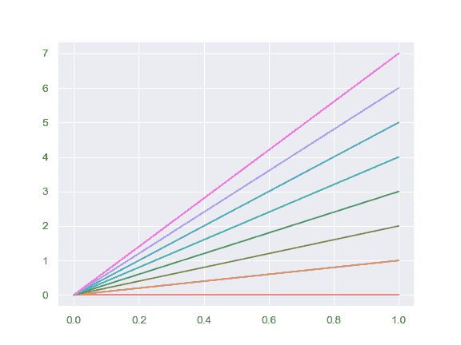

# seaborn.color_palette

```py
seaborn.color_palette(palette=None, n_colors=None, desat=None)
```

Return a list of colors defining a color palette.

```py
Available seaborn palette names:
```

deep, muted, bright, pastel, dark, colorblind

```py
Other options:
```

name of matplotlib cmap, ‘ch:<cubehelix arguments>’, ‘hls’, ‘husl’, or a list of colors in any format matplotlib accepts

Calling this function with `palette=None` will return the current matplotlib color cycle.

Matplotlib palettes can be specified as reversed palettes by appending “_r” to the name or as “dark” palettes by appending “_d” to the name. (These options are mutually exclusive, but the resulting list of colors can also be reversed).

This function can also be used in a `with` statement to temporarily set the color cycle for a plot or set of plots.

See the [tutorial](../tutorial/color_palettes.html#palette-tutorial) for more information.

参数：**palette：None, string, or sequence, optional**

> Name of palette or None to return current palette. If a sequence, input colors are used but possibly cycled and desaturated.

`n_colors`：int, optional

> Number of colors in the palette. If `None`, the default will depend on how `palette` is specified. Named palettes default to 6 colors, but grabbing the current palette or passing in a list of colors will not change the number of colors unless this is specified. Asking for more colors than exist in the palette will cause it to cycle.

`desat`：float, optional

> Proportion to desaturate each color by.


返回值：`palette`：list of RGB tuples.

> Color palette. Behaves like a list, but can be used as a context manager and possesses an `as_hex` method to convert to hex color codes.


See also

Set the default color cycle for all plots.Reassign color codes like `"b"`, `"g"`, etc. to colors from one of the seaborn palettes.

Examples

Calling with no arguments returns all colors from the current default color cycle:

```py
>>> import seaborn as sns; sns.set()
>>> sns.palplot(sns.color_palette())

```


Show one of the other “seaborn palettes”, which have the same basic order of hues as the default matplotlib color cycle but more attractive colors. Calling with the name of a palette will return 6 colors by default:

```py
>>> sns.palplot(sns.color_palette("muted"))

```


Use discrete values from one of the built-in matplotlib colormaps:

```py
>>> sns.palplot(sns.color_palette("RdBu", n_colors=7))

```


Make a customized cubehelix color palette:

```py
>>> sns.palplot(sns.color_palette("ch:2.5,-.2,dark=.3"))

```


Use a categorical matplotlib palette and add some desaturation:

```py
>>> sns.palplot(sns.color_palette("Set1", n_colors=8, desat=.5))

```


Make a “dark” matplotlib sequential palette variant. (This can be good when coloring multiple lines or points that correspond to an ordered variable, where you don’t want the lightest lines to be invisible):

```py
>>> sns.palplot(sns.color_palette("Blues_d"))

```


Use as a context manager:

```py
>>> import numpy as np, matplotlib.pyplot as plt
>>> with sns.color_palette("husl", 8):
...    _ = plt.plot(np.c_[np.zeros(8), np.arange(8)].T)

```

