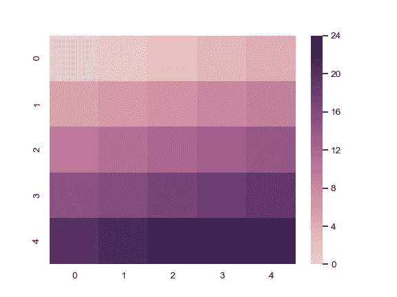

# seaborn.cubehelix_palette

```py
seaborn.cubehelix_palette(n_colors=6, start=0, rot=0.4, gamma=1.0, hue=0.8, light=0.85, dark=0.15, reverse=False, as_cmap=False)
```

Make a sequential palette from the cubehelix system.

This produces a colormap with linearly-decreasing (or increasing) brightness. That means that information will be preserved if printed to black and white or viewed by someone who is colorblind. “cubehelix” is also available as a matplotlib-based palette, but this function gives the user more control over the look of the palette and has a different set of defaults.

In addition to using this function, it is also possible to generate a cubehelix palette generally in seaborn using a string-shorthand; see the example below.

| Parameters: | **n_colors** : int

> Number of colors in the palette.

**start** : float, 0 &lt;= start &lt;= 3

> The hue at the start of the helix.

**rot** : float

> Rotations around the hue wheel over the range of the palette.

**gamma** : float 0 &lt;= gamma

> Gamma factor to emphasize darker (gamma &lt; 1) or lighter (gamma &gt; 1) colors.

**hue** : float, 0 &lt;= hue &lt;= 1

> Saturation of the colors.

**dark** : float 0 &lt;= dark &lt;= 1

> Intensity of the darkest color in the palette.

**light** : float 0 &lt;= light &lt;= 1

> Intensity of the lightest color in the palette.

**reverse** : bool

> If True, the palette will go from dark to light.

**as_cmap** : bool

> If True, return a matplotlib colormap instead of a list of colors.

 |
| --- | --- |
| Returns: | **palette or cmap** : seaborn color palette or matplotlib colormap

> List-like object of colors as RGB tuples, or colormap object that can map continuous values to colors, depending on the value of the `as_cmap` parameter.

 |
| --- | --- |

See also

Launch an interactive widget to select cubehelix palette parameters.Create a sequential palette with dark low values.Create a sequential palette with bright low values.

References

Green, D. A. (2011). “A colour scheme for the display of astronomical intensity images”. Bulletin of the Astromical Society of India, Vol. 39, p. 289-295.

Examples

Generate the default palette:

```py
>>> import seaborn as sns; sns.set()
>>> sns.palplot(sns.cubehelix_palette())

```


Rotate backwards from the same starting location:

```py
>>> sns.palplot(sns.cubehelix_palette(rot=-.4))

```


Use a different starting point and shorter rotation:

```py
>>> sns.palplot(sns.cubehelix_palette(start=2.8, rot=.1))

```


Reverse the direction of the lightness ramp:

```py
>>> sns.palplot(sns.cubehelix_palette(reverse=True))

```


Generate a colormap object:

```py
>>> from numpy import arange
>>> x = arange(25).reshape(5, 5)
>>> cmap = sns.cubehelix_palette(as_cmap=True)
>>> ax = sns.heatmap(x, cmap=cmap)

```



Use the full lightness range:

```py
>>> cmap = sns.cubehelix_palette(dark=0, light=1, as_cmap=True)
>>> ax = sns.heatmap(x, cmap=cmap)

```


Use through the [`color_palette()`](seaborn.color_palette.html#seaborn.color_palette "seaborn.color_palette") interface:

```py
>>> sns.palplot(sns.color_palette("ch:2,r=.2,l=.6"))

```

