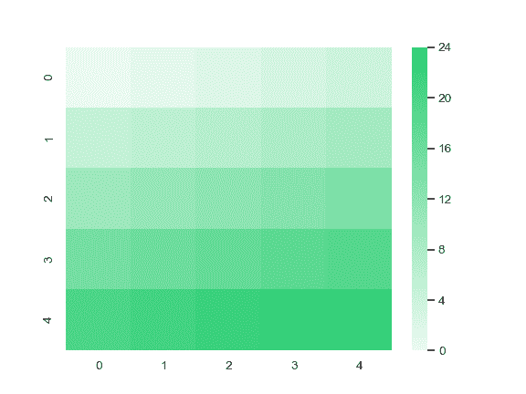

# seaborn.light_palette

```py
seaborn.light_palette(color, n_colors=6, reverse=False, as_cmap=False, input='rgb')
```

Make a sequential palette that blends from light to `color`.

This kind of palette is good for data that range between relatively uninteresting low values and interesting high values.

The `color` parameter can be specified in a number of ways, including all options for defining a color in matplotlib and several additional color spaces that are handled by seaborn. You can also use the database of named colors from the XKCD color survey.

If you are using the IPython notebook, you can also choose this palette interactively with the [`choose_light_palette()`](seaborn.choose_light_palette.html#seaborn.choose_light_palette "seaborn.choose_light_palette") function.

| Parameters: | **color** : base color for high values

> hex code, html color name, or tuple in `input` space.

**n_colors** : int, optional

> number of colors in the palette

**reverse** : bool, optional

> if True, reverse the direction of the blend

**as_cmap** : bool, optional

> if True, return as a matplotlib colormap instead of list

**input** : {‘rgb’, ‘hls’, ‘husl’, xkcd’}

> Color space to interpret the input color. The first three options apply to tuple inputs and the latter applies to string inputs.

 |
| --- | --- |
| Returns: | **palette or cmap** : seaborn color palette or matplotlib colormap

> List-like object of colors as RGB tuples, or colormap object that can map continuous values to colors, depending on the value of the `as_cmap` parameter.

 |
| --- | --- |

See also

Create a sequential palette with dark low values.Create a diverging palette with two colors.

Examples

Generate a palette from an HTML color:

```py
>>> import seaborn as sns; sns.set()
>>> sns.palplot(sns.light_palette("purple"))

```


Generate a palette that increases in lightness:

```py
>>> sns.palplot(sns.light_palette("seagreen", reverse=True))

```


Generate a palette from an HUSL-space seed:

```py
>>> sns.palplot(sns.light_palette((260, 75, 60), input="husl"))

```


Generate a colormap object:

```py
>>> from numpy import arange
>>> x = arange(25).reshape(5, 5)
>>> cmap = sns.light_palette("#2ecc71", as_cmap=True)
>>> ax = sns.heatmap(x, cmap=cmap)

```

