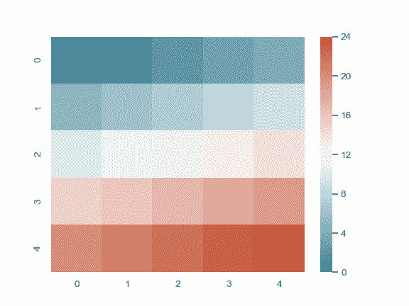

# seaborn.diverging_palette

> 译者：[Modrisco](https://github.com/Modrisco)

```py
seaborn.diverging_palette(h_neg, h_pos, s=75, l=50, sep=10, n=6, center='light', as_cmap=False)
```

在两个 HUSL 颜色直接建立一个发散调色板。

如果您在使用 IPython notebook，您还可以通过 [`choose_diverging_palette()`](seaborn.choose_diverging_palette.html#seaborn.choose_diverging_palette "seaborn.choose_diverging_palette") 函数交互式选择调色板。

参数：`h_neg, h_pos`：float in [0, 359]

> 图的正负范围的锚定色调

`s`：[0, 100] 范围内的浮点数，可选

> 图的两个范围的锚定饱和度

`l`：[0, 100] 范围内的浮点数，可选

> 图的两个范围的锚定亮度

`n`：int，可选

> 调色板中的颜色数（如果为not，返回一个colormap）

`center`：{“light”, “dark”}, 可选

> 调色板中心为亮或暗

`as_cmap`：bool, 可选

> 如果为 true，返回一个 matplotlib colormap 而不是一个颜色列表。


返回值：`palette or cmap`：seaborn color palette or matplotlib colormap

> 类似列表的颜色对象的 RGB 元组，或者可以将连续值映射到颜色的 colormap 对象，具体取决于 `as_cmap` 参数的值。


另外

创建具有暗值的连续调色板。创建具有亮值的连续调色板。

例子

生成一个蓝-白-红调色板：

```py
>>> import seaborn as sns; sns.set()
>>> sns.palplot(sns.diverging_palette(240, 10, n=9))

```


生成一个更亮的绿-白-紫调色板：

```py
>>> sns.palplot(sns.diverging_palette(150, 275, s=80, l=55, n=9))

```


生成一个蓝-黑-红调色板:

```py
>>> sns.palplot(sns.diverging_palette(250, 15, s=75, l=40,
...                                   n=9, center="dark"))

```


生成一个 colormap 对象:

```py
>>> from numpy import arange
>>> x = arange(25).reshape(5, 5)
>>> cmap = sns.diverging_palette(220, 20, sep=20, as_cmap=True)
>>> ax = sns.heatmap(x, cmap=cmap)

```


