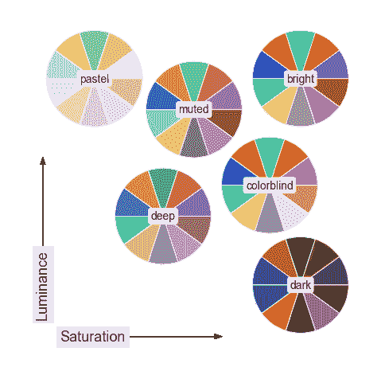
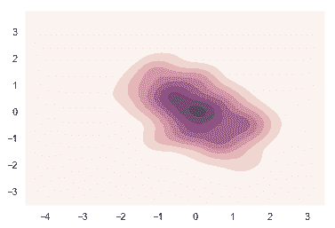
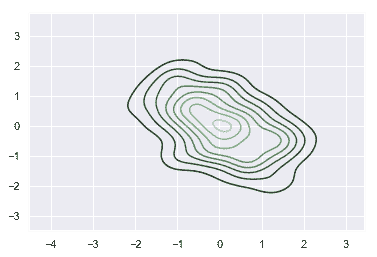
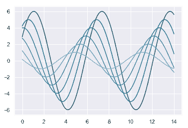

# 选择调色板

颜色在图像风格中比起其他元素显得更为重要。当合理有效地使用颜色时，数据模式会被凸显出来；反之，则会被隐藏。这里有很多数据可视化中关于颜色使用的优秀资源，我推荐阅读这些 Rob Simmon 的[博客文章](https://earthobservatory.nasa.gov/blogs/elegantfigures/2013/08/05/subtleties-of-color-part-1-of-6/) 以及这篇更加学术性的[论文](https://cfwebprod.sandia.gov/cfdocs/CompResearch/docs/ColorMapsExpanded.pdf)。 matplotlib 文档也提供了一篇很好的[教程](https://matplotlib.org/users/colormaps.html)来说明一些内置色彩映射的感知属性。

Seaborn让您在选择与您处理的数据和可视化过程中搭配的颜色模式变得简单。

```py
import numpy as np
import seaborn as sns
import matplotlib.pyplot as plt
sns.set()

```

## 创建调色板

使用离散调色板过程中最重要函数是[`color_palette()`](../generated/seaborn.color_palette.html#seaborn.color_palette "seaborn.color_palette")。这个函数为许多(但不是全部)可以在seborn中生成颜色的方式提供了一个接口，并且在任何具有`palette`参数的函数的内部都可以使用(以及某些需要多种颜色时具有`color`参数的情况)。

[`color_palette()`](../generated/seaborn.color_palette.html#seaborn.color_palette "seaborn.color_palette") 会接受所有的serborn调色板或者matplotlib色彩映射 (除了 `jet`, 您永远都不应该使用它). 它还可以获取以任何有效matplotlib格式(RGB元组、十六进制颜色代码或HTML颜色名称)指定的颜色列表。返回值始终是RGB元组的列表。

最后，在没有参数的情况下调用[`color_palette()`](../generated/seaborn.color_palette.html#seaborn.color_palette "seaborn.color_palette")函数将会返回当前默认的色彩循环。

A corresponding function, [`set_palette()`](../generated/seaborn.set_palette.html#seaborn.set_palette "seaborn.set_palette"), takes the same arguments and will set the default color cycle for all plots. You can also use [`color_palette()`](../generated/seaborn.color_palette.html#seaborn.color_palette "seaborn.color_palette") in a `with` statement to temporarily change the default palette (see [below](#palette-contexts)).

It is generally not possible to know what kind of color palette or colormap is best for a set of data without knowing about the characteristics of the data. Following that, we’ll break up the different ways to use [`color_palette()`](../generated/seaborn.color_palette.html#seaborn.color_palette "seaborn.color_palette") and other seaborn palette functions by the three general kinds of color palettes: _qualitative_, _sequential_, and _diverging_.

## Qualitative color palettes

Qualitative (or categorical) palettes are best when you want to distinguish discrete chunks of data that do not have an inherent ordering.

When importing seaborn, the default color cycle is changed to a set of six colors that evoke the standard matplotlib color cycle while aiming to be a bit more pleasing to look at.

```py
current_palette = sns.color_palette()
sns.palplot(current_palette)

```


There are six variations of the default theme, called `deep`, `muted`, `pastel`, `bright`, `dark`, and `colorblind`.



### Using circular color systems

When you have an arbitrary number of categories to distinguish without emphasizing any one, the easiest approach is to draw evenly-spaced colors in a circular color space (one where the hue changes while keeping the brightness and saturation constant). This is what most seaborn functions default to when they need to use more colors than are currently set in the default color cycle.

The most common way to do this uses the `hls` color space, which is a simple transformation of RGB values.

```py
sns.palplot(sns.color_palette("hls", 8))

```


There is also the [`hls_palette()`](../generated/seaborn.hls_palette.html#seaborn.hls_palette "seaborn.hls_palette") function that lets you control the lightness and saturation of the colors.

```py
sns.palplot(sns.hls_palette(8, l=.3, s=.8))

```


However, because of the way the human visual system works, colors that are even “intensity” in terms of their RGB levels won’t necessarily look equally intense. [We perceive](https://en.wikipedia.org/wiki/Color_vision) yellows and greens as relatively brighter and blues as relatively darker, which can be a problem when aiming for uniformity with the `hls` system.

To remedy this, seaborn provides an interface to the [husl](http://www.hsluv.org/) system (since renamed to HSLuv), which also makes it easy to select evenly spaced hues while keeping the apparent brightness and saturation much more uniform.

```py
sns.palplot(sns.color_palette("husl", 8))

```


There is similarly a function called [`husl_palette()`](../generated/seaborn.husl_palette.html#seaborn.husl_palette "seaborn.husl_palette") that provides a more flexible interface to this system.

### Using categorical Color Brewer palettes

Another source of visually pleasing categorical palettes comes from the [Color Brewer](http://colorbrewer2.org/) tool (which also has sequential and diverging palettes, as we’ll see below). These also exist as matplotlib colormaps, but they are not handled properly. In seaborn, when you ask for a qualitative Color Brewer palette, you’ll always get the discrete colors, but this means that at a certain point they will begin to cycle.

A nice feature of the Color Brewer website is that it provides some guidance on which palettes are color blind safe. There is a variety of [kinds](https://en.wikipedia.org/wiki/Color_blindness) of color blindness, but the most common variant leads to difficulty distinguishing reds and greens. It’s generally a good idea to avoid using red and green for plot elements that need to be discriminated based on color.

```py
sns.palplot(sns.color_palette("Paired"))

```


```py
sns.palplot(sns.color_palette("Set2"))

```


To help you choose palettes from the Color Brewer library, there is the [`choose_colorbrewer_palette()`](../generated/seaborn.choose_colorbrewer_palette.html#seaborn.choose_colorbrewer_palette "seaborn.choose_colorbrewer_palette") function. This function, which must be used in a Jupyter notebook, will launch an interactive widget that lets you browse the various options and tweak their parameters.

Of course, you might just want to use a set of colors you particularly like together. Because [`color_palette()`](../generated/seaborn.color_palette.html#seaborn.color_palette "seaborn.color_palette") accepts a list of colors, this is easy to do.

```py
flatui = ["#9b59b6", "#3498db", "#95a5a6", "#e74c3c", "#34495e", "#2ecc71"]
sns.palplot(sns.color_palette(flatui))

```


### Using named colors from the xkcd color survey

A while back, [xkcd](https://xkcd.com/) ran a [crowdsourced effort](https://blog.xkcd.com/2010/05/03/color-survey-results/) to name random RGB colors. This produced a set of [954 named colors](https://xkcd.com/color/rgb/), which you can now reference in seaborn using the `xkcd_rgb` dictionary:

```py
plt.plot([0, 1], [0, 1], sns.xkcd_rgb["pale red"], lw=3)
plt.plot([0, 1], [0, 2], sns.xkcd_rgb["medium green"], lw=3)
plt.plot([0, 1], [0, 3], sns.xkcd_rgb["denim blue"], lw=3);

```


In addition to pulling out single colors from the `xkcd_rgb` dictionary, you can also pass a list of names to the [`xkcd_palette()`](../generated/seaborn.xkcd_palette.html#seaborn.xkcd_palette "seaborn.xkcd_palette") function.

```py
colors = ["windows blue", "amber", "greyish", "faded green", "dusty purple"]
sns.palplot(sns.xkcd_palette(colors))

```


## Sequential color palettes

The second major class of color palettes is called “sequential”. This kind of color mapping is appropriate when data range from relatively low or uninteresting values to relatively high or interesting values. Although there are cases where you will want discrete colors in a sequential palette, it’s more common to use them as a colormap in functions like [`kdeplot()`](../generated/seaborn.kdeplot.html#seaborn.kdeplot "seaborn.kdeplot") and [`heatmap()`](../generated/seaborn.heatmap.html#seaborn.heatmap "seaborn.heatmap") (along with similar matplotlib functions).

It’s common to see colormaps like `jet` (or other rainbow palettes) used in this case, because the range of hues gives the impression of providing additional information about the data. However, colormaps with large hue shifts tend to introduce discontinuities that don’t exist in the data, and our visual system isn’t able to naturally map the rainbow to quantitative distinctions like “high” or “low”. The result is that these visualizations end up being more like a puzzle, and they obscure patterns in the data rather than revealing them. The jet palette is because the brightest colors, yellow and cyan, are used for intermediate data values. This has the effect of emphasizing uninteresting (and arbitrary) values while deemphasizing the extremes.

For sequential data, it’s better to use palettes that have at most a relatively subtle shift in hue accompanied by a large shift in brightness and saturation. This approach will naturally draw the eye to the relatively important parts of the data.

The Color Brewer library has a great set of these palettes. They’re named after the dominant color (or colors) in the palette.

```py
sns.palplot(sns.color_palette("Blues"))

```


Like in matplotlib, if you want the lightness ramp to be reversed, you can add a `_r` suffix to the palette name.

```py
sns.palplot(sns.color_palette("BuGn_r"))

```


Seaborn also adds a trick that allows you to create “dark” palettes, which do not have as wide a dynamic range. This can be useful if you want to map lines or points sequentially, as brighter-colored lines might otherwise be hard to distinguish.

```py
sns.palplot(sns.color_palette("GnBu_d"))

```


Remember that you may want to use the [`choose_colorbrewer_palette()`](../generated/seaborn.choose_colorbrewer_palette.html#seaborn.choose_colorbrewer_palette "seaborn.choose_colorbrewer_palette") function to play with the various options, and you can set the `as_cmap` argument to `True` if you want the return value to be a colormap object that you can pass to seaborn or matplotlib functions.

### Sequential “cubehelix” palettes

The [cubehelix](https://www.mrao.cam.ac.uk/~dag/CUBEHELIX/) color palette system makes sequential palettes with a linear increase or decrease in brightness and some variation in hue. This means that the information in your colormap will be preserved when converted to black and white (for printing) or when viewed by a colorblind individual.

Matplotlib has the default cubehelix version built into it:

```py
sns.palplot(sns.color_palette("cubehelix", 8))

```


Seaborn adds an interface to the cubehelix _system_ so that you can make a variety of palettes that all have a well-behaved linear brightness ramp.

The default palette returned by the seaborn [`cubehelix_palette()`](../generated/seaborn.cubehelix_palette.html#seaborn.cubehelix_palette "seaborn.cubehelix_palette") function is a bit different from the matplotlib default in that it does not rotate as far around the hue wheel or cover as wide a range of intensities. It also reverses the order so that more important values are darker:

```py
sns.palplot(sns.cubehelix_palette(8))

```


Other arguments to [`cubehelix_palette()`](../generated/seaborn.cubehelix_palette.html#seaborn.cubehelix_palette "seaborn.cubehelix_palette") control how the palette looks. The two main things you’ll change are the `start` (a value between 0 and 3) and `rot`, or number of rotations (an arbitrary value, but probably within -1 and 1),

```py
sns.palplot(sns.cubehelix_palette(8, start=.5, rot=-.75))

```


You can also control how dark and light the endpoints are and even reverse the ramp:

```py
sns.palplot(sns.cubehelix_palette(8, start=2, rot=0, dark=0, light=.95, reverse=True))

```


By default you just get a list of colors, like any other seaborn palette, but you can also return the palette as a colormap object that can be passed to seaborn or matplotlib functions using `as_cmap=True`.

```py
x, y = np.random.multivariate_normal([0, 0], [[1, -.5], [-.5, 1]], size=300).T
cmap = sns.cubehelix_palette(light=1, as_cmap=True)
sns.kdeplot(x, y, cmap=cmap, shade=True);

```



To help select good palettes or colormaps using this system, you can use the [`choose_cubehelix_palette()`](../generated/seaborn.choose_cubehelix_palette.html#seaborn.choose_cubehelix_palette "seaborn.choose_cubehelix_palette") function in a notebook to launch an interactive app that will let you play with the different parameters. Pass `as_cmap=True` if you want the function to return a colormap (rather than a list) for use in function like `hexbin`.

### Custom sequential palettes

For a simpler interface to custom sequential palettes, you can use [`light_palette()`](../generated/seaborn.light_palette.html#seaborn.light_palette "seaborn.light_palette") or [`dark_palette()`](../generated/seaborn.dark_palette.html#seaborn.dark_palette "seaborn.dark_palette"), which are both seeded with a single color and produce a palette that ramps either from light or dark desaturated values to that color. These functions are also accompanied by the [`choose_light_palette()`](../generated/seaborn.choose_light_palette.html#seaborn.choose_light_palette "seaborn.choose_light_palette") and [`choose_dark_palette()`](../generated/seaborn.choose_dark_palette.html#seaborn.choose_dark_palette "seaborn.choose_dark_palette") functions that launch interactive widgets to create these palettes.

```py
sns.palplot(sns.light_palette("green"))

```


```py
sns.palplot(sns.dark_palette("purple"))

```


These palettes can also be reversed.

```py
sns.palplot(sns.light_palette("navy", reverse=True))

```


They can also be used to create colormap objects rather than lists of colors.

```py
pal = sns.dark_palette("palegreen", as_cmap=True)
sns.kdeplot(x, y, cmap=pal);

```



By default, the input can be any valid matplotlib color. Alternate interpretations are controlled by the `input` argument. Currently you can provide tuples in `hls` or `husl` space along with the default `rgb`, and you can also seed the palette with any valid `xkcd` color.

```py
sns.palplot(sns.light_palette((210, 90, 60), input="husl"))

```


```py
sns.palplot(sns.dark_palette("muted purple", input="xkcd"))

```


Note that the default input space for the interactive palette widgets is `husl`, which is different from the default for the function itself, but much more useful in this context.

## Diverging color palettes

The third class of color palettes is called “diverging”. These are used for data where both large low and high values are interesting. There is also usually a well-defined midpoint in the data. For instance, if you are plotting changes in temperature from some baseline timepoint, it is best to use a diverging colormap to show areas with relative decreases and areas with relative increases.

The rules for choosing good diverging palettes are similar to good sequential palettes, except now you want to have two relatively subtle hue shifts from distinct starting hues that meet in an under-emphasized color at the midpoint. It’s also important that the starting values are of similar brightness and saturation.

It’s also important to emphasize here that using red and green should be avoided, as a substantial population of potential viewers will be [unable to distinguish them](https://en.wikipedia.org/wiki/Color_blindness).

It should not surprise you that the Color Brewer library comes with a set of well-chosen diverging colormaps.

```py
sns.palplot(sns.color_palette("BrBG", 7))

```


```py
sns.palplot(sns.color_palette("RdBu_r", 7))

```


Another good choice that is built into matplotlib is the `coolwarm` palette. Note that this colormap has less contrast between the middle values and the extremes.

```py
sns.palplot(sns.color_palette("coolwarm", 7))

```


### Custom diverging palettes

You can also use the seaborn function [`diverging_palette()`](../generated/seaborn.diverging_palette.html#seaborn.diverging_palette "seaborn.diverging_palette") to create a custom colormap for diverging data. (Naturally there is also a companion interactive widget, [`choose_diverging_palette()`](../generated/seaborn.choose_diverging_palette.html#seaborn.choose_diverging_palette "seaborn.choose_diverging_palette")). This function makes diverging palettes using the `husl` color system. You pass it two hues (in degrees) and, optionally, the lightness and saturation values for the extremes. Using `husl` means that the extreme values, and the resulting ramps to the midpoint, will be well-balanced.

```py
sns.palplot(sns.diverging_palette(220, 20, n=7))

```


```py
sns.palplot(sns.diverging_palette(145, 280, s=85, l=25, n=7))

```


The `sep` argument controls the width of the separation between the two ramps in the middle region of the palette.

```py
sns.palplot(sns.diverging_palette(10, 220, sep=80, n=7))

```


It’s also possible to make a palette with the midpoint is dark rather than light.

```py
sns.palplot(sns.diverging_palette(255, 133, l=60, n=7, center="dark"))

```


## Setting the default color palette

The [`color_palette()`](../generated/seaborn.color_palette.html#seaborn.color_palette "seaborn.color_palette") function has a companion called [`set_palette()`](../generated/seaborn.set_palette.html#seaborn.set_palette "seaborn.set_palette"). The relationship between them is similar to the pairs covered in the [aesthetics tutorial](aesthetics.html#aesthetics-tutorial). [`set_palette()`](../generated/seaborn.set_palette.html#seaborn.set_palette "seaborn.set_palette") accepts the same arguments as [`color_palette()`](../generated/seaborn.color_palette.html#seaborn.color_palette "seaborn.color_palette"), but it changes the default matplotlib parameters so that the palette is used for all plots.

```py
def sinplot(flip=1):
    x = np.linspace(0, 14, 100)
    for i in range(1, 7):
        plt.plot(x, np.sin(x + i * .5) * (7 - i) * flip)

```

```py
sns.set_palette("husl")
sinplot()

```


The [`color_palette()`](../generated/seaborn.color_palette.html#seaborn.color_palette "seaborn.color_palette") function can also be used in a `with` statement to temporarily change the color palette.

```py
with sns.color_palette("PuBuGn_d"):
    sinplot()

```

